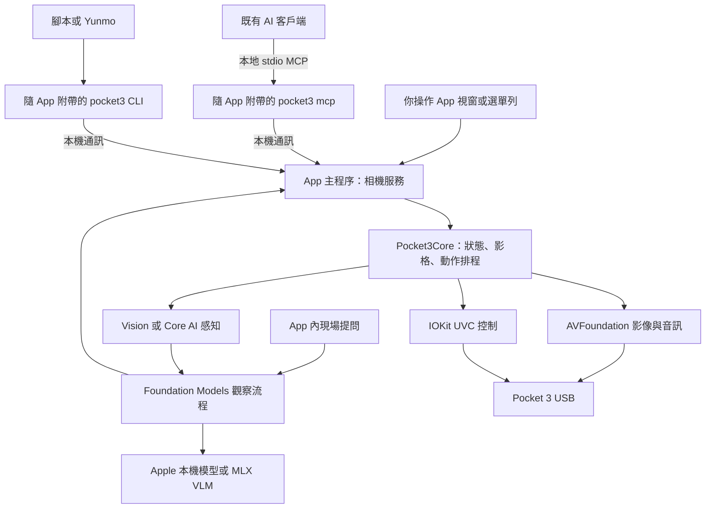

# DJI Pocket 3 MCP — 產品形態與完整構建提案

日期：2026-09-07  
狀態：**本提案已獲使用者同意並進入實作。2026-09-08 又擴大為完整裝置控制台，新增範圍與傳輸途徑以 [裝置功能擴充路線](docs/DEVICE_CAPABILITY_ROADMAP.md) 為準；原提案內容作為歷史設計依據。**

使用者希望先了解最後會得到什麼，再討論後開始構建。本文件承接 [深度研究](DEEP_RESEARCH.md) 和 [硬體短測](HARDWARE_VALIDATION.md)，補足產品形態、操作方式、實作責任及交付範圍。以下版本、介面名稱和目錄都是提案。

## 1. 要做成什麼

**做一個可以直接詢問現場、選擇觀察方向的 macOS 27 原生 AI 相機 App，附帶 MCP server 和命令列入口。**

你安裝與操作的是 App，並能在裡面用文字直接問現場問題；外部 AI 客戶端也能透過 MCP 使用相機；自己的程式可以呼叫 CLI，之後再按整合需求提供客戶端函式庫。它們共用同一個相機核心與控制規則。

產品的主要工作是讓 Pocket 3 成為一個可觀察、可控制、能回報實際結果的 AI 相機。你可以看見現場、手動調整視角、開放或收回 AI 使用權限，以及知道剛才的操作是否成功。

| 元件 | 在產品中的角色 | 首版交付 |
|---|---|---|
| macOS App | 預覽、現場提問、手動控制、模型選擇、AI 接入與診斷 | 是，主要使用入口 |
| MCP server | 讓支援本地 MCP 和圖片工具結果的 AI 客戶端取像、控制相機 | 是，隨 App 附帶 |
| CLI | 診斷、擷取圖片、腳本與 Yunmo 等程式整合 | 是，與 MCP 共用一個小型可執行入口 |
| 相機核心函式庫 | 裝置、影音、動作排程、狀態與恢復 | 是，內部可重用模組 |
| 獨立 HTTP API server | 讓網頁、其他主機或網路服務呼叫 | 首版不開放；有具體需求再設計 |
| App 內建 AI 觀察 | 文字提問、視覺理解、有限步驟操作與證據回覆 | 是；以本機 AI 為主，保留外部客戶端 |
| 完整聊天／陪伴系統 | 跨任務長期記憶、持續語音與人格 | 後續獨立需求 |

「有程式 API」不等於需要一個 HTTP server。首版的原生核心 API、CLI 與 MCP 已可支撐本機使用；App 和附帶程式間只需要本機通訊。

專案目錄與 repository 名稱繼續使用 DJI Pocket 3 MCP／`dji-pocket3-mcp`。App 顯示名稱暫定 **Pocket 3 MCP**，可在討論時調整，不為命名延後實作；對外說明維持非官方整合定位。

## 2. 為什麼選 App

| 形態 | 優點 | 需要承擔的代價 | 對本案的適合程度 |
|---|---|---|---|
| 純 API／MCP 工具 | 程式少、適合腳本與開發者 | 預覽、權限、控制狀態及故障常要靠終端機處理 | 適合底層原型，但日常使用入口不完整 |
| 原生 App＋MCP | 能直接看到相機狀態，人工與 AI 共用控制台 | 多出 UI、程序生命週期與 macOS 分發工作 | **建議採用** |
| 本地網頁控制台 | UI 方便跨平台開發 | macOS 相機／USB 仍需本地原生程序，還要管理網頁服務 | 目前只有 Mac 需求，暫無足夠收益 |
| 內建精簡 AI 觀察台 | 使用者在 App 內直接詢問現場 | 需要模型可用性、資源管理與回答品質驗證 | **納入本方案**，先聚焦相機任務 |

這是根據目前任務、硬體研究，以及使用者希望積極採用新 AI 技術而作出的產品判斷。App 最重要的價值是提供**人能看見並管理的相機狀態**；它也能在沒有接任何 AI 時，作為預覽、手動調整及診斷工具使用。

## 3. 實際使用會是什麼樣子

### 第一次使用

1. 開啟 `Pocket 3 MCP.app`，看到裝置連接指引。
2. 將 Pocket 3 接上 USB，並在相機上選擇 Webcam 模式；首版不假設能替你切換這個機身選項。
3. App 列出相機，讓你確認要使用的裝置；開始預覽時由 macOS 要求相機權限。麥克風在啟用音訊功能時才要求。
4. 預覽出現後，先用小幅方向按鈕確認畫面與方向。尚未驗證的能力不顯示為可用。
5. 進入「AI 接入」，選擇允許取像或允許取像與移動，取得 MCP 設定範例。
6. 可以直接在 App 觀察台提問；系統模型可用時先使用 Apple 本機 AI，需要自選模型時再下載已驗證的 MLX 模型。外部 MCP 客戶端的設定為另一個可選入口。

第一次選擇裝置後儲存偏好，但每次連接仍核對裝置。USB 位置改變、同型號裝置不唯一或識別不確定時，重新讓使用者選擇。

### 平常自己使用

開 App → 看預覽 → 小幅調整方向 → 擷取圖片，或把視窗關掉留在選單列。需要時能打開活動紀錄，查看最後一次移動與擷取結果。

基本預覽、手動控制、CLI 和 MCP bridge 本身不需要模型 API key。Apple 本機模型須通過可用性檢查；MLX 模型須先取得權重。雲端推論為使用者明確啟用的選項，才涉及供應商憑證與費用。

### 直接在 App 內問現場

你在預覽旁輸入：「畫面中的轉接器接了哪些線？」App 取得新影格，用本地 VLM 理解；小字需要時以 OCR／裁切輔助。回答旁顯示實際用到的影格，並能指出看不清或未觀察到的部分。

若你說「往左看一點再回答」，且已允許 AI 移動，App 內的觀察流程可調用相機工具、等待、再取像。內建 AI 和外部 MCP 共用同一套操作服務，不能各自直接控制 USB。

### 平常讓 AI 使用

你在已接入的 AI 客戶端說：「往左看一點，看看桌面上有什麼。」

AI 先取一張圖，視需要要求移動。App 的核心檢查當前使用權、動作範圍和狀態，執行後等待穩定，再提供新影格。你在 App 能看到取像／移動活動，回答則出現在原本的 AI 客戶端。

App 預覽留在本機。MCP 只在請求時交出所需圖片；外部 AI 客戶端如何處理或傳送這些圖片，取決於該客戶端的模型與設定。

### 結束或暫停

「停止操作」處理動作與請求；「隱私暫停」另外關閉影音擷取並拒絕新請求。兩者的狀態分開顯示。硬體停止尚未得到確認時，顯示「停止未確認」，不能只讓按鈕變色就回報成功。

## 4. App 的具體畫面

首版使用一個主要視窗和選單列入口，設計三個頁面：相機與 AI 觀察、AI 引擎與接入、診斷。

### 相機與 AI 觀察頁：日常主要畫面

- 中央為大面積即時預覽，正確處理比例、方向和鏡像。
- 上方顯示選定裝置、連線狀態與目前使用模式。
- 旁邊提供小幅左／右／上／下控制、擷取圖片，以及停止操作。
- 預覽旁有精簡文字提問與回答區，顯示使用的證據影格、處理進度和取消操作。
- 下方顯示最近的取像／移動結果；詳細 USB 值、模型記憶體與 profiling 資訊放到診斷頁。
- 可切換「僅手動」「AI 可取像」「AI 可取像與移動」。

方向控制先做單次小步進，不以長按連續移動或自由搖桿作為第一個 UI。Zoom／roll 在正式測試通過後才加入。返回指定視角屬下一版功能，沒有通過重複性驗證前不以「精準預設」呈現。

初步資訊布局如下，屬功能草圖，不是最終視覺稿：

```text
┌──────────────────────────────────────────────────────────┐
│ Pocket 3 MCP       相機 / AI 接入 / 診斷               │
│ OsmoPocket3 · 已連接                   AI 可取像與移動    │
├──────────────────────────────────────┬───────────────────┤
│                                      │       ↑           │
│                                      │   ←       →       │
│             相機即時預覽              │       ↓           │
│                                      │                   │
│                                      │  現場提問與回答   │
│                                      │  證據影格         │
├──────────────────────────────────────┴───────────────────┤
│ 最近活動：取得更新畫面    擷取 / 停止操作 / 隱私暫停      │
└──────────────────────────────────────────────────────────┘
```

### AI 引擎與接入頁：選模型與管理連接

先顯示 Apple 本機 AI／已下載 MLX 模型的可用性，以及目前選定的推論模式。模型下載需顯示大小、來源、進度與刪除方式，關閉任務後可以卸載模型釋放資源。另顯示 MCP 是否開啟、已建立的本地連接、權限模式與最近請求；提供可複製設定、連接測試與失敗指引。首版只承諾已測試的客戶端組合，其他客戶端提供通用設定，不宣稱全部即插即用。

不默默改寫其他 App 的設定檔。若之後提供一鍵安裝，必須讓使用者知道要改哪個設定並保留可還原內容。

### 診斷頁：把硬體問題變成可處理的問題

顯示權限、裝置識別、請求／實際格式、影格更新狀態、控制能力及最近錯誤。可以匯出診斷報告；序號、私人路徑和影像預設不納入匯出，使用者可選擇附加必要畫面。

## 5. App 關掉後還能不能用

首版採用 **App 主程序持有相機** 的模式。預覽 UI、MCP 和 CLI 都經由它使用同一裝置。

| 使用者動作 | 提案中的行為 |
|---|---|
| 關閉主要視窗 | App 留在選單列，依既有模式維持服務 |
| 明確退出 App | 拒絕新請求、取消排程、執行已驗證停止策略並釋放裝置；MCP 回報服務不在運作 |
| 隱私暫停 | 釋放影像／音訊輸入，拒絕新觀察與移動；仍可開啟設定 |
| MCP bridge 啟動但 App 未開 | 回報請先開啟 App；首版不從 AI 請求偷偷啟動相機 |
| USB 拔除 | 停止任務、使舊影格和動作失效；顯示斷線 |
| USB 重接／Mac 喚醒 | 重新辨識裝置，不接續舊動作；AI 移動權限重新啟用 |
| 使用者人工接管 | 取消 AI 排程、收回移動權限，再執行人工命令 |

因此首版的 MCP／CLI 需要 App 程序在執行，但不需要視窗一直開著，也不需要另開終端機維持服務。登入後自動啟動為後續選項，預設不開啟。

核心會做成可獨立重用的函式庫；**無 GUI 的獨立 host** 是後續部署模式，不是首版免費得到的能力。日後若 Yunmo 需要沒有圖形登入的主機服務，再用同一核心建 host，另外驗證其相機權限和生命週期。

## 6. 程序和元件如何分工



MCP server 實際上是附帶的輕量程式，由 AI 客戶端啟動並透過 stdio 溝通；它將請求轉交 App。它不再自己開一次相機。多個 MCP 連接可以存在，馬達操作仍只有一個擁有者與排程。

App 與 bridge 的本機通訊先選 Unix domain socket 作為實作候選，包含協議版本、請求 ID、逾時及有界訊息；使用者私有目錄、檔案權限和連接憑證限制接入。連接的自報名稱僅供顯示，不能代替授權。這不是公開、穩定的 HTTP API。

此設計把權限及相機生命週期集中到 App，代價是首版依賴 App 主程序。先在早期驗證 bridge 連接、App 重啟和權限行為，再投入完整 UI。

## 7. 技術選擇

**建議主體使用 Swift，UI 使用 SwiftUI，USB 控制保留小型 Objective-C／C 模組。** 先前 Python 是研究原型的候選；既然產品方向確定為原生 Mac App，正式版本改以原生技術為主，讓影像、狀態與 UI 共用資料模型。

| 部分 | 提案 | 選擇理由 |
|---|---|---|
| App UI | SwiftUI，必要時少量 AppKit | 原生視窗、選單列、設定與操作流程 |
| 相機核心 | 獨立 Swift Package | 可由 App、測試和未來 headless host 重用 |
| 本機 AI 觀察 | Foundation Models 27、Dynamic Profiles、結構化產生與 tools | Apple 模型與自選本地模型共用流程 |
| 自選 VLM | MLX Swift／MLXVLM／MLXFoundationModels | 原生整合，按需載入一個已測模型 |
| 輕量感知 | Vision＋Core AI；量測 ANE／GPU 執行情況 | OCR、品質與事件候選處理；有資料再選加速策略 |
| 影像／音訊 | AVFoundation | 已有本機取像與 PCM 短測基線 |
| UVC 控制 | 小型 IOKit 模組，參考／適度重用 MIT 的 uvc-util | 已有此台 Pocket 3 的成功讀寫證據 |
| MCP | 優先評估官方 Swift SDK | 提供 server 與 stdio 支持，降低額外 runtime 打包需求 |
| CLI／MCP bridge | 同一個附帶可執行檔的不同子命令 | 同一套裝置選擇、錯誤與通訊規則 |
| 設定／診斷 | 本地設定、有限事件紀錄與明確匯出 | 首版沒有帳號或雲端儲存需求 |

官方 Swift SDK 已提供 MCP client／server；但本次讀到的 README 仍以 2025-11-25 描述支持版本，與前一輪研究的 current 規格不同。實作初期會固定 SDK 版本並與目標客戶端驗證，**不預先承諾支持全部最新規格**。[MCP Swift SDK](https://github.com/modelcontextprotocol/swift-sdk)。

本版以 **macOS 27＋Apple Silicon** 為目標，優先使用 27 的新 AI API，不把支援舊系統當首發門檻。本機讀取得到 **M3 Max／36 GiB 統一記憶體**；這足以值得做小型量化 VLM 實測，但不是已完成模型速度／品質保證。此次讀到的 active developer directory 是 Command Line Tools，Swift 版本為 6.4；是否需要完整 Xcode 與正式簽章環境，放在構建起始檢查，不預設已具備。

影音權限會在 App bundle 中正確宣告並依功能請求。先前研究腳本拿到的權限不能視為正式 App 已獲權限。[Apple 影音權限說明](https://developer.apple.com/documentation/avfoundation/requesting-authorization-to-capture-and-save-media)。

## 8. 第一個完整版本的功能範圍

本次構建目標是 **1.0 的 App＋MCP＋CLI 產品**。過程先交付可用的本地 alpha，不等所有打包和相容性工作完成才讓你看成果。

| 功能 | 1.0 範圍 | 完成標準 |
|---|---|---|
| 裝置選擇與相機權限 | 必做 | 不選錯相機；拒絕權限後仍能操作設定和看見恢復指引 |
| 即時預覽 | 必做，1080p30 基線 | 有新影格；斷流不顯示成正常；視窗縮放不改變相機控制座標 |
| 4K30 擷取選項 | 驗證後提供 | 顯示實際使用格式；失敗時說明，不能靜默降級還回報 4K |
| 單次小幅 pan／tilt | 必做，通過控制驗證才開放 | 有界、序列化、有回讀／影像確認及失敗狀態 |
| 停止、取消、人工接管 | 必做 | 清除排程、禁止後續動作，停止結果如實回報 |
| 擷取單張圖片 | 必做 | 使用新鮮影格，帶來源和時間資訊；儲存位置由使用者指定 |
| MCP 接入 | 必做 | 一個已測客戶端能完成觀察與動作流程，App 顯示同一活動 |
| CLI 與診斷匯出 | 必做 | 狀態、圖片與錯誤可由腳本使用，不需重寫硬體控制 |
| 隱私暫停、關窗／退出行為 | 必做 | 使用者能知道服務是否仍在執行；暫停期間拒絕擷取與移動 |
| 影音裝置／音量診斷 | 包含有界測試 | 使用相機音訊裝置，麥克風預設關閉；不等同語音功能 |
| 最小模型 API 示範 | 獨立範例 | 透過同一 CLI／核心服務取像與操作，輪數與費用有界 |
| 指定觀察區域、返回視角、畫面中選點 | 1.0 後優先增量 | 取決於定位重複性與方向校準 |
| Zoom、roll、錄影／曝光設定 | 按實测和需求擴充 | 不因控制項被枚舉就直接出現在可用功能表 |
| App 內文字提問與視覺理解 | 必做 | 至少一條本地 VLM 路徑能完成現場問答與有界觀察任務 |
| Apple 模型＋MLX 模型選擇 | 必做 | 模型可用性、下載、記憶體和取消可管理，實測選定預設 |
| Core AI 感知與 ANE 評估 | 納入構建 | 一個有用感知任務完成模型／硬體量測；收益不足則列實驗模式 |
| 按鍵收音／SpeechAnalyzer | 下一個增量 | 核對語言資產、來源與同步，先做有界語音，不做常時喚醒 |
| Wi-Fi、HTTP 遠端 API、無 GUI host | 後續部署需求 | 有清楚使用場景才擴充，不成為 USB 首發門檻 |

首版包含精簡的文字 AI 觀察台；語音操作為下一個增量。人格、長期記憶、24/7 巡視或雲端影音保存維持獨立需求。新技術的具體分工和採用門檻見第 15 節。

## 9. 核心接口與行為契約

MCP 對外先維持四個明確工具，名稱與原研究計劃一致：

| 工具 | 使用意義 | 必要結果 |
|---|---|---|
| `camera_status` | 現在接到哪台相機、可做什麼 | 裝置、模式、能力、影格與控制狀態、錯誤 |
| `capture_frame` | 看一張現在的畫面 | 圖片、frame ID、session ID、尺寸、鏡像／旋轉、時間戳來源 |
| `move_gimbal` | 做一次有限度的方向調整 | 動作 ID、實際採用參數、接受／完成／確認狀態 |
| `stop_gimbal` | 停止目前操作 | 取消排程和停止請求結果；不支持或未確認時明確回報 |

`move_gimbal` 的預設產品語義為「移動後等待並回報結果」。核心可提供動作後影格，讓 MCP 選擇一起回傳，減少模型自己猜等待時間。原始 USB 數值保留在診斷層；對外使用通過驗證的方向、幅度或座標模式。

`accepted=true` 只代表接受請求，不能直接代表移動完成。回讀值、畫面位移與校準物理角度是不同確認方式，結果中必須標示。停止有不確定性時，禁止自動接續另一個移動。

建議 CLI 形態（尚未實作）：

```text
pocket3 status --json
pocket3 snapshot --output image.jpg
pocket3 move --direction left --amount small
pocket3 stop
pocket3 doctor
pocket3 mcp
```

首版 CLI 連到已開啟的 App。它可以讓 Yunmo 或 Python／Node 等程式先用 subprocess 整合；若頻繁呼叫產生額外負擔，再提供長連接 client library。跨程序本機通訊和 Swift 核心模組會做版本管理，不把 GUI 狀態當成整合 API。

### 狀態與資料

核心至少區分：未連接、權限未取得、連接中、可觀察、移動中、停止中、暫停、恢復中和錯誤。每次重連更換 session ID，舊影格與舊動作不再有效。

預覽使用有限影格緩衝；活動紀錄預設只保存請求、時間與結果摘要。使用者儲存的圖片與匯出的診斷另行處理。介面顯示已連接不等於保證正在取像，也不等於 AI 有移動權。

## 10. 構建順序與每階段交付

### 階段 A：驗證原生 App 的完整最小路徑

先建立最小 `.app` 與核心模組，使它能以正式 App 身分請求權限、選定 Pocket 3、取得一張圖並讀取 UVC 能力。同時建立最小 MCP bridge，驗證能連到 App 並交出這張圖。這一步先回答打包、權限和程序分工是否可行。

補記實機韌體，重做小幅往返與中途停止研究。若停止路徑尚未成立，App 先提供唯讀預覽與診斷，移動只留在明確的研究測試中。

同一階段加入 Apple 本機模型 availability／影像輸入檢查、MLX Swift VLM 的固定版本小測，以及 Core AI 的模型載入和執行可見性驗證；先用靜態測試圖，模型選型不驅動相機。

**交付：** 能打開的原生原型、App 權限與 bridge 取像結果、硬體能力矩陣，以及 AI 引擎可用性／效能基線。

### 階段 B：完成穩定相機核心

建立持續擷取、影格新鮮度、單一裝置擁有者、動作排程、停止優先、逾時、回讀容差、取消與重連。把原型裡硬編碼的裝置 ID 改成選定裝置與對應控制端的明確匹配。

使用 mock／重播資料測試狀態和錯誤，並以實機確認小幅定位、影音並行、斷流及恢復。針對 stop、過期影格、競爭控制及未知結果重試寫有意義的測試。

**交付：** 可獨立測試的 Swift 核心、CLI、控制與錯誤驗證紀錄。

### 階段 C：完成日常可用 App

完成相機、AI 接入、診斷三頁，以及選單列、首次引導、設定、人工接管和隱私暫停。空狀態、權限拒絕、裝置被占用、斷線及停止未確認都必須有可理解的畫面。

**交付：** 可日常操作的本地 alpha。你能用 App 預覽、手動調整、擷取圖片和查看活動，不需要終端機維持服務。

### 階段 D：完成內建 AI 與 MCP 使用流程

先完成 App 內文字＋影像問答、結構化觀察結果、有限步數工具調用、模型取消與資料來源標示。Foundation Models Tool 和 MCP Tool 各有薄適配，共用底層相機操作。接通四個 MCP tools、圖片結果和明確錯誤；挑一個你實際使用、具備所需能力的客戶端做端到端測試。設定由 App 產生，驗證 bridge 路徑在 App 搬到安裝位置後仍正確。

完成「先看 → 小幅轉向 → 等待 → 再看 → 回答」示範。另放一個可選的模型 API 範例，展示不依賴 MCP 客戶端也能調用同一相機服務；模型 SDK 不進相機核心。

**交付：** 可直接現場提問的 App＋MCP 完整 alpha、至少一條已測本機 VLM 路徑、模型選擇與資源管理、接入指引及可重現結果。

### 階段 E：驗證、整理與打包 1.0

整理能力矩陣、30 分鐘影音、每軸至少 20 次小幅往返、取消／斷線／重連與啟停測試。這些是提案驗收門檻，尚未執行。以實際結果決定支持範圍，不在停止未通過時標示完整自主控制。

另以固定場景題集和保留題目評測 VLM 的事實正確性、看不清時的回報、工具選擇、動作參數與資源消耗；模型輸出符合 schema 不能當作答案正確。

提供 `.app`、README、變更紀錄、第三方授權、診斷方式與安裝包。對外分享版再進入簽章與公證流程；使用者本機開發版先交付，不必等待公開發布。

**交付：** 在明確支持矩陣內通過驗收的 1.0，以及已知限制。

### 1.0 後

先由真實使用選出最需要的一項：看向影像中的點、命名觀察區域、返回視角、同視角比較或按鍵語音。每項都能單獨發布，不一次擴展成完整陪伴／導播平台。

時程在階段 A 完成後再估算，因為 App 身分下的 UVC／權限、停止及 MCP SDK 相容性仍會影響工期。上述階段是驗收批次，不是預設各需一天；每一批都要能給你看見可執行成果。

## 11. 安裝、執行與發布

一般使用者的目標體驗是：取得 App → 放入 Applications → 開啟並授權 → 接上 Pocket 3。CLI／MCP bridge 隨 bundle 附帶，初次接入可以直接使用其絕對路徑，不要求先安裝 Python、Node、FFmpeg 或 Homebrew。系統模型的準備由系統可用性檢查呈現；自選 MLX 模型需另行下載，App 不預先塞入多套大型權重。這是正式版本的打包目標，需在乾淨環境驗收。

開發者則從原始碼構建 Swift 套件與 App；研究資料留作證據，不把臨時探測程式直接當產品核心。

首發建議直接分發 `.app`／DMG，先不把 Mac App Store 上架納入門檻。對外分發的簽章、公證與 hardened runtime 依 Apple 規範處理；當前沒有檢查或使用你的 Developer ID 憑證。公開分發所需帳號／簽章材料若尚未具備，獨立列為發布條件，不阻擋本機產品開發。[Apple 公證說明](https://developer.apple.com/documentation/security/notarizing-macos-software-before-distribution)、[Apple 分發準備](https://developer.apple.com/documentation/Xcode/preparing-your-app-for-distribution)。

不新增核心驅動或要求使用者關閉系統保護。App 的 USB 存取和簽章模式要在早期實測；如果無法按既定架構完成，回到階段 A 調整元件邊界。

## 12. 預計程式結構

以下是邏輯責任，實作時不一定拆成同等數量的獨立套件。

```text
DJI-Pocket3-MCP/
  App/                         SwiftUI 視窗、選單列與引導
  Packages/
    Pocket3Core/               裝置、影格、狀態與動作排程
    Pocket3UVC/                小型 IOKit 控制模組
    Pocket3BridgeProtocol/     App 與附帶程式的本機訊息
    Pocket3Intelligence/       Foundation Models 流程與模型適配
    Pocket3Perception/         Vision、Core AI 與效能量測
  Tools/
    pocket3/                   CLI 與 MCP 子命令
  Tests/                       核心、IPC、MCP 與 UI 測試
  Examples/                    可選模型 API 範例
  Scripts/                     build、package、verify
  docs/                        安裝、支持矩陣與開發說明
  research/                    已有實測程式與證據
```

初期不建立多品牌後端插件框架。核心保留可替換的裝置接口，先實作 USB 和測試後端，Wi-Fi 等到它真正需要時再加入。

## 13. 和原計劃相比，改了什麼

| 原本偏向 | 本提案 |
|---|---|
| 相機核心＋四個工具＋示範，產品入口未定 | App 是使用入口，MCP／CLI 為附帶接口 |
| Python 核心加原生 helper 的候選方向 | Swift 原生核心＋SwiftUI；小型 Objective-C／C 處理 UVC |
| 各入口直接調用核心的概念圖 | 首版由 App 程序持有裝置，bridge／CLI 透過本機通訊使用 |
| 尚未討論關窗、退出與背景執行 | 關窗留選單列，退出停止服務；headless host 為後續獨立模式 |
| 技術驗證完再考慮使用介面 | 最早一批就驗證真正 App bundle、權限與 bridge 路徑 |
| 以功能存在作為交付描述 | 以安裝、預覽、人工控制、AI 任務、暫停和恢復作為驗收流程 |

保留的原則：USB 優先、真實證據、有限動作、核心與模型解耦、獨立於 Yunmo、按里程碑交付。既有研究結果不因採用 App 而被視為已通過正式產品驗收。

## 14. 本輪建議採用的產品決策

1. **產品：原生 macOS App，附帶 MCP 與 CLI。**
2. **使用方式：App 可直接以本地 VLM 回答現場問題，外部 AI 仍可透過 MCP 使用相機。**
3. **首版程序：App 持有裝置；關窗可繼續運作，明確退出即結束服務。**
4. **技術：macOS 27、Swift／SwiftUI、Foundation Models、MLX Swift、Core AI／Vision，搭配 IOKit 控制。**
5. **完整交付：能安裝、預覽、人工控制、接入 AI、驗證觀察結果，以及處理暫停／錯誤的產品。**

這些是本次討論的基準。依使用者的新技術偏好，App 內直接提問已納入 1.0；無 GUI 服務、持續語音與常駐巡視留作後續。產品體驗以本地 AI 觀察為中心，MCP 保持外部整合能力。

## 15. 最新技術的具體分工與採用門檻

### 15.1 本輪查證到什麼

本節來源存取於 2026-09-07。除了讀官方 WWDC26／文件與 MLX 原始專案，也查讀了本機 macOS 27 SDK：確有 Foundation Models 的 `Attachment(CVPixelBuffer)`、`LanguageModel`、`DynamicProfile` 等公開宣告，以及 CoreAI framework。**SDK 裡存在 API，不代表系統模型已準備好，也不代表這台 Mac 的推論已測試成功。** 本輪未下載模型、執行模型 benchmark 或建立 App。

Apple 的 macOS 27 新功能頁和本次讀取的 release notes 仍標示 beta；實作會固定 SDK／模型／套件版本，記錄本機環境，避免依賴隨 beta 改動的隱含行為。[macOS 27 新功能](https://developer.apple.com/macos/whats-new/)、[macOS 27 Release Notes](https://developer.apple.com/documentation/macos-release-notes/macos-27-release-notes)。

### 15.2 Foundation Models 27：App 內 AI 的主要流程

新版本的系統模型可接收圖片；框架也提供 `LanguageModel` 抽象、Dynamic Profiles 及 Vision 工具整合。可直接將相機的 pixel buffer 作為圖片附件，減少為本地理解特地儲存 JPEG 的步驟，但不宣稱整條管線已經零複製。[Foundation Models 更新](https://developer.apple.com/documentation/Updates/FoundationModels)、[多模態圖片輸入](https://developer.apple.com/documentation/FoundationModels/analyzing-images-with-multimodal-prompting)。

本案採用方式：

- **觀察模式**：看新影格、回答場景問題；只提供取像和必要視覺工具。
- **檢查模式**：聚焦小字或指定區域，結合裁切、OCR 與結構化結果。
- **調整視角模式**：使用者開放移動後，加入有限動作工具，移動後重新觀察。

Dynamic Profiles 用來配置以上任務的工具、指令與模型；核心權限仍獨立檢查，不能靠換 profile 取得移動權。結構化輸出記錄觀察內容、證據影格、未能判斷之處與建議動作；schema 合法不代表事實正確。

`SystemLanguageModel` 是優先評估的預設引擎。先查 availability、語言與圖片能力，再做繁體中文、桌面物品、小字和位置描述題目的實測。系統模型隨 OS 更新，不能假設每次升級答案品質不變。

### 15.3 MLX Swift／MLXVLM：可選的本地視覺模型

MLX Swift 的模型套件提供 LLM／VLM，且已有 `MLXFoundationModels` 接到同一 `LanguageModelSession` 的適配；它支援宣告視覺、工具及結構化產生能力，並要求 27 SDK。能力宣告必須與實際模型相符，不能勾上 `.vision` 就把文字模型變成 VLM。[MLX Swift LM](https://github.com/ml-explore/mlx-swift-lm)、[MLXFoundationModels](https://github.com/ml-explore/mlx-swift-lm/blob/main/Libraries/MLXFoundationModels/README.md)。

這讓 App 能在 Apple 系統模型以外提供一個**實測過的小型量化 VLM**。選型時從近期、在 Swift 後端真正支持的模型中比較繁體中文、辨識、工具行為與記憶體；正式權重 revision、授權及量化方式在階段 A 固定。不能把 Python `mlx-vlm` 的模型清單直接當成 Swift 支持清單；Python 版只作研究候選與交叉評估工具。[Python MLX-VLM 專案](https://github.com/Blaizzy/mlx-vlm)。

本機 M3 Max 的 36 GiB 是總統一記憶體，也要供系統、相機預覽和其他 App 使用。先同時只載入一個主要 VLM；模型下載、取消、卸載、記憶體壓力和推論逾時都屬產品功能。沒有在量測前承諾特定 tokens/s 或「任何模型都跑得動」。

### 15.4 Core AI 與 ANE：為感知工作量選擇執行方式

Core AI 是 macOS 27 的新模型部署框架，涵蓋模型轉換、執行、specialization、AOT 編譯與 profiling，能使用 CPU／GPU／Neural Engine。[Meet Core AI](https://developer.apple.com/videos/play/wwdc2026/324/)。

**MLX 目前的原生計算裝置是 CPU／GPU；不能把使用 MLX 寫成已使用 ANE。** ANE 是硬體加速器，Core AI 是我們評估它的主要公開框架路徑；實際用到哪個裝置、是否回退，要看模型、轉換、配置與量測。[MLX 官方說明](https://github.com/ml-explore/mlx)。

Core AI 在本案先選一個有實際用途的輕量感知任務，例如限定物件分類／偵測，或輔助篩選需要交給 VLM 的畫面。先與不用模型的簡單基線、Vision 或 GPU 路徑比較；不是每一個像素差異計算都需要神經網路。使用公開模型與合法權重，不自訓大模型。

構建要求是完成一個可重現的 Core AI 模型流程，核對轉換前後結果、冷啟動、延遲、記憶體及實際執行裝置。收益明確就成為預設感知元件；若在 M3 Max 上沒有收益，就保留在實驗模式並把結果記錄清楚。

AOT 可評估用於縮短載入等待，但仍要處理裝置架構與模型準備狀態；官方文件也指出 AOT 後仍可能需要部分裝置端 specialization。[Core AI AOT 編譯](https://developer.apple.com/documentation/coreai/compiling-core-ai-models-ahead-of-time)。首版不為每個平台預打包所有大型模型。

macOS release notes 的 Core AI 區段混有明指 iOS 的背景 ANE 說明。本案會實測 Mac 關窗、背景及喚醒後的推論行為，不能直接把 iOS 規則或其他晶片的速度當成此台 Mac 的結論。[macOS 27 Release Notes](https://developer.apple.com/documentation/macos-release-notes/macos-27-release-notes)。

### 15.5 Vision／Core Image／Metal：處理圖像本身

本地影像管線負責方向校正、尺寸選擇、ROI、畫面品質與動作後的穩定性判斷；OCR／條碼等適合的工作交給 Vision。新 Foundation Models 已能使用 Vision 的 OCR／Barcode 工具，讓 VLM 有機會取得更適合文字或碼的工具結果。[WWDC26 Foundation Models](https://developer.apple.com/videos/play/wwdc2026/241/)。

VLM 負責理解「應該看什麼」；控制器負責「如何有限度移動」。每張圖片綁定 frame ID、方向與座標資訊。模型指出目標位置後，需由影像／控制層校驗，沒有可靠目標框時不生成精確座標承諾。

效能設計為：預覽保持流暢；輕量判斷以較低頻率執行；VLM 按任務取少量影格。相機 30fps 不表示 VLM 也必須每秒跑 30 次。

### 15.6 macOS 27 體驗：原生介面、系統操作與語音

**SwiftUI 新外觀與資料流改進。** 採用系統更新後的 Liquid Glass 外觀和適合 Mac 的互動；材質主要用在工具列與浮動控制，預覽保留原始影像。評估新的狀態初始化與工具列能力，確保縮小視窗時停止／暫停仍可見；每個 API 以 Mac availability 為準。[WWDC26 SwiftUI](https://developer.apple.com/videos/play/wwdc2026/269/)。

**App Intents。** 第一個增量提供「擷取目前畫面」「暫停觀察」等 Shortcuts 動作，沿用 App 內同一服務和權限；再評估 Siri 與畫面內容的整合。系統語言理解與功能可用性須另測，不宣稱加入 Intent 就能理解任意命令。新的 Intent 測試與取消機制列入驗證。[WWDC26 App Intents](https://developer.apple.com/videos/play/wwdc2026/345/)。

**SpeechAnalyzer。** 語音增量先做按鍵收音→轉文字→原有觀察流程，核對繁體中文／所需語系與模型資產。SpeechAnalyzer 自 macOS 26 起提供，屬可延續採用的原生技術，不冒稱首次出現在 27。[Apple SpeechAnalyzer](https://developer.apple.com/documentation/speech/speechanalyzer)。

### 15.7 Evaluations 與 Instruments：把新技術用成可比較的結果

導入 Apple 新的 Evaluations 工具來管理 AI 任務評估，搭配固定題集、保留題目和人工可核對標準；硬體狀態測試仍使用一般測試與實機紀錄。模型／prompt／SDK 升級時，跑同一批觀察題目。[Meet Evaluations](https://developer.apple.com/videos/play/wwdc2026/298/)、[Agentic app 評估](https://developer.apple.com/videos/play/wwdc2026/299/)。

比較至少涵蓋：

| 面向 | 本案要量測的結果 |
|---|---|
| 視覺品質 | 可見物品／文字是否答對；模糊、遮擋與未觀察區域是否如實回報 |
| 操作品質 | 工具與參數是否正確；先前影格失效後是否重新取像；停止是否被尊重 |
| 體驗 | 模型冷啟動、首個可用回答、整個任務完成時間 |
| 資源 | 記憶體峰值、預覽卡頓、GPU／ANE 執行情況、空閒和背景資源 |
| 升級穩定性 | 固定模型 revision 與 OS 版本之間的結果差異 |

Instruments 用於找出來源：影格擷取、圖像處理、模型載入、推論或控制等待。專案紀錄只保存需要的統計和使用者選擇的測試材料；不因 profiling 自動保存全部現場影音。

### 15.8 雲端模型與 PCC 的位置

本地模型為預設。之後可在使用者明確選擇時提供較強雲端推論，資料去向顯示在 App；本地失敗不默默切換雲端。

Private Cloud Compute 值得研究，但官方的存取資格、entitlement 和額度有條件，目前直接分發 App 的方案尚未查核實際資格。因此 PCC 不列為必需引擎，也不把它當成無條件免費服務來估算產品成本。[Apple macOS 27／PCC 說明](https://developer.apple.com/macos/whats-new/)。

### 15.9 最終技術路線

**macOS 27 原生 App → Foundation Models 觀察流程 → Apple 系統 VLM／可選 MLX VLM → Vision／Core AI 感知 → 共用相機動作核心 → USB Pocket 3。**

MCP、CLI 和 App Intents 使用同一動作核心。Core AI／ANE 的收益以量測決定，VLM 的選擇以任務品質和資源決定。這樣新技術能直接形成使用者看得到的功能，同時保留可重現、可取消和可診斷的執行方式。
