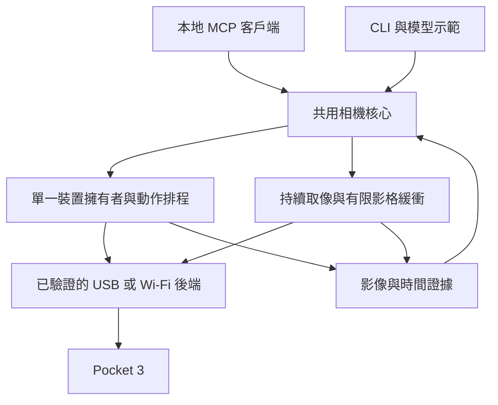

# DJI Pocket 3 MCP：能力邊界、開源生態與產品方向深度研究

研究日期：2026-09-07（Asia/Taipei）  
對象：專案作者與後續實作者  
範圍：以現有 Pocket 3、macOS 優先、獨立可發布專案為假設，回答「能做什麼、別人做到哪裡、我們應該做什麼」。

本次查讀官方文件、韌體紀錄、開源原始碼與 MCP 規格；使用者隨後授權探測已連接的相機，因此也完成了**短時間 USB 影音與小幅視角控制測試**。工作目錄原先只有 `PROJECT_PLAN.md`，尚無產品實作或 Git repository。以下「官方支持」「作者實測」「原始碼存在」「本機觀察」「研究推論」是不同證據層級，不能互換。未標發布日期的網頁均以本次存取日期為準；重要程式引用固定至所查 commit。

**實機新增結論：這台 Mac＋Pocket 3 已能透過 USB 取得 1080p／4K 約 30fps 影像；在 1080p 取像與 USB 音訊同時運作下，pan／tilt 小幅寫入都造成可觀察的畫面位移，並已恢復原設定。** 這讓 USB 優先從研究假設提升為有本機證據的開發路徑。4K60 雖出現在格式枚舉中，單次五秒測試收到零影格；中途停止、重連與長時間可靠性仍未通過驗收。詳細數據、方法及證據見 [硬體探測紀錄](HARDWARE_VALIDATION.md)。

## 1. 直接結論：值得做，但價值必須超過「相機接 MCP」

建議將定位精煉為：

> **讓 AI 使用 Pocket 3 主動選擇觀察方向，取得可追溯的新畫面，並確認動作是否真正完成。**

原計劃把核心、MCP 與模型示範分開，以及先驗證硬體的方向都應保留。這次研究支持五項調整：

1. **USB 已具備值得直接開發的本機證據。** 影像、音訊與小幅控制通過短測；接下來重點是停止、定位誤差與持續運作。官方也有 4K UVC 與 Webcam 收音說明。[DJI 韌體紀錄，2025-08-26 彙整](https://dl.djicdn.com/downloads/DJI_Osmo_Pocket_3/RN/20250826/DJI_Osmo_Pocket_3_Release_Notes_en.pdf)、[DJI Webcam 說明](https://repair.dji.com/help/content?customId=zh-cn03400006962&lang=zh-CN&re=CN&spaceId=34)。
2. **Wi-Fi 候選實作應重新排序。** 新找到的 Kaze for DJI 明確聚焦 Pocket 3，作者稱已在 iOS／Android 實機使用；它應成為主要協議參考，原計劃的 Python 專案則作 macOS 起手與對照。[Kaze for DJI，2026-08-21](https://github.com/brianmerchant/Kaze-for-DJI/tree/341a35de18493ff61f97c93b8b10161a7512aa36)。
3. **通用取像和 PTZ MCP 已有人做。** `webcam_mcp` 已提供照片與影格序列；`gaze` 已有 macOS 原生 UVC 控制及 MCP。因此四個工具可以是良好的發布單位，但不能單靠工具數量構成差異化。[Webcam MCP](https://github.com/pavel-kirienko/webcam_mcp/tree/7bbb79ee62a0ef19dee9947db7b6ce47e153ac51)、[gaze](https://github.com/Obedience-Corp/gaze/tree/3463077e30e44a326f46f5f391c6cb280c2d3a8c)。
4. **最值得投入的是可驗證的觀察流程。** 裝置識別、影格新鮮度、動作後取像、停止、重連及失敗原因，能讓它成為其他 AI 專案可靠使用的元件。這是本研究的產品判斷，尚未經使用者訪談驗證。
5. **長期功能按需求分支發展。** 桌面觀察可往區域記憶與變化比較發展；創作者可往構圖與錄影工作流發展。先用一條流程證明價值，再決定支線，不把語音、導播、常駐陪伴全部塞入第一版。

最有價值的第一個展示可以是：「看一下左邊的測試板，告訴我顯示是否如預期」，畫面中包含可由人核對的狀態。這比泛泛描述桌面更容易量測，也更能驗證 AI 是否真的從螢幕延伸到實體工作環境。

## 2. 能力邊界：裝置會做，不代表外部程式能做

### 2.1 USB、Wi-Fi 預覽、RTMP 必須當成三條路徑

| 路徑 | 有證據的能力 | 關鍵限制與本機待測項目 | 建議角色 |
|---|---|---|---|
| USB Webcam／UVC | 官方支持電腦取像，含 macOS 說明；後續韌體加入 4K 25/30P | 本輪影音與小幅 pan／tilt 並行短測成功；停止、定位語義、重連及耐久待測 | 第一條開發路徑 |
| BLE 配對＋Wi-Fi 直接預覽／控制 | Pocket 3 開源實作有 H.264 預覽、雲台和狀態回報 | 非官方協議；session、ACK、媒體重組、韌體差異及 macOS 移植 | 主動觀察的第二條驗證路徑 |
| 相機原生 Wi-Fi RTMP | 官方 Mimo 工作流支持 Pocket 3 直播 | 官方說明直播中無即時參數／運動控制；無手機啟動和第三方控制共存未證實 | 影音接入備案，不能預設是完整控制後端 |
| BLE 單獨控制 | 有配對、設定與狀態研究 | `lib-osmo-ble` 明列其 BLE 雲台命令被忽略 | 協議研究與配對輔助 |

路徑證據：[DJI Webcam](https://repair.dji.com/help/content?customId=zh-cn03400006962&lang=zh-CN&re=CN&spaceId=34)、[DJI 韌體紀錄](https://dl.djicdn.com/downloads/DJI_Osmo_Pocket_3/RN/20250826/DJI_Osmo_Pocket_3_Release_Notes_en.pdf)、[Kaze](https://github.com/brianmerchant/Kaze-for-DJI/tree/341a35de18493ff61f97c93b8b10161a7512aa36)、[DJI Mimo 直播指南](https://repair.dji.com/help/content?customId=zh-cn03400006728&lang=zh-CN&re=CN&spaceId=34)、[lib-osmo-ble](https://github.com/yigitkonur/lib-osmo-ble)。表中的排序是研究建議。

### 2.2 需要修正的官方規格理解

**4K USB 已有明確韌體證據。** 2024-05-15 的 v01.04.08.02 加入 3840×2160、25/30P UVC，並提到直播時 ActiveTrack 與 Mic 2 可用。2025-02-18 又加入 Webcam 的 D-Log M 色彩選項。官方規格與支援文章仍混有 1080p 描述；對「是否支持 4K」應優先採用明確的版本變更紀錄，再以本機枚舉確認。不能把 D-Log M 選項直接等同 Mac 已取到 10-bit 像素，也不能把機內 50/60fps 錄影等同 USB 60fps 輸出。[DJI Release Notes，第 2、4、8 頁](https://dl.djicdn.com/downloads/DJI_Osmo_Pocket_3/RN/20250826/DJI_Osmo_Pocket_3_Release_Notes_en.pdf)。

**USB 音訊已有官方支持。** 剩下要查的是這台 Mac 上的裝置來源、通道、格式、延遲和同步。官方另指出 Webcam 下 Mimo 可能連得上卻不可操作；Pocket 3 在 Webcam 模式的機內錄影需要 SD 卡，且限制於 1080p 輸出。這些限制不能擴張成「所有無線控制都不能共存」，但足以排除把 USB＋正常 Mimo 遙控當作已成立方案。[DJI Webcam 常見問題](https://repair.dji.com/help/content?customId=zh-cn03400006962&lang=zh-CN&re=CN&spaceId=34)。

**三支麥克風不等於三路原始通道。** 同樣地，官方 pan／tilt 可控範圍、機械範圍與穩定精度，是不同物理指標；它們不能直接充當第三方 API 的座標、值域或定位精度。最近對焦距離為 0.2m，鏡頭約 20mm 等效，桌面小字與近距離元件需要實拍檢查。[DJI Specs](https://www.dji.com/osmo-pocket-3/specs)。

**官方 BLE 範例的型號範圍不包含 Pocket 3。** DJI 已公開 `Osmo-GPS-Controller-Demo`，所列支持對象包括 Action 4／5 Pro／6、Osmo 360。此次未找到 Pocket 3 對應的官方公開控制 SDK；這是本輪檢索結果，不是對所有 DJI SDK 的否定。[DJI 官方範例](https://github.com/dji-sdk/Osmo-GPS-Controller-Demo)、[支持型號表](https://github.com/dji-sdk/Osmo-GPS-Controller-Demo/blob/main/docs/protocol_data_segment.md)。

**供電與無人值守要分開驗證。** DJI 說明可邊供電邊使用，且錄影時直接使用外部輸入電力。166 分鐘續航是在指定溫度、1080p24、關閉 Wi-Fi 和螢幕下測得，不能推算本專案的常駐時間。[DJI FAQ](https://www.dji.com/osmo-pocket-3/faq)。

### 2.3 從硬體邊界推導出的產品限制

以下是工程推論：

- 轉動雲台主要擴大可觀察的方向，沒有提供足夠的平移觀察能力；它無法保證看見遮擋物背面，也不應宣稱能建立可靠的 3D 地圖。
- 數位裁切適合把既有像素集中給模型；它不會憑空增加原始畫面的細節。4K 取像的主要價值可以是局部裁切，而非每次把整張 4K 圖送入模型。
- 單台相機只看得到當下視野。轉向別處時，原位置發生的短暫事件可能漏掉；「沒有看到」不能被回答成「沒有發生」。
- 單純轉向沒有讓物體更靠近鏡頭。若任務依賴近拍、小字辨識或觀察底面，調整架設位置可能比增加 AI 控制功能更有效。
- 原生 ActiveTrack、人工搖桿與外部控制可能同時爭用雲台。每次任務要知道目前由誰控制；初版測試先在人工確認關閉追蹤的條件下進行。

## 3. 別人做到哪裡，以及該如何使用這些成果

### 3.1 直接相關專案

以下是研究時的公開版本與原始碼查讀；其中 `uvc-util` 已在本機編譯並用於探測，其餘沒有在本機執行。更新日期代表所查 commit，不代表成熟度或使用者規模。

| 專案 | 實際參考價值 | 不能直接採信的部分 | 建議 |
|---|---|---|---|
| [Kaze for DJI](https://github.com/brianmerchant/Kaze-for-DJI/tree/341a35de18493ff61f97c93b8b10161a7512aa36) | Pocket 3 為主要對象；有手機端預覽、控制、狀態及協議測試向量 | 作者仍定位 early alpha；手機實測不等於 macOS 可用 | 升為 Wi-Fi 協議主要參考 |
| [DJI-Wifi-Connect](https://github.com/sniffingpickles/DJI-Wifi-Connect) | Python 結構貼近本案；macOS 配對、Wi-Fi session、媒體和雲台的起手參考 | 相機部分命令註解承認待調整；停止與命令語義需稽核 | 用於探測和對照，不整包直接發布 |
| [DJIRemote](https://github.com/TheRealShieri/DJIRemote) | Windows 相機控制路徑與實作細節 | DirectShow 介面不直接等於 macOS UVC 傳輸或角度語義 | 查清實際屬性，再設計 Mac 探測 |
| [uvc-util](https://github.com/jtfrey/uvc-util) | macOS 控制枚舉與通用 UVC 操作；本輪已成功讀寫此台 Pocket 3 | 短測不等於完整停止、精度或跨韌體支持 | 作診斷基線與 USB 後端參考 |
| [lib-osmo-ble](https://github.com/yigitkonur/lib-osmo-ble) | BLE 封包、連線及姿態研究 | 作者已記錄單用 BLE 不會驅動雲台 | 不作主要馬達後端 |
| [dji-osmo-ble-protocol](https://github.com/coolboy/dji-osmo-ble-protocol) | BLE、Wi-Fi 設定和 RTMP 啟動研究 | 封包發送成功不能證明取像與控制可並行 | 配對／RTMP 支線參考 |
| [osmosis](https://github.com/KonradIT/osmosis) | Android 無線媒體管理與協議生態 | 媒體下載能力不能視為即時觀察能力 | 日後有素材匯入需求時再研究 |
| [OpenPocketCine](https://github.com/erik-sutton95/OpenPocketCine) | 手機監看和攝影工作流的設計參考 | 查讀的 captured live-view 支持說明集中在其他型號，不能推定 Pocket 3 | 列為相鄰專案，暫不作 Pocket 3 支持證據 |

### 3.2 原始碼中的關鍵衝突

這是本次研究最能節省實作時間的發現：不同專案並不一定實作同一套正確語義。**同一命令名稱、CRC 正確、收到 ACK，仍不足以證明控制結果。**

Kaze 的協議文件把雲台控制、姿態回報、錄影接受回覆與實際狀態分開，並指出部分猜測命令曾造成錯誤動作。它對軸向與封包旗標的解讀，和較早 Python 實作有差異。應以固定版本建立對照，逐軸低幅驗證；不要混合兩邊 payload，也不要把猜測的回中命令暴露給模型。[Kaze Pocket 3 協議參考，2026-08-21](https://github.com/brianmerchant/Kaze-for-DJI/blob/341a35de18493ff61f97c93b8b10161a7512aa36/docs/POCKET3_DUML_PROTOCOL.md)。

| 查讀項目 | 實際發現 | 對本專案的決策 |
|---|---|---|
| 雲台軸和尾端旗標 | 舊 Python 將第一軸視為 yaw、第三軸視為 pitch，尾端包含 `0x0042`；Kaze 依序為 pitch／yaw，尾端為 `0x0022` | Wi-Fi 測試需逐軸對照，禁止混搭 |
| 舊 Python 停止函式 | `stop()` 結束控制執行緒；`stop_movement()` 才設定零速度，由仍在運作的迴圈送出 | 結束程序不能被包裝成已確認停止 |
| 舊 Python `nudge()` | 每次各建一個 timer | 舊 timer 可能提前停止後續動作，屬程式推論；需單一排程 |
| Windows 位置狀態 | DJIRemote 的 `CurrentPan/Tilt` 是本地累加數值 | 不能把這個欄位當硬體回饋 |

原始碼依據：[DJI-Wifi-Connect gimbal.py，2026-03-05](https://github.com/sniffingpickles/DJI-Wifi-Connect/blob/52a5cbda289b8623dbe11ee943137b51a2ac8ba7/pocket3/gimbal.py)、[Kaze 雲台命令，2026-08-21](https://github.com/brianmerchant/Kaze-for-DJI/blob/341a35de18493ff61f97c93b8b10161a7512aa36/android/app/src/main/java/com/pocket3/gimbaltest/Pocket3GimbalCommands.kt)、[DJIRemote GimbalController，2026-06-15](https://github.com/TheRealShieri/DJIRemote/blob/93e3d4b1055b665a05fc2c9b402e24b382f70177/Services/GimbalController.cs)。本次 USB 探測沒有判定 Wi-Fi payload 誰適用於本機。

還有兩個容易踩到的資料品質問題：舊 Python 的拍照與錄影函式註解承認 payload 可能需要調整；coolboy 的 BLE／RTMP 專案是相關 BLE 程式的 fork，查讀版本的 CLI 命令表沒有 README 宣稱的 `stream`。因此它不能算獨立硬體交叉驗證，也不能直接把 README 命令當成已可重現的串流方案。[Python camera.py](https://github.com/sniffingpickles/DJI-Wifi-Connect/blob/52a5cbda289b8623dbe11ee943137b51a2ac8ba7/pocket3/camera.py)、[coolboy CLI](https://github.com/coolboy/dji-osmo-ble-protocol/blob/b9a5f3c6f299a2bad470e13ad2cfd1fd6d7f6071/src/cli/index.mjs)。

### 採用原始碼前的授權決策

| 候選 | 查讀的授權狀態 | 建議 |
|---|---|---|
| Kaze、DJI-Wifi-Connect、uvc-util、Osmosis | 各自 LICENSE／專案頁標示 MIT | 可優先評估，保留來源與相關第三方 notices |
| gaze、OpenPocketCine | Apache-2.0 | 引用或移植時維持其授權與 notices |
| DJIRemote | 該固定版本未見 LICENSE，GitHub metadata 也沒有授權識別 | 暫不複製程式入發布版本；參照公開介面，另行實作或取得授權 |
| lib-osmo-ble | LICENSE／README 為 MIT，package metadata 卻寫 ISC | 列為待釐清，不直接當已完成的依賴授權稽核 |

以上記錄查讀版本內的授權文件；最終發布需核對實際納入的檔案與依賴。[Kaze LICENSE](https://github.com/brianmerchant/Kaze-for-DJI/blob/341a35de18493ff61f97c93b8b10161a7512aa36/LICENSE)、[gaze LICENSE](https://github.com/Obedience-Corp/gaze/blob/3463077e30e44a326f46f5f391c6cb280c2d3a8c/LICENSE)、[DJIRemote 固定版本](https://github.com/TheRealShieri/DJIRemote/tree/93e3d4b1055b665a05fc2c9b402e24b382f70177)、[BLE 套件 metadata](https://github.com/yigitkonur/lib-osmo-ble/blob/021e96c2bec7e9a2a81296292545bc1ee432af49/package.json)。

### 3.3 相鄰方案已證明什麼

| 方案 | 公開成果 | 對本案的啟示 |
|---|---|---|
| [Webcam MCP](https://github.com/pavel-kirienko/webcam_mcp/tree/7bbb79ee62a0ef19dee9947db7b6ce47e153ac51) | OpenCV 取像，MCP 回傳圖片或影格序列 | 取一張照片本身已相當通用，唯讀版應著重裝置診斷和證據品質 |
| [gaze](https://github.com/Obedience-Corp/gaze/tree/3463077e30e44a326f46f5f391c6cb280c2d3a8c) | 原生 UVC＋取像＋MCP，能力表區分已測與未測機型 | macOS 原生 helper 有現成架構可學；其已測表沒有 Pocket 3 |
| [AXIS Camera MCP Server](https://github.com/kotyzap/AXIS-Camera-MCP-Server/tree/3338e6557fd0118b4d3ce7e5686abfc57c9369e7) | 以 AXIS 平台提供影像、PTZ、診斷與事件等工具 | 「AI 控制攝影機」已有多種實作；不要宣稱全球首創或所有客戶端即插即用 |
| [OBSBOT SDK](https://www.obsbot.cn/sdk) | 官方提供不同產品／系統的開發工具包申請入口 | 若目標變成部署可控攝影機，可比較有官方開發接口的硬體；申請與授權條件需另外確認 |
| [Reachy Mini SDK](https://huggingface.co/docs/reachy_mini/API/reachymini) | 提供 `look_at_image`、姿態移動、取消與媒體生命週期 | 像素目標到動作的高階抽象有參考價值；不能因此把 Pocket 3 當成同等機器人 |

對 `gaze` 的固定版本查讀發現，macOS 控制使用 IOKit UVC request，取像使用 AVFoundation，並在寫入 pan／tilt 後讀回。這能作為架構參考；讀回值仍不一定是物理軸的位置。其 `vid:pid` 配對方式在有兩台同型號裝置時也不夠唯一。[gaze macOS 控制原始碼](https://github.com/Obedience-Corp/gaze/blob/3463077e30e44a326f46f5f391c6cb280c2d3a8c/src/uvc_macos.m)、[取像原始碼](https://github.com/Obedience-Corp/gaze/blob/3463077e30e44a326f46f5f391c6cb280c2d3a8c/src/see_macos.m)。後兩項為本研究的程式解讀。

**合作策略：** 可獨立發布本專案，同時把可重現的修正、Pocket 3 測試矩陣與協議發現準備成上游貢獻。價值在補足可靠性和工作流，沒有必要重寫所有 USB 或手機控制技術。此次未聯絡任何作者，也未取得新的合作承諾。

## 4. 我們該做什麼：先選任務，再選功能

以下為研究提出的需求假設；沒有訪談資料、使用量或付費意願可以支持市場規模估計。

### 4.1 優先服務的三種任務

| 任務 | 使用者真正想完成的事 | 所需能力 | 如何證明價值 |
|---|---|---|---|
| 實體開發／測試助手 | 修改韌體或軟體後，確認測試板、指示燈、儀表或顯示器的結果 | 指向目標、取新畫面、辨認狀態、保存必要證據 | 指令與視覺結果一致；可對照人工判讀 |
| 桌面觀察助手 | 查看指定區域、找可見物件、比較整理前後差異 | 有界轉向、區域名稱、視角一致性與前後影像 | 看到／未看到／無法觀察分明，不把轉頭當物品移動 |
| 創作者拍攝助手 | 檢查構圖、切換事先設定的角度、確認是否開始錄影 | 預設視角、相機狀態、錄影回讀、曝光／對焦 | 實拍成功率和人工操作步數改善 |

**第一版建議選實體開發／桌面觀察中的一項。** 這與 macOS、CLI 和 MCP 的使用環境一致，而且成功與失敗容易核對。創作者路線有價值，但需要更完整的相機設定和素材生命週期，適合後續分支。

聲控追人、陪伴、全天候巡視目前不適合作為首發承諾：它們還需要常駐主機、場景事件策略、聲音來源、追蹤控制和長時間可靠性。原計劃已排除這些內容，應保留。

### 4.2 功能優先序

P0＝首發必要；P1＝核心成功後最值得做；P2＝已有需求再做；研究＝不承諾排期。

| 功能 | 優先序 | 為何值得做／前置條件 |
|---|---|---|
| `doctor`：裝置、權限、格式和控制診斷 | P0 | 安裝失敗要能定位，不能只回「找不到相機」 |
| 能力與連線狀態 | P0 | 依實際後端提供模式、值域、證據和資料新鮮度 |
| `capture_frame` | P0 | 回傳真實影像及來源資訊；支援合理尺寸和硬性逾時 |
| 有界移動與停止策略 | P0 | 不依賴模型維持連續控制；區分有界定位和可中斷停止 |
| 動作後等待、取像、驗證 | P0，先做核心組合函式 | 直接支撐「AI 往左看」的完整閉環 |
| 唯讀模式、人工停止／暫停 | P0，本地控制即可 | 不想轉動時仍可使用；使用者能解除任務並釋放裝置 |
| 按影格座標重新構圖 `look_at` | P1 | 使用者／模型指出畫面中的位置，比猜角度自然；需座標、鏡像及控制校準 |
| 區域命名與回到原視角 | P1 | 「看看測試板」比「轉 17 度」更貼近任務；需重複定位與重新上電後失效規則 |
| 同視角前後比較 | P1 | 先做視角對齊及曝光／運動排除，再分析場景差異 |
| ROI 裁切與按需細節圖 | P1 | 先傳概覽，再傳相關局部；能利用 4K 來源而控制圖片量 |
| 限定區域、有限步數找物 | P1／P2 | 可建立小型掃視策略，但只能回報實際觀察到的範圍 |
| 有界音訊片段＋VAD | P2 | 以實測可用音訊路徑為基礎；STT 另外適配 |
| 錄影啟停＋實際狀態確認 | P2，創作者分支 | 必須能區分接受命令、錄影中和停止完成；需處理 SD 卡 |
| 曝光／白平衡／對焦設定 | P2，任務驅動 | 某些固定場景需要穩定視覺比較；每個設定都需回讀證據 |
| 素材匯入與拍攝紀錄 | P2 | 用於批次理解與工作流；可借鑑 Osmosis，先避免刪檔能力 |
| 原生 ActiveTrack 目標控制 | 研究 | 「相機內有」與「程式可設定目標」要分別驗證 |
| 聲源定位、聲音轉頭 | 研究 | USB 雙聲道並不足以證明可取得校準過的麥克風陣列資訊 |
| 24/7、多相機、多品牌 | 研究／獨立階段 | 新維運與硬體矩陣會稀釋首發範圍 |

這張表不是要求第一版新增十幾個 MCP tools。四個核心工具仍可以保留；高階行為先在共用核心與示範中組合，真正有需求時才擴充外部接口。

### 4.3 兩個值得做深的功能

**看向畫面中的目標。** 呼叫應攜帶 `frame_id` 和標準化座標，先確認它仍屬於目前視角；若畫面過期、已轉動或鏡像模式不明，就重新取像。控制器用小幅動作把目標往畫面中心移動，再拍一張確認。第一版可採有限次修正，不必先求出完整相機內參，也不應宣稱每次都能達到指定絕對角度。若只有圖片座標卻不知道物件深度，就不提供世界座標定位承諾。

**回到指定觀察區域。** 先區分兩種實作：有實測位置回饋時儲存可校準的目標；只有開迴路脈衝時，先儲存參考影像並要求人工重定位，或明確標為近似返回。移動底座、重連、換鏡像方向或變焦後，舊區域要重新驗證。Kaze 的 Mark／Return 展示了速度控制配合姿態回饋的可行研究方向；不必把找到原生絕對定位命令當成唯一出路。[Kaze 協議的高階行為說明](https://github.com/brianmerchant/Kaze-for-DJI/blob/341a35de18493ff61f97c93b8b10161a7512aa36/docs/POCKET3_DUML_PROTOCOL.md)。

### 4.4 如何驗證需求，而不是持續增加點子

建議準備三個各不超過一分鐘的原型任務，請 3–5 位已持有 Pocket 3 的開發者或創作者實際使用。這是後續工作，尚未執行。觀察：第一次接通耗時、卡住在哪一步、是否需要轉頭、是否重複使用，以及一張固定 Webcam 圖片能否同樣完成任務。

若大多數任務完全不需要轉向，先強化取像與診斷；若最常用的是錄影和構圖，就發展創作者支線；若反覆需要查看不同固定區域，優先做可重複視角。以實際行為決定產品，不以 GitHub 星數或工具數量替代需求證據。

## 5. 建議架構：把可靠性放進共用核心

這是建議設計，並非已完成的系統。

### 5.1 核心責任

**單一裝置擁有者。** 多個工具請求只能透過一個控制排程；停止優先、移動序列化、相機只由一處取像。MCP 多客戶端連線成功不代表能同時搶用雲台。先做單程序鎖／單一 session，不必一開始設計大型 daemon 平台。

**控制與影像後端在邏輯上分開，但組合要整體驗證。** USB 取像、USB 控制、USB 音訊可有不同技術元件；不能因三個元件分別成功，就推定組合後成功。Wi-Fi 後端也是如此。

**持續取像、只回傳需要的影格。** 若每次工具都重新開啟相機，會引入啟動與曝光收斂等待。保持一個有界緩衝，請求時選擇符合條件的影格；失去資料來源時停止更新，而不是用舊圖裝作正常。

**MCP 和模型不參與馬達即時迴圈。** 模型決定觀察目標，本地控制器處理移動、完成判定、停止和恢復。模型慢、失聯或超出預算時，硬體邊界仍應有效。

### 5.2 第一版結果契約

| 接口 | 建議保留的必要資訊 |
|---|---|
| `camera_status` | 裝置 ID、後端、連線狀態、能力、控制模式、最後錯誤、最後影格與回饋年齡 |
| `capture_frame` | `frame_id`、`session_generation`、來源、尺寸、鏡像／旋轉、時間戳來源與取得時間、圖片 |
| `move_gimbal` | `action_id`、請求值、實際送出值、座標／單位、接受狀態、完成狀態、確認方法 |
| `stop_gimbal` | 停止策略、是否送出、是否有硬體或視覺確認；不支持直接停止時明確回報 |

`accepted`、`completed`、`verified` 不應合併為一個成功布林值。應允許「已送出，但結果未知」；此時再次移動可能疊加效果，不可盲目自動重試。上電或重連時變更 `session_generation`，使上一個 session 的影格、動作和區域參照失效。

時間戳也需要誠實：如果只能取得主機接收／解碼時間，就使用 `received_at` 或 `decoded_at`；不知道感測器曝光時間時，`captured_at` 留空並標示來源。影格在主機上很新，不保證相機端沒有排隊延遲。端到端延遲要用可見計時器或受控燈號等另行量測。

可另有核心函式 `observe_after(action_id, timeout)`：確認動作結束、等待收斂、取得其後的新影格。移動時暫停場景變化判斷；曝光改變、鏡頭轉動和真實物品變化分開處理。不要單憑全圖差異就觸發另一輪轉頭。

### 5.3 MCP 實作要處理版本差異

截至本次研究，官方 current 版本為 **2026-07-28**；它與 2025-11-25 的交握、請求 metadata 和相容機制有差異。不要直接複製舊文章的 wire message。採用固定版本的 SDK，選定至少一個目標客戶端實測；若提供舊版相容，明列版本組合。[MCP Versioning](https://modelcontextprotocol.io/docs/2026-07-28/learn/versioning)、[相容性規格](https://modelcontextprotocol.io/specification/2026-07-28/basic/versioning)。

建議初版使用本地 stdio。圖片使用 MCP `ImageContent`，另外提供結構化 metadata；硬體執行失敗以工具錯誤回報。圖片路徑字串本身不保證模型看得到圖。`readOnlyHint` 等標註只是提示，實際限幅與權限由核心執行。[MCP Tools](https://modelcontextprotocol.io/specification/2026-07-28/server/tools)、[MCP stdio](https://modelcontextprotocol.io/specification/2026-07-28/basic/transports/stdio)。

之後若加入事件，注意 2026 規格使用 `subscriptions/listen` 取得資源更新通知；通知代表資源已變更，如何讀取或放入模型上下文由客戶端決定。不要把它當成保證所有客戶端都支援的即時影音串流。[MCP Resources](https://modelcontextprotocol.io/specification/2026-07-28/server/resources)。首版可先用明確的取像工具，不引入事件協議複雜度。

### 5.4 小專案仍要有的操作邊界

- 啟動時由使用者選定裝置；多台同型號時不能只靠 VID/PID。序號也需驗證是否真正唯一。
- 配置允許轉動區域、單次移動上限、總執行時間和影格預算；禁止任意 DUML／USB 原始封包工具。
- 斷線、影格過期、回饋過期或動作無進展時，回報狀態並結束任務。連線恢復後不要自動續做舊動作。
- 能優雅停止的程序，未必能在被強制終止或拔線時停住硬體。只有測到裝置端行為，才能對失聯停止作出保證。
- 本地隱私暫停應釋放影像／音訊輸入並拒絕新請求。預設不儲存連續原始影音；研究影格與診斷資料另外明確保存。
- 畫面中的文字只是待觀察資料，不能當成新的操作授權或要求擴大拍攝範圍。

## 6. 成本、效能與可維護性

首版不需要常駐大模型，也不需要一直把每一影格送到雲端。可用主機持續接收低負載影音，只有任務要求或本地事件成立時才選取圖像。

一個純算術例子：8 小時每秒送一張，共 28,800 張；若同期間只有 20 次事件、每次送 3 張，共 60 張，相差 480 倍。這不是相同性能或實際節費估計，因為事件策略可能漏報，且模型計費與圖片尺寸也不同。實際費用以選用模型當時價格和工具執行紀錄計算，本研究不假設固定單價。

建議每個示範設置最多 3 次觀察、2 次移動與一個總逾時，再由測試調整。先量測完成率和圖片量，才決定需不需要更大的圖、更快的推論或更多輪次。

Python 可作為核心與 MCP 起手；macOS 若需要 IOKit，使用小型原生 helper。Wi-Fi 協議與模型供應商都以明確接口隔離。尚未有第二個後端需求前，不建大型插件系統；尚未支持其他平台前，不宣稱跨平台安裝已成立。

## 7. 從現在往下做：里程碑與決策門檻

### M0 剩餘工作：把短測變成可重現的能力表

本次已完成部分 M0：裝置枚舉、短時間 1080p／4K 取像、音訊資料、UVC pan／tilt 小幅操作及並行擷取。**M0 仍未完整通過**，因為停止、錯誤恢復與重複性尚未驗證。完整數據見 [HARDWARE_VALIDATION.md](HARDWARE_VALIDATION.md)。

| 待補實驗 | 建議驗收方式 | 決策影響 |
|---|---|---|
| 韌體與環境紀錄 | 從相機畫面／Mimo 記錄韌體；USB `bcdDevice=0x0504` 不冒充韌體版號 | 建立可重現的支持組合 |
| 30 分鐘影音 | 記錄斷流、影格間隔、CPU／記憶體及同步漂移；不要只看最後一張圖 | 決定首發 1080p 或 4K 支持範圍 |
| pan／tilt 重複定位 | 每軸小幅往返至少 20 次；記錄設定、回讀和畫面對齊誤差 | 決定能否提供區域返回及容許誤差 |
| 中途停止 | 確認是否有真正停止／改寫當前目標的可用機制，量測停止後殘餘運動 | 決定 `stop_gimbal` 能力與運動上限 |
| 取消、程序中止、USB 斷線 | 各自建立測試；停止程式、停止命令和相機停止分開記錄 | 決定能否允許自主操作 |
| 主機休眠與重連 | 舊 frame／action 作廢，重新枚舉後恢復；不能自動續做先前動作 | 是否支持日常使用 |
| 1080p 和 4K 比較 | 同場景細節辨識、延遲、主機負載及線材；4K60 本次失敗保留 | 避免預設成本高卻無任務收益的格式 |
| 音訊來源與影音同步 | 近端受控聲音／可見拍手，確認來源與偏移 | 決定語音功能能否進入下一階段 |

表中次數和時間是建議的測試門檻，不是已完成數據，也不代表統計性可靠度保證。正常影音通過後再做 2 小時、8 小時耐久；未量測的溫度與電量欄位保持未知。

**USB 接下來優先。** 既然本機已能控制視角，目前沒有必要切換 Mac Wi-Fi、重建手機 session 或大規模逆向。若 USB 最終無法滿足停止和重複性要求，才用 Kaze 的固定協議快照做 Wi-Fi 對照。建議對每個無進展的探索設定工作時數上限；例如 USB 特定缺口一天、Wi-Fi 起手兩至三天後重新評估。這是避免無限探索的投入上限，不是實作工時承諾。

### M1：一個可獨立發布的可靠元件

交付相機核心、診斷 CLI、本地 MCP、單一模型示範、能力矩陣與短展示。第一條任務包含：先取像 → 決定是否移動 → 有界移動 → 等待 → 取動作後影像 → 根據證據回答。

首發測試除了 mock，也應有真正能抓到錯誤的測試：影格重連後過期、請求重複送出、同時搶用裝置、動作逾時、回讀缺失、停止優先、錯誤時禁止假成功。模型示範只需一個供應商；核心不依賴其 SDK。

若只有取像穩定，就發布明確標示唯讀的版本，保留硬體研究成果。若小幅定位可靠而直接停止仍缺乏證據，先保留人工控制／研究模式，不對外宣稱可安全執行任意自主轉向。

### M1.1：從控制工具變成任務工具

優先做 `look_at`、ROI 裁切、命名觀察區域和動作後取像的使用體驗。選 10 個可由人判定答案的桌面／測試台任務，記錄成功率、用時、影格數與失敗原因。區域比較必須加入「畫面沒有足夠重疊」「目標被遮住」「未曾觀察該區」的失敗案例。

### M2／M3：由使用情境選擇分支

- 需要口頭喚起：有界收音、VAD、STT，再接原有視覺工具。
- 需要拍攝工作流：錄影狀態、構圖、相機設定、素材匯入。
- 需要 Yunmo 常駐：在完成耐久後增加事件、預算、冷卻與來源新鮮度；Yunmo 只調用公開接口。

這些分支共用核心，不把每條支線都變成首發的前置條件。

## 8. 還不知道什麼，哪些結果會改變結論

| 未解問題 | 目前最合理判斷 | 會改變決策的新證據 |
|---|---|---|
| USB 能否可靠中途停止 | 本次只測到小幅有界操作後穩定，沒有獨立停止命令證據 | 可重複的停止／取消測試 |
| USB 位置回讀是否等於校準物理角度 | 有回讀，也有視覺變化；差值和耦合需量測 | 外部角度或可校準目標測量 |
| USB 4K60 是否完全不可用 | 本次配置五秒零影格；只足以判該組合未通過 | 不同格式／韌體下可重現且有新鮮畫面的輸出 |
| USB 音訊來自哪個實體麥克風 | 已取得相機 USB 音訊；無法僅憑裝置名區分內建或配對發射器 | 受控來源隔離與聲音測試 |
| Wi-Fi 是否適合本機 | 有較完整的 Pocket 3 手機實作，仍未在本機測試 | macOS 上影音、控制、停止及重連一起成立 |
| 精確區域返回能否成立 | 本次返回有數個像素殘差；小樣本不能估計可靠度 | 多次往返及重上電校準 |
| 長時間使用是否划算 | 現有相機可低成本試驗；沒有耐久或耗電測量 | 長時間運行結果和實際使用頻率 |
| 是否有足夠需求 | 已有相鄰工具證明方向有實作者；沒有本產品市場證據 | 真正使用者重複完成任務 |

本次限定搜尋未發現直接對應的 Pocket 3 MCP 公開專案，但搜尋覆蓋不可能完整；不宣稱全球首創。第三方 README 的「已實測」屬作者陳述，不等於我們重現了所有功能。不同型號、不同韌體、不同平台的證據均保留邊界。

研究停止於：關鍵技術路徑、競品與差異化已有足夠來源；最高影響的 USB 可用性又得到短時實機證據。剩下主要缺口需要可靠性實驗和使用者任務驗證，繼續增加泛搜尋不太可能改變下一步。

**下一個具體交付應是 USB 後端的停止與重複性驗證，接著完成一條可驗證的觀察任務。** 目前研究成果已足以支撐這個決策，不必再等整個 Yunmo 或完整影音產品成熟。

文件核驗：Markdown 標題、表格、程式區塊、引用及本地證據連結已作結構檢查；沒有產生 Word／PDF 分頁版面。硬體影格的目視檢查為抽樣，數據核對涵蓋表列各次測試。
