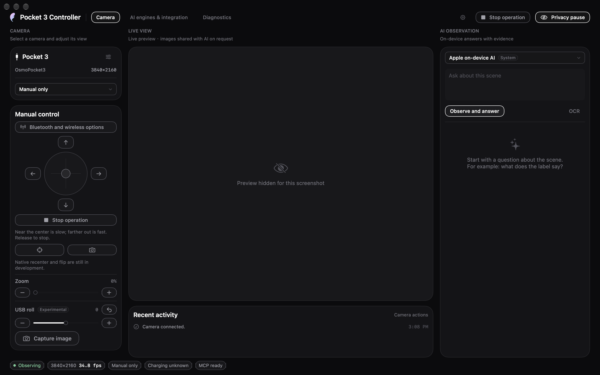
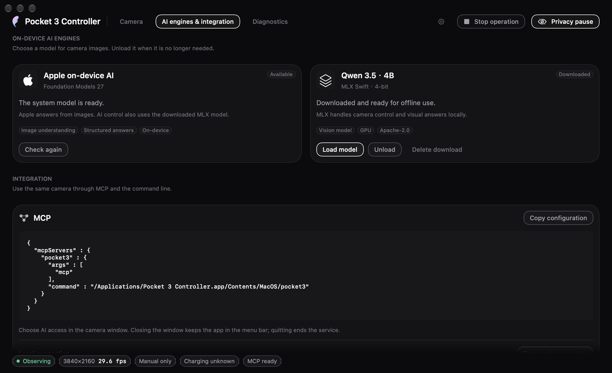
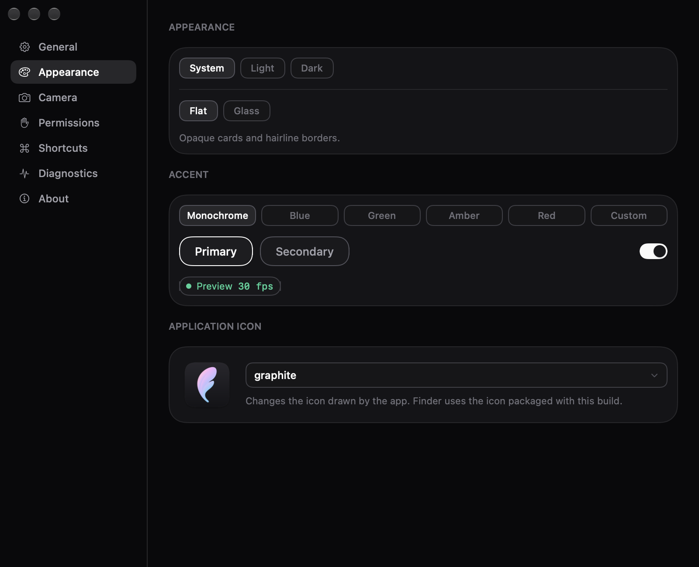

<div align="center">

# Pocket 3 Controller

**A native macOS app for Pocket 3 preview, manual gimbal control and on-device AI — with CLI and MCP access built in.**

[](#requirements-and-building)
[](#requirements-and-building)
[](https://github.com/YuhuanStudio/Pocket3-Controller/releases/tag/v0.0.1-beta.2)

English · [繁體中文](README.zh-Hant.md) · [简体中文](README.zh-Hans.md)

</div>



*Camera UI captured during beta 2 development; the sensor preview is omitted. The beta 2 build 24 media workspace is shown in the usage guide.*

## Overview

Pocket 3 Controller brings the Pocket 3 into a Mac workspace: see its USB preview,
move the gimbal by holding a direction or dragging the joystick, adjust zoom, and
ask a local model about an image. The window, menu bar panel, preferences and
status pills use the shared YunAudio / YunUI design.

It is a desktop app first. The CLI and MCP server connect to the same running app,
so another tool does not need to open or compete for the camera itself.
USB control keeps the Mac on its existing network; no camera Wi-Fi join is needed.

| | |
|---|---|
| **Published release** | [0.0.1 beta 2 · build 24](https://github.com/YuhuanStudio/Pocket3-Controller/releases/tag/v0.0.1-beta.2) |
| **Release source** | Tag `v0.0.1-beta.2`; later `main` changes may be newer |
| **Platform** | macOS 27, Apple Silicon, Pocket 3 in USB Webcam mode |
| **Interfaces** | Main window, menu bar panel, CLI and MCP over stdio |
| **Languages** | English, Traditional Chinese and Simplified Chinese |
| **Publisher** | Yuhuan Studio · independent, unofficial integration for DJI Osmo Pocket 3 |

## Download and install

| Asset | Download |
|---|---|
| Disk image | [Pocket3Controller-0.0.1-beta.2.dmg](https://github.com/YuhuanStudio/Pocket3-Controller/releases/download/v0.0.1-beta.2/Pocket3Controller-0.0.1-beta.2.dmg) |
| ZIP archive | [Pocket3Controller-0.0.1-beta.2.zip](https://github.com/YuhuanStudio/Pocket3-Controller/releases/download/v0.0.1-beta.2/Pocket3Controller-0.0.1-beta.2.zip) |
| SHA-256 checksums | [checksums-0.0.1-beta.2.txt](https://github.com/YuhuanStudio/Pocket3-Controller/releases/download/v0.0.1-beta.2/checksums-0.0.1-beta.2.txt) |
| Release notes | [Features and known limitations](https://github.com/YuhuanStudio/Pocket3-Controller/releases/tag/v0.0.1-beta.2) |

1. Download the DMG or ZIP and move **Pocket 3 Controller.app** into **Applications**.
2. Open the app. This beta is signed with a local development certificate and is
   **not notarized**. If macOS blocks it, open **System Settings → Privacy & Security → Open Anyway** for this download after checking its source.
3. Connect Pocket 3 by USB and select **Webcam** on the camera. Select the device
   in the app, connect, and allow camera access when macOS asks.
4. Use the preview and manual controls. For local AI or an external client,
   explicitly choose the observation or control access you want to grant.

There is no Homebrew cask yet. The app uses Sparkle with this project's signed
beta feed, now published and verified. The public feed and its downloadable ZIP
passed public-key signature verification. Update installation and relaunch
between published versions have not yet been verified.

## Features

### USB preview and controls

Hold a direction or drag the joystick to move pan and tilt. Moving farther from
the joystick's centre requests faster movement; releasing it, losing focus or
using Stop ends the gesture. The implementation follows bounded USB position
targets. Full physical range, speed calibration and worst-case stopping latency
remain under evaluation.

Zoom uses the camera's reported range and step. The app shows control travel,
not a calibrated optical zoom ratio. A 100 → 200 → 100 raw-value round trip has
been verified on hardware. USB Roll is labelled **Experimental**: a 0 → 1 → 0
raw-value round trip is recorded, but physical angle and moving-stop behaviour
are not fully verified.

| Capture combination | Hardware evidence |
|---|---|
| 1280 × 720 · NV12 · 30 fps | Fresh frames observed |
| 1920 × 1080 · NV12 · 24 / 30 fps | Fresh frames observed; 30 fps used for the beta smoke test |
| 3840 × 2160 · NV12 · 30 fps | Fresh frames observed in earlier bounded trials |
| Portrait formats | Earlier trials passed after changing the camera's physical orientation; this does not verify every orientation or advertised format |

Choose a format and reconnect to apply it. Advertised formats are not a list of
verified combinations: H.264 / UYVY paths, 4K60 and every high-frame-rate option
are not supported by a passing capture result. See the [hardware record](docs/HARDWARE_ACCEPTANCE.md)
for the conditions of individual trials.

### Bluetooth status

Explicitly select and pair a Bluetooth device to read camera-reported battery,
charging state, pose, focus mode, white balance and exposure state. Low battery
and a sustained falling battery level have distinct status indications.

These are read-only reports. Bluetooth identity is not automatically equated
with the USB camera, and its pose coordinates are not calibrated to USB controls.
USB preview and these BLE reports have been observed working together without
changing the Mac's Wi-Fi connection.

**Still in development:** native rapid recenter and front/back flip, app-side
tap-to-focus, and writable camera settings. The camera body's own tap-to-focus
and a readable AF mode do not mean that the app can set a focus point.

### Local AI and access

Apple Foundation Models, MLX Qwen 3.5 and Vision tools provide local image
questions, OCR and barcode reading. Apple features depend on system-model
availability; the optional MLX model is downloaded only when requested. Core AI model evaluation has a measured GPU path;
this project does not claim that every AI workload runs on the Neural Engine.

**Build 16 development branch — model responsibilities.**
When **Apple** is selected and AI movement or zoom is available, the already-downloaded
MLX model runs the complete camera tool loop; the app refreshes the final frame,
and Apple answers from that new image. This is not Apple independently calling
camera tools. Apple observation-only use does not require MLX; selecting **MLX**
still lets MLX handle its own camera tools and answer.

The app does not download MLX automatically. If this control workflow needs a
missing model, the UI explains that requirement; choose the download explicitly,
or use Apple with observation-only access. Development responses expose
`metadata.executionRoles`: `controllerEngine=mlx`, `answerEngine=apple`,
`finalFrameRefresh=app` for the combined route. These roles are separate from
actual action evidence. A bounded live-camera run passed all 11 checks in 38.039 seconds:
MLX made four model tool calls, with one raw-200 zoom; the app then obtained a
frame newer than the final model capture, and Apple answered it. That host refresh
is not an extra SDK tool call. Raw 100 and manual access were restored afterward.
This proves that case, not Apple-only camera control, every MCP scenario, or a
capability of the published beta 1 binary. See the [hardware record](docs/HARDWARE_ACCEPTANCE.md).

AI access starts off. Manual controls take priority over AI; movement and zoom
require the corresponding access and verification conditions. A model's
text is not proof that a camera action completed; callers receive tool results
and frame metadata. **Privacy pause** releases camera and audio inputs. Closing
the window leaves the menu bar service running; quitting ends it.

## Interface

<table>
<tr>
<td width="50%" valign="top"><br><b>AI engines and integration</b><br>Choose a local engine and copy the MCP configuration for your installed app.</td>
<td width="50%" valign="top"><br><b>Appearance</b><br>Shared Yun controls, themes and language preferences.</td>
</tr>
</table>

These camera screenshots were captured during beta 2 development, with the sensor preview omitted. They contain no Pocket 3 photographs. The [build 23 media workspace screenshot](docs/guide.md#build-23-verified-development-images-selected-video-frames-and-areas) shows the later file-analysis UI shipped in build 24.

## MCP and CLI

Keep the app running and copy its configuration from **AI engines and integration**,
or use this configuration after installing in Applications:

```json
{
  "mcpServers": {
    "pocket3": {
      "command": "/Applications/Pocket 3 Controller.app/Contents/MacOS/pocket3",
      "args": ["mcp"]
    }
  }
}
```

The six tools are `camera_status`, `capture_frame`, `move_gimbal`, `stop_gimbal`,
`camera_zoom_status` and `camera_set_zoom`. The helper uses a private local Unix
socket to reach the app. External observation and camera actions follow the
app's access setting; the default leaves control with the person using the app.

```sh
'/Applications/Pocket 3 Controller.app/Contents/MacOS/pocket3' status
'/Applications/Pocket 3 Controller.app/Contents/MacOS/pocket3' snapshot --output "$PWD/pocket3-frame.jpg"
'/Applications/Pocket 3 Controller.app/Contents/MacOS/pocket3' ask --engine apple --question 'What is visible?'
```

The snapshot command writes to the path you supply and needs observation access.
See the [usage guide](docs/guide.md#mcp-and-cli) for session-bound zoom requests and
how to handle unconfirmed or cancelled actions.

## Requirements and building

Building requires full Xcode with the macOS 27 SDK. Scripts use
`/Applications/Xcode-beta.app/Contents/Developer` when available without changing system-wide `xcode-select`.

```sh
./Scripts/build-app.sh
./Scripts/verify.sh
./Scripts/verify.sh --release --ui --models --package
```

Build output is `dist/Pocket 3 Controller.app`. Use tag `v0.0.1-beta.2` to reproduce
beta 2; `main` may contain later development. The full gate relaunches the app and
needs the optional MLX model downloaded first. It prepares evaluation fixtures
automatically and does not open the camera. Finish active app work before running it.

## Verification

The historical public beta 1 build is tied to clean source [`21778c0`](https://github.com/YuhuanStudio/Pocket3-Controller/commit/21778c0e6ddec9ec9da017683f74c62177443985).
Its release verification includes **397 tests**, **59 UI captures**, shared-design
and three-language checks, copied-app inference, and ZIP / DMG payload signatures
and hashes. A separate clean-checkout compilation passed, and the public downloads
were fetched and matched against the prepared asset hashes.

Hardware smoke testing covers a bounded preview, manual release and restoration,
zoom round trip, privacy pause / reconnection and final Stop. It does not certify
all camera functions, mechanical emergency stopping or complete physical range.
Local Apple / MLX simulated-camera tool tests are not hardware movement evidence.
Historical reports retain their original conditions and limitations.

## Documentation and development

Start with the [usage guide](docs/guide.md) for everyday operation, or the
[documentation index](docs/README.md) for validation, design and release records.
The [device roadmap](docs/DEVICE_CAPABILITY_ROADMAP.md) and [TODO](TODO.md) track
unfinished work; the [beta 2 release page](https://github.com/YuhuanStudio/Pocket3-Controller/releases/tag/v0.0.1-beta.2)
defines the published download. See [Contributing](CONTRIBUTING.md) before changing
hardware control or shared design behaviour.

## Attribution

YunAudio / YunUI supply the shared design; uvc-util, Kaze and the model projects have their own licences.
See [NOTICE.md](NOTICE.md) and the licences included in the app. The project's own source has no
separate open-source licence. Pocket 3 Controller is not an official DJI product.

[Beta 2 release notes](docs/releases/0.0.1-beta.2.md) · [Public beta 2 verification summary](docs/releases/0.0.1-beta.2-verification.json) · [Historical beta 1 verification](docs/releases/0.0.1-beta.1-verification.json)
