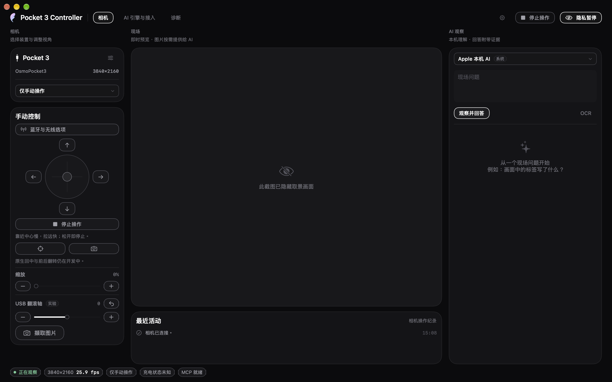
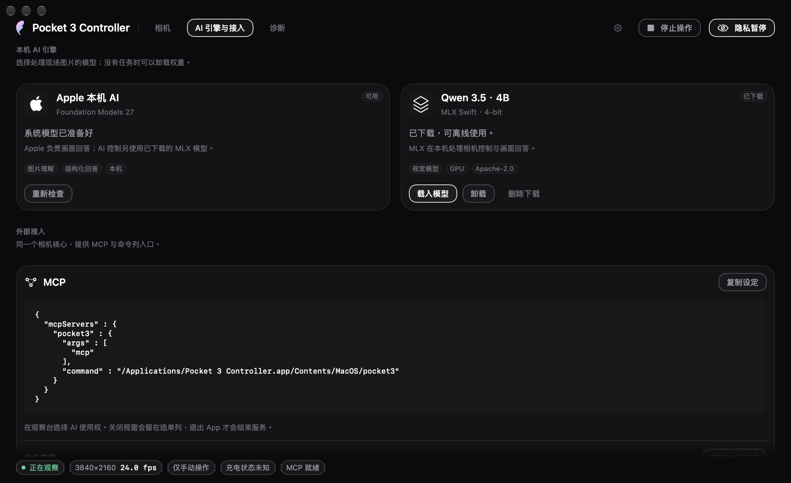
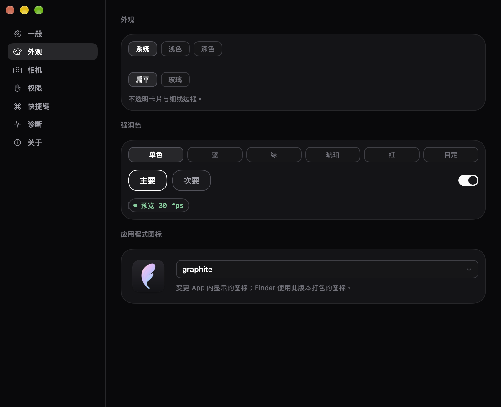

<div align="center">

# Pocket 3 Controller

**Pocket 3 的原生 macOS 控制 App：USB 预览、持续云台控制、本地 AI，以及 MCP 接入。**

[](#系统需求与构建)
[](#系统需求与构建)
[](https://github.com/YuhuanStudio/Pocket3-Controller/releases/tag/v0.0.1-beta.1)

[English](README.md) · [繁體中文](README.zh-Hant.md) · 简体中文

[下载 beta 1](https://github.com/YuhuanStudio/Pocket3-Controller/releases/tag/v0.0.1-beta.1) · [文件](docs/zh-Hans/README.md) · [反馈问题](https://github.com/YuhuanStudio/Pocket3-Controller/issues)

</div>



*当前开发界面：beta 2 build 16，已隐藏取景；公开下载为 beta 1 build 9。*

## 概览

Pocket 3 Controller 让 Mac 成为 Pocket 3 的操作界面：看预览、按住方向或拖动摇杆移动、采集帧，再让本地模型解读画面。App 统一持有相机；CLI 和 MCP helper 通过同用户的私有 Unix socket 调用它，沿用同一套权限与停止流程。

界面及通用 App 功能沿用 [YunAudio](https://github.com/YuhuanStudio/YunAudio)／YunUI 的设计语言，包括窗口、菜单栏、设置、主题、语言与状态栏。相机控制的状态与操作则按这个 App 的用途调整。

| | |
|---|---|
| **目前下载** | **0.0.1 beta 1，build 9**，tag `v0.0.1-beta.1` |
| **开发分支** | `main` 正在开发 **beta 2，build 21**；不是已发布版本 |
| **平台** | Apple Silicon、macOS 27 或更新 |
| **界面** | 原生 App、菜单栏、CLI、MCP stdio |
| **控制路径** | USB 预览及手动 pan／tilt；BLE 提供另行配对的只读报告 |
| **网络** | Mac 保留原有的网络／互联网连接，不加入相机 Wi-Fi |

这是早期 Beta，不是 DJI 官方软件；尚未取代所有机身设置。

## 下载与安装

从已发布的 [0.0.1 beta 1](https://github.com/YuhuanStudio/Pocket3-Controller/releases/tag/v0.0.1-beta.1) 选择：

| 文件 | 用途 |
|---|---|
| [DMG](https://github.com/YuhuanStudio/Pocket3-Controller/releases/download/v0.0.1-beta.1/Pocket3Controller-0.0.1-beta.1.dmg) | 开启磁盘映像，将 App 拖到 Applications |
| [ZIP](https://github.com/YuhuanStudio/Pocket3-Controller/releases/download/v0.0.1-beta.1/Pocket3Controller-0.0.1-beta.1.zip) | 解压后将 App 放到 Applications |
| [SHA-256 checksums](https://github.com/YuhuanStudio/Pocket3-Controller/releases/download/v0.0.1-beta.1/checksums-0.0.1-beta.1.txt) | 比对下载文件的完整性 |
| [Release 说明](https://github.com/YuhuanStudio/Pocket3-Controller/releases/tag/v0.0.1-beta.1) | 本版功能与已知限制 |

1. 把 **Pocket 3 Controller.app** 放入 Applications，再开启 App。
2. 用可传输数据的 USB 线连接 Pocket 3，在机身选择 **Webcam** 模式。
3. 在 App 选择相机并连接，需要时授予相机权限。
4. 从 1920×1080、30 fps、NV12 开始，确认新帧再操作控制。

此版本使用固定本地开发证书，**尚未 Apple 公证，也不是 Developer ID 公开分发签名**。若 macOS 阻挡首次启动，确认来源后可依「系统设置 → 隐私与安全性」中的「仍要打开」提示操作。不需要停用 SIP 或 Gatekeeper。其他 Mac 的首次启动与权限行为仍需要报告与验证。

App 已接入 Sparkle，build 9 配置了本项目独立的更新身份。**Beta signed feed 已完成 Keychain 签名并发布**；从公开 HTTPS 重新下载的 feed 与 ZIP，已使用 CryptoKit 及本项目 Ed25519 公钥验证通过。自动检查依用户偏好启用；实际跨版本更新的安装、替换与重启仍未验收。也可从 Release 页手动下载，目前没有 Homebrew 安装方式。[发布流程](docs/RELEASE.md)

## 功能

### USB 预览与手动控制

按住方向按钮或拖动摇杆持续移动 pan／tilt；拖动离中心越远，移动越快。松开、失焦或按 Stop 结束操作。手动控制会接管 AI，无须先建立 BLE 电机控制或切换 Mac 的 Wi-Fi。

USB 缩放可由 App、CLI、MCP 与 App 内 AI 使用，已有 100 → 200 → 100 原始值往返的真机证据。数值是设备的原始控制刻度，须遵守当次读到的最小值、最大值及 step，不能解读成已校准的光学倍率。Roll 为实验功能，已有 0 → 1 → 0 原始值往返；物理角度及移动中停止尚未全面验收。[云台控制](docs/CONTINUOUS_GIMBAL.md) · [USB Roll](docs/USB_ROLL.md)

以下是已取得新帧的 NV12 真机基线，不代表所有系统、固件或输入格式组合都通过：

| 分辨率 | 帧率 | 实测情况 |
|---|---|---|
| 1280×720 | 30 fps | NV12 |
| 1920×1080 | 24／30 fps | NV12 |
| 3840×2160 | 30 fps | NV12 |
| 竖屏格式 | 依各次试验 | 早期改变机身物理方向后取得帧，不代表所有方向或声明格式均通过 |

App 会列出设备声明的分辨率、帧率与输入格式；改选后重新连接才生效。**声明可用不等于实测可用**。H.264、4K60、所有 UYVY／高帧率组合及原生竖屏尚未全面打通；竖屏选项也不能当作机身原生竖屏录像已支持。[硬件验收](docs/HARDWARE_ACCEPTANCE.md)

### BLE 电量与机身回报

明确配对后可查看电量、充电状态、姿态，以及 AF、白平衡、曝光等已收到的只读状态。低电量或多笔报告持续下降时，状态提示会说明情况。USB 预览与 BLE 报告已有共存证据。

「未充电」不直接判为故障，USB 的配置电流也不是实际充电量。BLE peer 不自动绑成目前 USB 相机；姿态尚未与 USB 控制坐标校准。只读报告不表示这些机身设置已可写入。[遥测规则](docs/BLUETOOTH_TELEMETRY.md)

### 本地 AI 与帧观察

Apple Foundation Models 在系统模型可用时提供图片问答；MLX 路径可下载固定 revision 的 Qwen 3.5 4B 4-bit 模型，使用 Apple Silicon GPU 在本地推理。Vision 提供 OCR／条码工具，Core AI 使用随附的 YOLOS tiny Float32 模型做对象检测。

模型可加载、取消与卸载。结果带有来源帧及工具执行记录，不能只靠模型说「完成了」就认定相机真的移动。MLX 不是 ANE 路径；Core AI 的计算偏好也不是实际使用 Neural Engine 的证据。模型仍可能误认或算错对象。[AI 验证](docs/AI_VALIDATION.md)

**build16开发分支：模型分工。** 选择 **Apple** 且AI移动或缩放能力可用时，由已下载的MLX模型执行完整相机工具流程，App更新最后一帧，再由Apple根据这张新图回答；不能描述成Apple独立调用了相机工具。纯Apple“只允许观察”不需要MLX；选择 **MLX** 时仍由MLX自行执行相机工具并回答。

App不会自动下载MLX。需要这条控制流程却尚未下载模型时，UI会提示；你可明确下载，或先改用Apple的仅观察模式。开发版回复的`metadata.executionRoles`会标明混合路径的`controllerEngine=mlx`、`answerEngine=apple`及`finalFrameRefresh=app`，角色分工不代替实际动作证据。一次有界真机任务已在38.039秒内通过全部11项检查：MLX调用四次模型工具、仅一次raw200缩放，App再取得比最后一次模型取像更新的帧，由Apple回答。这次host更新不算额外SDK工具调用；之后恢复raw100及manual。此结果只证明该案例，不表示Apple单独控制、所有MCP情境或公开beta1已支持。[硬件记录](docs/HARDWARE_ACCEPTANCE.md)

### 权限与日常使用

AI 访问默认关闭。选择「只允许观察」后，外部 MCP／CLI 才能取像；允许移动还需要控制权及当次连接的验证。MCP 取到的帧会交给你选择的客户端，后续使用依该客户端设置。

隐私暂停释放音视频输入。麦克风只在启用相应功能时请求，BLE 也不在 App 初始化时自动连接。关闭窗口会保留菜单栏服务，退出 App 才结束。主菜单、齿轮或 ⌘, 可开启设置；菜单栏图标左键开面板，右键／Control-click 开功能菜单。

## 界面

以下截图为当前 beta 2 开发界面（build 16），取景画面已隐藏，不含 Pocket 3 实拍照片；公开 beta 1 安装包仍为 build 9。

<table>
<tr>
<td width="50%" valign="top"><br><b>AI 引擎与接入</b><br>选择本地模型、检查引擎状态并复制 MCP 设置。</td>
<td width="50%" valign="top"><br><b>外观与设置</b><br>沿用 Yun 的主题、图标、语言与通用 App 操作。</td>
</tr>
</table>

## MCP 与 CLI

「AI 引擎与接入」页可复制符合目前 App 位置的 MCP 设置。安装于 Applications 时，例如：

```json
{
  "mcpServers": {
    "pocket3": {
      "command": "/Applications/Pocket 3 Controller.app/Contents/MacOS/pocket3",
      "args": ["mcp"]
    }
  }
}
```

MCP helper 使用 stdio，通过同用户私有 Unix socket 调用已开启的 App，不另行抢占相机。

| 工具 | 用途 |
|---|---|
| `camera_status` | 读取选定相机、权限、能力及帧新鲜度，不自动开启相机 |
| `capture_frame` | 在允许观察时取得新 JPEG 与帧／session 信息 |
| `move_gimbal` | 经验证与授权的有界 UVC 移动，返回动作后证据 |
| `stop_gimbal` | 取消排队动作，报告停止及读回结果 |
| `camera_zoom_status` | 读取当次连接的缩放范围与原始值 |
| `camera_set_zoom` | 依同一 session 的范围、step 与控制权设置缩放 |

```sh
'/Applications/Pocket 3 Controller.app/Contents/MacOS/pocket3' status
'/Applications/Pocket 3 Controller.app/Contents/MacOS/pocket3' snapshot --output frame.jpg
'/Applications/Pocket 3 Controller.app/Contents/MacOS/pocket3' ask --engine apple --question '画面中有什么？'
'/Applications/Pocket 3 Controller.app/Contents/MacOS/pocket3' mcp
```

缩放先读 `camera_status.capture.sessionID`，使用同一 `expectedSessionID` 调用 `camera_zoom_status`，再把符合 minimum／maximum／step 的整数 `rawValue` 传给 `camera_set_zoom`。检查结果的 `completed`／`verified`，再取新帧；未确认或取消的动作不要盲目重试。`move_gimbal` 的 UVC 目标不等同 DJI 原生快速 preset，送出命令也不是已完成物理动作的证明。[示例](Examples/README.md)

## 系统需求与构建

- **Apple Silicon、macOS 27 或更新。** Apple 系统模型另需在该 Mac 可用；MLX 权重是可选下载，不含于 App 压缩包。
- **源代码构建需要带 macOS 27 SDK 的完整 Xcode 工具链。** 构建脚本可使用 `/Applications/Xcode-beta.app/Contents/Developer`，不更改全系统 `xcode-select`。
- Swift Package Manager 依赖及 revision 位于 `Package.resolved`。构建需取得依赖；公开模型评估图片按固定 SHA-256 下载。

```sh
git clone https://github.com/YuhuanStudio/Pocket3-Controller.git
cd Pocket3-Controller
./Scripts/build-app.sh release
open 'dist/Pocket 3 Controller.app'
```

`main` 是 beta 2 开发版本。复现已发布 beta 1 时，在构建前使用 `git checkout v0.0.1-beta.1`。构建脚本会依序解析依赖、套用已有兼容修补、组装资源及本地签名；不需要另外复制研究 checkout。

## 验证

```sh
./Scripts/verify.sh
./Scripts/verify.sh --release --ui --models --package
```

beta 1 发布验证包含 **397 项 Release 测试、59 张 UI 检查**，以及 ZIP／只读 DMG 包内签名与 hash 核对。来源 [`21778c0`](https://github.com/YuhuanStudio/Pocket3-Controller/commit/21778c0e6ddec9ec9da017683f74c62177443985) 的干净副本另完成依赖解析、修补及冷 Release 编译；冷编译不冒充另一份完整 App 签名验收。公开下载亦已重新取得并与准备好的发布文件的 hash 比对。

`--ui` 会重开 App、切换页面并检查窗口生命周期；`--models` 会从搬移后的 App 实际推理及卸载；`--package` 产生并核对安装包。这些 gate 不开启相机。模型检查需先下载默认 MLX 模型，执行前先结束目前 App 操作。隐藏 `.build` 后的资源验证用来确认 App 不依赖构建目录。

真机证据另包含已列出的 NV12 格式、按住／拖动后松开、Stop、缩放往返、隐私暂停及重连。**完整物理范围、校准速度、所有停止情境、原生快速回中／翻转与 App 点按 AF 仍未完成**。Roll 保持实验标注；稳定遥测／USB 读回不是机械急停认证。

## 文档与开发

[完整使用指南](docs/zh-Hans/guide.md) 说明首次使用与常见问题；[文档入口](docs/zh-Hans/README.md) 汇总控制、遥测、AI、发布与设计数据。[TODO](TODO.md) 与[能力路线图](docs/DEVICE_CAPABILITY_ROADMAP.md) 保留未完成范围；不能把开发分支或单次测试当成已发布支持。修改硬件控制或共享设计前，先看 [参与开发](CONTRIBUTING.md)。

目前持续研究机身设置、原生快速 preset、点按 AF、更多可靠格式及完整控制范围。慢速轨迹不是机身快速 preset 的替代；Mac 也不切换到相机 Wi-Fi。反馈问题时附版本、macOS 与复现步骤；相机影像、设备序号和完整诊断由你决定是否分享。本地原始研究与测试证据不随来源发布。[测试产物政策](docs/TEST_ARTIFACTS.md)

## 归属与授权

Copyright © 2026 Yuhuan Studio。项目自有来源尚未授予独立开源授权；公开 repository 不代表可以任意重新授权。具体范围见 [NOTICE.md](NOTICE.md)。

YunAudio／YunUI 设计、uvc-util、Kaze 协议参考、Apple Core AI 支持及模型权重各自保留原授权；Swift 依赖授权随 App 放在 `Contents/Resources/Licenses`。[第三方说明](ThirdParty/README.md) · [模型归属](ThirdParty/ModelWeights/NOTICE.md)

[beta 1 公开验证摘要](docs/releases/0.0.1-beta.1-verification.json)
