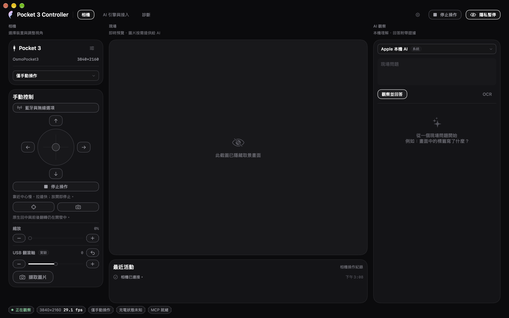
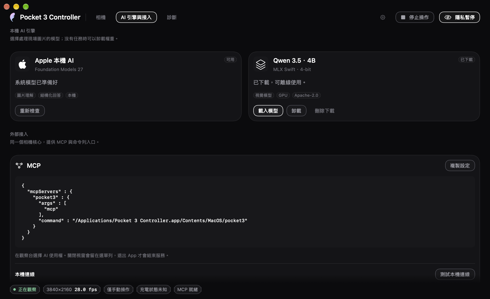
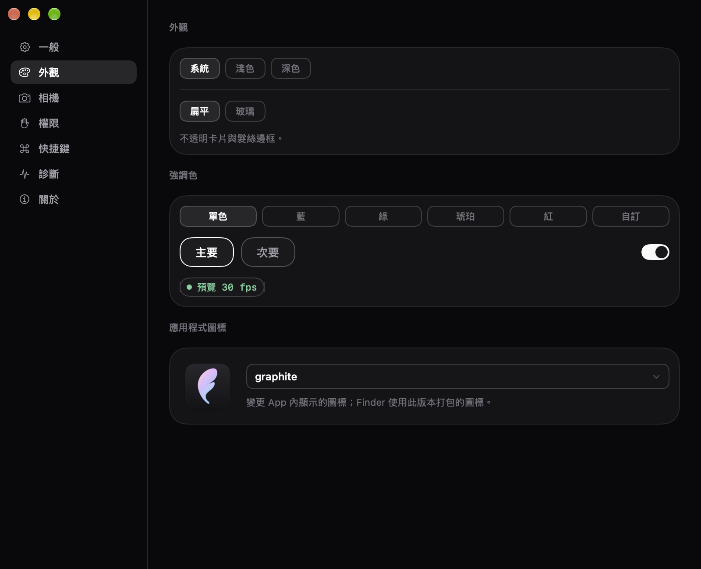

<div align="center">

# Pocket 3 Controller

**Pocket 3 的原生 macOS 控制 App：USB 預覽、持續雲台控制、本機 AI，以及 MCP 接入。**

[](#系統需求與建置)
[](#系統需求與建置)
[](https://github.com/YuhuanStudio/Pocket3-Controller/releases/tag/v0.0.1-beta.2)

[English](README.md) · 繁體中文 · [简体中文](README.zh-Hans.md)

[下載 beta 2](https://github.com/YuhuanStudio/Pocket3-Controller/releases/tag/v0.0.1-beta.2) · [文件](docs/zh-Hant/README.md) · [回報問題](https://github.com/YuhuanStudio/Pocket3-Controller/issues)

</div>



*相機介面攝於 beta 2 開發期間，已隱去取景；build 24 的媒體工作區見完整指南。*

## 概觀

Pocket 3 Controller 讓 Mac 成為 Pocket 3 的操作介面：看預覽、按住方向或拖曳搖桿移動、擷取影格，再讓本機模型解讀畫面。App 統一持有相機；CLI 和 MCP helper 透過同使用者的私有 Unix socket 呼叫它，沿用同一套權限與停止流程。

介面及通用 App 功能沿用 [YunAudio](https://github.com/YuhuanStudio/YunAudio)／YunUI 的設計語言，包括視窗、選單列、設定、主題、語言與狀態列。相機控制的狀態與操作則按這個 App 的用途調整。

| | |
|---|---|
| **目前下載** | **0.0.1 beta 2，build 24**，tag `v0.0.1-beta.2` |
| **發布來源** | 以 `v0.0.1-beta.2` 重現；後續 `main` 可能更新 |
| **平台** | Apple Silicon、macOS 27 或更新 |
| **介面** | 原生 App、選單列、CLI、MCP stdio |
| **控制路徑** | USB 預覽及手動 pan／tilt；BLE 提供另行配對的只讀回報 |
| **網路** | Mac 保留原本的網路／網際網路連線，不加入相機 Wi-Fi |

這是早期 Beta，不是 DJI 官方軟體；尚未取代所有機身設定。

## 下載與安裝

從已發布的 [0.0.1 beta 2](https://github.com/YuhuanStudio/Pocket3-Controller/releases/tag/v0.0.1-beta.2) 選擇：

| 檔案 | 用途 |
|---|---|
| [DMG](https://github.com/YuhuanStudio/Pocket3-Controller/releases/download/v0.0.1-beta.2/Pocket3Controller-0.0.1-beta.2.dmg) | 開啟磁碟映像，將 App 拖到 Applications |
| [ZIP](https://github.com/YuhuanStudio/Pocket3-Controller/releases/download/v0.0.1-beta.2/Pocket3Controller-0.0.1-beta.2.zip) | 解壓後將 App 放到 Applications |
| [SHA-256 checksums](https://github.com/YuhuanStudio/Pocket3-Controller/releases/download/v0.0.1-beta.2/checksums-0.0.1-beta.2.txt) | 比對下載檔案的完整性 |
| [Release 說明](https://github.com/YuhuanStudio/Pocket3-Controller/releases/tag/v0.0.1-beta.2) | 本版功能與已知限制 |

1. 把 **Pocket 3 Controller.app** 放入 Applications，再開啟 App。
2. 用可傳輸資料的 USB 線連接 Pocket 3，在機身選擇 **Webcam** 模式。
3. 在 App 選擇相機並連接，需要時授予相機權限。
4. 從 1920×1080、30 fps、NV12 開始，確認新影格再操作控制。

此版本使用固定本機開發憑證，**尚未 Apple 公證，也不是 Developer ID 公開發行簽署**。若 macOS 阻擋首次啟動，確認來源後可依「系統設定 → 隱私權與安全性」中的「仍要打開」提示操作。不需要停用 SIP 或 Gatekeeper。其他 Mac 的首次啟動與權限行為仍需要回報與驗證。

App 已接入 Sparkle，build 9 配置了本專案獨立的更新身分。**Beta signed feed 已完成 Keychain 簽署並發布**；從公開 HTTPS 重新下載的 feed 與 ZIP，已使用 CryptoKit 及本專案 Ed25519 公鑰驗證通過。自動檢查依使用者偏好啟用；實際跨版本更新的安裝、替換與重啟仍未驗收。也可從 Release 頁手動下載，目前沒有 Homebrew 安裝方式。[發布流程](docs/RELEASE.md)

## 功能

### USB 預覽與手動控制

按住方向按鈕或拖曳搖桿持續移動 pan／tilt；拖曳離中心越遠，移動越快。放開、失焦或按 Stop 結束操作。手動控制會接管 AI，無須先建立 BLE 馬達控制或切換 Mac 的 Wi-Fi。

USB 縮放可由 App、CLI、MCP 與 App 內 AI 使用，已有 100 → 200 → 100 原始值往返的實機證據。數值是裝置的原始控制刻度，須遵守當次讀到的最小值、最大值及 step，不能解讀成已校準的光學倍率。Roll 為實驗功能，已有 0 → 1 → 0 原始值往返；物理角度及移動中停止尚未全面驗收。[雲台控制](docs/CONTINUOUS_GIMBAL.md) · [USB Roll](docs/USB_ROLL.md)

以下是已取得新影格的 NV12 實機基線，不代表所有系統、韌體或輸入格式組合都通過：

| 解析度 | 幀率 | 實測情況 |
|---|---|---|
| 1280×720 | 30 fps | NV12 |
| 1920×1080 | 24／30 fps | NV12 |
| 3840×2160 | 30 fps | NV12 |
| 直幅格式 | 依各次試驗 | 早期改變機身實體方向後取得影格，不代表所有方向或宣告格式均通過 |

App 會列出裝置宣告的解析度、幀率與輸入格式；改選後重新連接才生效。**宣告可用不等於實測可用**。H.264、4K60、所有 UYVY／高幀率組合及原生直幅尚未全面打通；直幅選項也不能當作機身原生直幅錄影已支援。[硬體驗收](docs/HARDWARE_ACCEPTANCE.md)

### BLE 電量與機身回報

明確配對後可查看電量、充電狀態、姿態，以及 AF、白平衡、曝光等已收到的只讀狀態。低電量或多筆回報持續下降時，狀態提示會說明情況。USB 預覽與 BLE 回報已有共存證據。

「未充電」不直接判為故障，USB 的配置電流也不是實際充電量。BLE peer 不自動綁成目前 USB 相機；姿態尚未與 USB 控制座標校準。只讀回報不表示這些機身設定已可寫入。[遙測規則](docs/BLUETOOTH_TELEMETRY.md)

### 本機 AI 與影格觀察

Apple Foundation Models 在系統模型可用時提供圖片問答；MLX 路徑可下載固定 revision 的 Qwen 3.5 4B 4-bit 模型，使用 Apple Silicon GPU 在本機推論。Vision 提供 OCR／條碼工具，Core AI 使用隨附的 YOLOS tiny Float32 模型做物件偵測。

模型可載入、取消與卸載。結果帶有來源影格及工具執行紀錄，不能只靠模型說「完成了」就認定相機真的移動。MLX 不是 ANE 路徑；Core AI 的運算偏好也不是實際使用 Neural Engine 的證據。模型仍可能誤認或算錯物件。[AI 驗證](docs/AI_VALIDATION.md)

**build16開發分支：模型分工。** 選擇 **Apple** 且AI移動或縮放能力可用時，由已下載的MLX模型執行完整相機工具流程，App更新最後影格，再由Apple根據這張新圖回答；不能描述成Apple獨立呼叫了相機工具。純Apple「只允許觀察」不需要MLX；選擇 **MLX** 時仍由MLX自行執行相機工具並回答。

App不會自動下載MLX。需要這條控制流程卻尚未下載模型時，UI會提示；你可明確下載，或先改用Apple的只觀察模式。開發版回覆的`metadata.executionRoles`會標明混合路徑的`controllerEngine=mlx`、`answerEngine=apple`及`finalFrameRefresh=app`，角色分工不代替實際動作證據。一次有界真機任務已在38.039秒內通過全部11項檢查：MLX呼叫四次模型工具、僅一次raw200縮放，App再取得比最後一次模型取像更新的影格，由Apple回答。這次host更新不算額外SDK工具呼叫；其後恢復raw100及manual。此結果只證明該案例，不表示Apple單獨控制、所有MCP情境或公開beta1已支援。[硬體紀錄](docs/HARDWARE_ACCEPTANCE.md)

### 權限與日常使用

AI 存取預設關閉。選擇「只允許觀察」後，外部 MCP／CLI 才能取像；允許移動還需要控制權及當次連線的驗證。MCP 取到的影格會交給你選擇的客戶端，後續使用依該客戶端設定。

隱私暫停釋放影音輸入。麥克風只在啟用相應功能時請求，BLE 也不在 App 初始化時自動連接。關窗會保留選單列服務，退出 App 才結束。主選單、齒輪或 ⌘, 可開啟設定；選單列圖示左鍵開面板，右鍵／Control-click 開功能選單。

## 介面

以下相機截圖攝於 beta 2 開發期間，取景畫面已隱去，不含 Pocket 3 實拍照片；[完整指南](docs/zh-Hant/guide.md#build23已驗證開發版圖片指定影片影格與區域)另有 build 23 媒體介面，功能已納入 build 24。

<table>
<tr>
<td width="50%" valign="top"><br><b>AI 引擎與接入</b><br>選擇本機模型、檢查引擎狀態並複製 MCP 設定。</td>
<td width="50%" valign="top"><br><b>外觀與設定</b><br>沿用 Yun 的主題、圖示、語言與通用 App 操作。</td>
</tr>
</table>

## MCP 與 CLI

「AI 引擎與接入」頁可複製符合目前 App 位置的 MCP 設定。安裝於 Applications 時，例如：

```json
{
  "mcpServers": {
    "pocket3": {
      "command": "/Applications/Pocket 3 Controller.app/Contents/MacOS/pocket3",
      "args": ["mcp"]
    }
  }
}
```

MCP helper 使用 stdio，透過同使用者私有 Unix socket 呼叫已開啟的 App，不另行搶占相機。

| 工具 | 用途 |
|---|---|
| `camera_status` | 讀取選定相機、權限、能力及影格新鮮度，不自動開啟相機 |
| `camera_format_inventory` | 列出所選 Pocket 3 宣告的模式與輸入 path；不啟動取像，宣告不代表串流已驗證 |
| `camera_connect` | 明確啟動本機 USB 預覽，保留 manual access |
| `camera_pause` | 釋放 USB 預覽與當次 session |
| `camera_compare_frames` | 比較同一 session 的兩張新影格，只回傳 scalar 差異，不輸出影像 |
| `capture_frame` | 在允許觀察時取得新 JPEG 與影格／session 資訊 |
| `move_gimbal` | 經驗證與授權的有界 UVC 移動，回傳動作後證據 |
| `stop_gimbal` | 取消排隊動作，回報停止及讀回結果 |
| `camera_focus_status` | 只讀當次 AVFoundation 點選／自動／連續對焦能力，不送出對焦點 |
| `camera_zoom_status` | 讀取當次連線的縮放範圍與原始值 |
| `camera_set_zoom` | 依同一 session 的範圍、step 與控制權設定縮放 |

```sh
'/Applications/Pocket 3 Controller.app/Contents/MacOS/pocket3' status
'/Applications/Pocket 3 Controller.app/Contents/MacOS/pocket3' snapshot --output frame.jpg
'/Applications/Pocket 3 Controller.app/Contents/MacOS/pocket3' ask --engine apple --question '畫面中有什麼？'
'/Applications/Pocket 3 Controller.app/Contents/MacOS/pocket3' mcp
```

縮放先讀 `camera_status.capture.sessionID`，以同一 `expectedSessionID` 呼叫 `camera_zoom_status`，再把符合 minimum／maximum／step 的整數 `rawValue` 傳給 `camera_set_zoom`。檢查結果的 `completed`／`verified`，再取新影格；未確認或取消的動作不要盲目重試。`move_gimbal` 的 UVC 目標不等同 DJI 原生快速 preset，送出命令也不是已完成物理動作的證明。[範例](Examples/README.md)

## 系統需求與建置

- **Apple Silicon、macOS 27 或更新。** Apple 系統模型另需在該 Mac 可用；MLX 權重是選配下載，不含於 App 壓縮包。
- **原始碼建置需要帶 macOS 27 SDK 的完整 Xcode 工具鏈。** 建置腳本可使用 `/Applications/Xcode-beta.app/Contents/Developer`，不更改全系統 `xcode-select`。
- Swift Package Manager 依賴及 revision 位於 `Package.resolved`。建置需取得依賴；公開模型評估圖片按固定 SHA-256 下載。

```sh
git clone https://github.com/YuhuanStudio/Pocket3-Controller.git
cd Pocket3-Controller
./Scripts/build-app.sh release
open 'dist/Pocket 3 Controller.app'
```

重現已發布 beta 2 時，在建置前使用 `git checkout v0.0.1-beta.2`；`main` 可能包含後續開發。建置腳本會依序解析依賴、套用已有相容修補、組裝資源及本機簽署；不需要另外複製研究 checkout。

## 驗證

```sh
./Scripts/verify.sh
./Scripts/verify.sh --release --ui --models --package
```

beta 1 發布驗證包含 **397 項 Release 測試、59 張 UI 檢查**，以及 ZIP／唯讀 DMG 包內簽署與 hash 核對。來源 [`21778c0`](https://github.com/YuhuanStudio/Pocket3-Controller/commit/21778c0e6ddec9ec9da017683f74c62177443985) 的乾淨副本另完成依賴解析、修補及冷 Release 編譯；冷編譯不冒充另一份完整 App 簽署驗收。公開下載亦已重新取得並與準備資產的 hash 比對。

`--ui` 會重開 App、切換頁面並檢查視窗生命週期；`--models` 會從搬移後的 App 實際推論及卸載；`--package` 產生並核對安裝包。這些 gate 不開啟相機。模型檢查需先下載預設 MLX 模型，執行前先結束目前 App 操作。隱藏 `.build` 後的資源驗證用來確認 App 不依賴建置目錄。

真機證據另包含已列出的 NV12 格式、按住／拖曳後放開、Stop、縮放往返、隱私暫停及重連。**完整物理範圍、校準速度、所有停止情境、原生快速回中／翻轉與 App 點按 AF 仍未完成**。Roll 保持實驗標示；穩定遙測／USB 讀回不是機械急停認證。

## 文件與開發

[完整使用指南](docs/zh-Hant/guide.md) 說明首次使用與常見問題；[文件入口](docs/zh-Hant/README.md) 彙整控制、遙測、AI、發布與設計資料。[TODO](TODO.md) 與[能力路線圖](docs/DEVICE_CAPABILITY_ROADMAP.md) 保留未完成範圍；不能把開發分支或單次測試當成已發布支援。修改硬體控制或共享設計前，先看 [參與開發](CONTRIBUTING.md)。

目前持續研究機身設定、原生快速 preset、點按 AF、更多可靠格式及完整控制範圍。慢速軌跡不是機身快速 preset 的替代；Mac 也不切換到相機 Wi-Fi。回報問題時附版本、macOS 與重現步驟；相機影像、裝置序號和完整診斷由你決定是否分享。本機原始研究與測試證據不隨來源發布。[測試產物政策](docs/TEST_ARTIFACTS.md)

## 歸屬與授權

Copyright © 2026 Yuhuan Studio。專案自有來源尚未授予獨立開源授權；公開 repository 不代表可以任意重新授權。具體範圍見 [NOTICE.md](NOTICE.md)。

YunAudio／YunUI 設計、uvc-util、Kaze 協定參考、Apple Core AI 支援及模型權重各自保留原授權；Swift 依賴授權隨 App 放在 `Contents/Resources/Licenses`。[第三方說明](ThirdParty/README.md) · [模型歸屬](ThirdParty/ModelWeights/NOTICE.md)

[beta 2 發行說明](docs/releases/0.0.1-beta.2.md) · [beta 2 公開驗證摘要](docs/releases/0.0.1-beta.2-verification.json) · [beta 1 歷史驗證](docs/releases/0.0.1-beta.1-verification.json)
