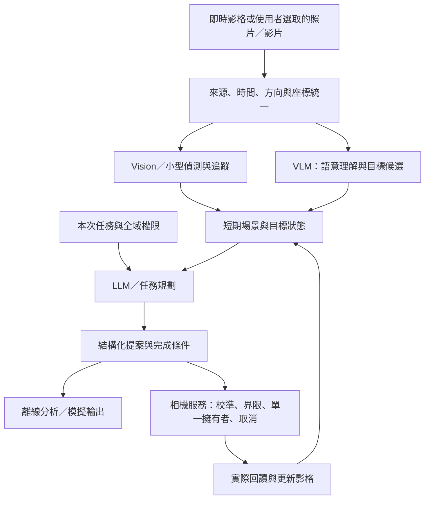

# Pocket 3 Controller 的本機視覺與主動取景

## 產品決策

Pocket 3 Controller 的 AI 應產生可使用的觀察、目標位置、構圖方案與事件記錄，而不只是一段看圖文字或幾次工具呼叫。近期適合採用的架構是：以原生視覺演算法處理快速測量，以 VLM 理解語意與選取目標，以 LLM 組織有完成條件的任務，再由既有相機服務執行和停止動作。VLA 值得平行研究；本輪查核的 OpenVLA、SmolVLA 與 openpi 公開資料中，未找到能直接適用於本案 Pocket 3 動作協定、校準與 macOS 執行環境的 checkpoint。這是查核範圍內的結論，不是證明不存在其他實作。[^openvla][^smolvla][^openpi]

優先投資順序是：**離線影像工作區、觀察與操作的任務分流、語意主體定位、構圖測量、影片追蹤與事件時間軸**。真正的自動跟拍要等影像座標、相機動作與停止行為完成校準；新的視覺能力則可先在照片與影片上完成。更換較大的模型只有在同一題集證明有足夠收益後，才應改變預設。

本報告以 2026-09-09 可查核的官方資料、固定版本原始碼及專案量測為依據。模型卡能力、此 Mac 的實測、工程建議分開陳述；後面的數值門檻若沒有附結果，均屬待驗證的產品目標。

## 現有 AI 為何缺乏使用感

截至build21，App的AI主要是看圖回答與有界工具流程。build22已補上面向使用者的靜態圖片工作區：開啟／替換檔案、問答、計數、定位標記、OCR，以及取消與來源切換；這些已通過無相機的真App基本流程測試。仍未形成持續的視覺工作流程：短片輸入、互動ROI、跨影格目標ID、事件時間軸與可編輯構圖任務尚待實作。固定類別物件偵測與少量語意定位案例，也仍不等於任意物件都能可靠找到。[^app][^workspace22]

截至build21的基線路由存在不必要的雙模型成本。選擇 Apple 時，只要相機具備可用的移動或縮放權限，程式便先執行 MLX 控制階段，再更新影格給 Apple 回答；它沒有先區分本次只是觀察，還是真的要求操作。因此授予控制權後，即使問題沒有動作要求，也可能支付兩段模型生成的成本。build22已加入獨立的 `observe`／`assistFraming` 任務意圖：預設純觀察不提供寫入工具，也不因既有控制權而啟動混合路由；相關路由與CLI傳遞／拒絕測試已納入通過的軟體gate。確切節省時間仍需同圖同問的專門對照，不能用不同版本或不同入口的時間相減，也不能把軟體測試當成新真機操作驗收。[^route][^gate22]

另兩個常見解釋不符合目前證據。模型權重、tokenizer 與 grammar 已有重用，不能說每一問都重新下載或載入整套模型。MLX provider 沒有宣告 reasoning capability，所固定的橋接版本會關閉可選 thinking；不能把延遲直接歸因於忘記關閉 thinking。尚未建立的是跨提問的可證實 KV／影像特徵重用，以及完整的分階段延遲量測。[^mlx-provider]

| 已有實機案例 | 完成情況 | 可以證明的範圍 |
|---|---|---|
| Apple 直接工具流程，build13 | 約4.610秒返回，但沒有執行要求的縮放 | 回答速度不能代替任務成功 |
| MLX，build13 | 約34.111秒完成取圖、讀縮放、單次raw200、再取圖 | 一個真機工具任務成功 |
| MLX控制＋Apple回答，build16 | 約38.039秒，11項該次檢查通過 | 一個分工明確的混合任務成功 |

以上不是可靠率估計，也不是嚴格的模型 A/B。它們足以指出下一個產品問題：應衡量使用者要求是否完成，以及多久得到有用結果，而不只計算是否返回 JSON、答案是否非空。[^local-evidence]

## 第一批應交付的功能

### 離線影像工作區

build22已實作靜態圖片的第一步；接下來應擴充短片、區域選取與畫面比較。每份輸入必須明示來源為檔案，保留影像尺寸及後續影片時間點、旋轉與裁切資訊。現有檔案分析介面不持有CameraService或硬體方法；全域相機權限不會使匯入圖片取得操作能力。

這同時是日常功能與測試基礎。相同素材能重播給不同模型，失敗答案可直接對照原圖；影片則能驗證目標消失、場景變化與追蹤漂移。模型不可用、取消、卸載、開啟另一份檔案，應與即時相機一樣有清楚狀態，不能把已換來源的舊回答顯示成目前結果。

### 觀察與調整分開

權限回答「允許做什麼」，任務模式回答「這次要做什麼」。build22已提供明確的「觀察」與「協助取景」入口：前者只提供讀取工具，後者才可使用符合既有權限與能力的調整工具；兩者都不能提高全域權限。這個明示模式不依賴尚未驗證的意圖分類器，後續仍須驗證實際構圖任務的完成率。

未來可增加自動意圖判斷，但要包含否定句、引述、模糊指代與圖片內文字的測試。「不要放大」「告訴我放大會怎樣」與「放大那個標籤」不是同一任務。無法分清時可以要求選擇目標或模式，不能默默嘗試動作，再靠回答文字補救。

### 指定主體與構圖助理

「把紅色杯子放在右下三分點」至少包含三件事：辨認杯子、確定它的位置、計算期望構圖。VLM 可以提出候選物件，但候選必須帶來源影格、框或 mask、不確定性；若有兩個相似杯子，先顯示候選供選擇。對已知類別，低成本 detector 與幾何排序也可能比完整 VLM 定位更快、更穩定。

構圖測量應先做可計算的內容，例如主體是否被裁切、是否貼邊、人物頭部留白、主體中心與期望錨點的距離。LLM 的角色是解釋測量與整理建議。美感偏好應允許使用者選擇，不應把一個任意「美感分數」包裝成客觀品質。

### 影片事件與拍攝腳本

有用的事件結果應包含時間點、前後證據與不確定性，例如物件被拿走、人物進入、畫面失焦或主體離開。先由低成本測量產生事件候選，再讓 VLM 做低頻解釋，可減少逐幀生成的成本。鏡頭自己的移動、曝光變化與預覽方向改變必須是負例；一般 scene cut 並不等於語意事件。

拍攝腳本則把多步要求變成可編輯的 shot list，每步包含主體、構圖意圖、必要能力、完成條件及失敗處理。沒有硬體時可以完成編輯與 dry-run；執行時只使用已驗證的能力。原生回中尚未成功的情況，腳本不能自稱已執行機身快速預設。

## 建議的系統架構

語意層、追蹤層與控制層應以不同頻率工作。VLM 決定追蹤哪個主體、想要怎樣的構圖；追蹤器處理較新的影格；控制器依新鮮誤差更新命令。若 VLM 回覆已耗時數秒，原來的框可能已過期，必須重新定位或對應至目前 track，不能直接以舊框移動。[^autoptz][^frigate]

資料契約至少需要 source kind、source/session ID、frame ID、時間戳來源、尺寸與座標變換、目標候選及來源影格。動作提案另外帶權限快照、校準版本、有效期限及預期完成條件。離線來源在型別或介面上就不提供真實動作能力，比靠提示詞要求模型「不要碰相機」更可靠。

先實作短期場景狀態即可，不必立即建立永久記憶。應記住目標最後出現的時間、位置、目前是否可見及身份是否有歧義；不應在遮擋後假裝仍然看得到。長期儲存、事件提醒與背景監看需要獨立的使用者設定和保留規則，不應由一次問答暗中變成常駐追蹤。

## macOS 27、MLX 與 ANE 的實際分工

### Foundation Models

macOS 27 的框架提供影像 Attachment、LanguageModel provider、Dynamic Profiles，以及 token/context 查詢；本機 SDK 亦有相應介面。其中 token/context 查詢早於 WWDC26 已開始提供，不應把整組能力都視為27才首次出現。這些介面適合用於系統模型觀察、typed output、工具與模型 provider 的統一接入。新 API 會改善整合方式，但不會自動保證工具選擇或視覺定位正確。[^fm26][^fm-tools]

Dynamic Profiles 適合按任務縮小工具集合。觀察問題沒有理由看到寫入工具，構圖任務也不應看到與該任務無關的機身設定。Private Cloud Compute 應視為另一個有部署、資格與資料離機條件的選項，不能由 API 存在就宣稱目前 GitHub 版本已可直接使用；本地工作流程應能獨立成立。[^mac27]

### Core AI

Core AI 提供模型執行、stateful inference、specialization 與編譯快取等能力。對本案而言，它適合承載固定形狀、能量測數值一致性的視覺子模型；昂貴的首次準備應在功能就緒前完成，而非第一次追蹤時才發生。[^coreai][^coreai-app]

官方 `coreai-models` 已包含 VLM recipe；固定版本的 Qwen3-VL 路徑對應 2B Instruct，使用448×448視覺編碼與f16 decoder，預設KV context為4096。這值得作為 Core AI／MLX 的同模型比較，但它不是把現在的 Qwen3.5-4B 權重換個副檔名。stretch、crop、pad 的選擇還會改變定位座標，必須一起驗證。[^coreai-vlm]

### MLX 與 ANE

MLX 是快速比較 Apple Silicon 開放模型的主要路徑，利用 CPU／GPU 與統一記憶體。現有 pinned MLXVLM 已有 Qwen3.5、Qwen3-VL、Gemma4、SmolVLM 等 loader；loader 存在只證明有架構實作，不能替每一個 checkpoint 的工具模板、guided output 或影像前處理背書。[^mlx][^mlx-factory]

ANE 應是經量測的執行選項。指定 preferred compute unit、列出可用裝置或看到 ANEServices 執行緒，都不足以證明某個模型在 ANE 運算。採用判準應包含實際 trace、相同精度的輸出差、冷暖延遲、持續記憶體及功耗；若 GPU 路徑較合適，就應如實選用 GPU。[^coreai][^local-evidence]

## 候選模型與選擇策略

以下磁碟大小是指定量化倉庫的 safetensors 大小總和，為十進位GB；不是RAM需求，也不包括所有配套檔案。各來源註記固定artifact revision，讓大小與授權metadata可以重查。未列本機結果的候選尚未在本專案執行；loader或README列出的相容性不能代替實測。模型卡的評分條件不一致，不以不同榜單數字合成產品排名。

| 候選 | 可用路徑與大致權重大小 | 採用判斷 |
|---|---|---|
| Apple 系統模型 | 現有Foundation Models；系統管理 | 保留為純觀察基線，先量語意正確性與回應時間；不能由單次速度快推定動作可靠 |
| Qwen3.5-4B 4-bit | 已快取MLX；3.034GB | 現有基線，先改善工作流並量測；Apache-2.0[^qwen4] |
| Qwen3.5-2B 4-bit | 同架構候選；1.722GB | 低成本對照，針對ROI與簡單任務，不預設通用品質等同4B[^qwen2] |
| Qwen3.5-9B 4-bit | 同架構候選；5.950GB | 品質上限對照；只有定位、OCR或可靠性收益足夠時才接受較高成本[^qwen9] |
| Gemma4 E2B 4-bit | pinned loader已有；3.551GB | 優先不同家族對照。E2B是effective參數名稱，並不比現有4B權重更小；官方與量化artifact的授權metadata差異需釐清[^gemma][^gemma-card] |
| Gemma4 E4B 4-bit | 5.147GB | 第二梯隊品質候選，先避免一次引入太多常駐模型[^gemma-card] |
| Ministral3 3B 4-bit | pinned loader已有；2.745GB | 可比較工具格式與不同訓練家族的錯誤型態；未在本App跑過[^ministral] |
| SmolVLM2 500M BF16 | 影像／多圖／影片；約1.015GB | 低成本事件摘要基線；英文與官方條件下的RAM聲明不能代替繁中／Mac實測[^smolvlm] |
| Qwen3-VL 2B Core AI | 官方匯出recipe，尚未產生本案artifact | 比較部署、數值與計算單元的候選；先做parity再談替換[^coreai-vlm] |

第一輪應控制變因：先比較已可運作的 Apple 與 Qwen3.5-4B，再加入一個不同家族或較高品質的候選。Qwen3.6-27B量化權重約16.055GB、35B-A3B的啟用參數也不等於只需3B權重；在36GB的相機App中，它們不適合作為未經比較的預設。[^qwen36]

每個可發行模型需有獨立manifest：來源revision、檔案雜湊、權重授權、工具格式、EOS、前處理、已驗證能力和資源預算。不能把 Qwen 的工具格式直接套到 Gemma。FastVLM 可作架構研究參考，但官方權重條款限定研究且排除產品開發，不納入直接內建發行候選。[^mlx-factory][^fastvlm]

## VLA 應如何研究

OpenVLA 的官方例子輸出依 WidowX／BridgeData 正規化的7自由度動作，且建議新領域使用相應示範與微調。這些維度包含機械手臂的動作，不能截成三個數值就當成 pan、tilt、zoom。OpenVLA-OFT 的 action chunks 值得參考，但頻率、正規化與裝置適配仍然存在。[^openvla][^oft]

SmolVLA 的小型模型與推論／執行分離，使它值得優先列入小型學習控制比較；這是工程選擇建議，尚非本機測得的優勢。LeRobot 程式的 Apache 授權不能自動套到所有權重，該 base model card 在查核版本未提供明確授權欄。openpi 的官方執行條件則以 NVIDIA／Ubuntu 為主，目前資料不支持宣稱現成支援 macOS MLX；這也不代表未來不能移植。[^smolvla][^openpi]

Pocket 3 的學習問題更接近「如何改變自己的視野」。zoom、橫直畫面、裁切及運動延遲都會改變像素誤差與動作之間的關係。合理的第一個基線是有deadband、限幅和延遲處理的視覺控制器。VLA 的離線模擬、動作表示與示範資料研究可同步進行；是否成為產品預設，則應以相同多步搜尋、預測或構圖任務中的完成率、延遲與資源收益決定。

資料至少需要任務、frame與時間、目標位置、畫面變換、動作提交時間、讀回、完成結果與人工接管。訓練／驗收以整個場景或錄製session切分，避免鄰近影格洩漏。模型輸出action chunk到達時仍要檢查有效期限、連線與權限；模型不能接管Stop或自行解除限制。

## 其他專案提供的實際啟發

| 專案 | 真正可用的參考 | 需要保留的界線 |
|---|---|---|
| SCOPE，2026 | 小型planner與VLM分工、九個工具、Blender benchmark | 公開tracking是stub，AXIS driver未公開；論文536題與倉庫541列不是同一範圍[^scope] |
| AutoPTZ 2.2.0 | 桌面追蹤pipeline、目標鎖定、平滑、PD與運動預測 | AGPL程式不能當作MIT元件直接搬入；CoreML provider存在不等於本App效能已測[^autoptz] |
| Frigate | FOV-relative控制、校準、相機自身運動補償 | ONVIF driver不是Pocket3 USB/BLE driver；自動搜尋與回preset也需自己的契約[^frigate] |
| Vision tracking | 原生框追蹤與速度／精度選擇 | 需要初始框，不是文字定位，也不保證重新辨認離開畫面的同一物件[^vision] |
| GroundingDINO／Grounded-SAM-2 | 開放語意定位與影片分割pipeline | 適合離線品質對照；多模型成本與Mac部署尚需量測[^grounding] |
| SAM2／SAM3.1 | 視訊分割；SAM3.1提供shared-memory多物件追蹤 | 兩代授權不同；SAM3現行CUDA條件不能當原生Mac支持[^sam] |
| ByteTrack／PySceneDetect | 資料關聯、低成本場景切換候選 | 分別不能替代detector、語意理解及相機運動補償[^tracking] |

從這些專案可推導出適合本案的分層設計；這是工程綜合判斷，不是它們已替 Pocket 3 驗證整條流程。尤其應區分自己相機的運動與物件運動；否則背景平移可能污染速度估計，造成追蹤來回超調。SCOPE 也指出其設定下感知主導延遲，量化收益依平台與 serving path 改變，不能把參數較少等同更快。[^scope]

## 離線量測與驗收

### 資料與指標

第一批實驗使用公開標註照片與既有可運行模型，分開測count、指定物件的point grounding與無目標反應。輸出格式通過與答案正確分開計分；答案中的關鍵字不能代替完整判定。COCO標註並非無誤，也不能排除基礎模型見過相關影像，因此小樣本只能作探索性基線，不能當現場成功率。

後續固定題集建議280個案例：60定位、40 OCR、40前後比較／事件、60控制意圖、50拒絕／歧義／注入、30取消與資源。開發集可調prompt，驗收集凍結；每個後端使用相同素材與尺寸。控制結果用確定性判準，語意品質用可核對標註與人工複核；model judge只作輔助。[^evaluations]

| 能力 | 必記指標 | 建議門檻的性質 |
|---|---|---|
| 目標定位 | target選擇、IoU、中心誤差、無目標誤報 | clean set 95%是待驗目標；座標合法不等於選對物件 |
| OCR | CER／WER、exact-field、文字框 | 與Vision基線比較後才決定是否加入VLM |
| 構圖 | 裁切／留白／中心誤差與建議方向 | 可計算條件應完全由幾何核對；主觀偏好另報 |
| 事件 | precision／recall、時間誤差、重複提醒、false alerts/hour | F1目標0.9待驗；自己的鏡頭運動不能算外部事件 |
| 追蹤 | ID切換、漂移、target loss、錯誤重認、p95延遲 | 先公布本機測得值，不直接承諾30fps |
| 操作 | 授權、參數、前置與完成條件、取消後額外寫入 | 未授權或過期寫入、假成功應為零 |

### 延遲和記憶體

延遲應拆為cold load、影像前處理、vision encoding／prefill、首token、工具前生成、I/O、更新影格與回答。權限路由的比較需同圖同問：Apple純觀察與Apple但提供模擬控制能力，另以MLX對照；交錯順序、暖機與冷載入分報。不能把 `evaluate-image` 與完整 `observe()` 的差值當作單一因素。

36GB Mac 的起始策略是只常駐一個通用VLM，按需要準備小型detector／tracker；比較長邊640、960、1280與1、2、4、8張影格的品質收益。4K BGRA每張約33.18MB，30張接近0.995GB，還沒有算複本或模型。因此時間軸應使用有界ring buffer、下採樣或壓縮，不把全部30fps輸入生成模型。

單模型暖態工作增量8GB、整App增量12GB、無持續swap增長可作初始預算，均未承諾已達成。應量測memory pressure、長任務與卸載，而不只看weight檔案大小。若低頻VLM＋快速追蹤能完成工作，沒有理由為了使用最新大模型而增加全部常駐成本。

### 實驗結果位置

第一輪pilot使用COCO圖片29596，標註與可見場景均為兩把椅子，並查詢不存在的大象。兩個模型共六次呼叫均成功返回匯入圖片結果，但現有自由文字answer中的巢狀JSON要求大多失敗：Apple的三個答案均未符合格式；MLX只在無目標案例符合完整契約。

| 任務 | Apple | MLX Qwen3.5-4B |
|---|---|---|
| 數椅子 | 回答兩把，語意符合標註；格式不符 | 回答4，與兩把的標註不符；格式亦不符 |
| 最左椅子中心，要求0–1 | 回傳`point=[200,200]`，無法作為合法點位 | 以文字回傳`(442,650)`，不符合0–1契約 |
| 找不存在的大象 | 文字表示未發現，語意正確；格式不符 | `found=false/point=null`，契約與標註均符合 |

MLX的定位數值若**事後假定**為0–1000再換算，會落在左椅子的標註框內；這說明它可能有正確的視覺指代，但不能據此把原始輸出改成通過。單位必須是明確契約，不能等看到答案後才挑一個有利的解釋。Apple數對椅子也不能因JSON解析失敗就被描述為「看不懂椅子」。

這個pilot支持一個實作變更：計數、定位與存在性應使用各自的typed schema，座標由host驗證範圍與一致性，不從一般回答文字猜測或修補。新離線入口使用單一選定模型、禁止工具、限定匯入圖片，並保留來源與時間；它還不是可直接驅動雲台的功能。[pilot原始紀錄](../artifacts/ai-grounding/pilot-20260909/report.json)

六次pilot的整體CLI耗時約1.00–5.87秒，混有首次模型準備；只有一張圖片，不能作為延遲排名或一般品質估計。後續typed實驗使用相同資料集的六張照片、18個任務，結果獨立保留，不覆寫pilot，也不將兩種輸出契約說成完全相同設定。

### build21：六張照片、36次typed實驗

正式typed入口的第一輪共執行36次請求：每個模型各6個計數、6個定位、6個不存在目標。版本為build21、source commit `35eded8dea943150cc755c21e9bd3a79c5e8992b`，相同工作階段先前已執行過pilot；每題依序Apple再MLX，沒有額外重複或獨立冷載入量測。公開的[完整metadata結果](../Evaluation/Grounding/results/build21-typed.json)包含題目、預期、實際回覆及分項評分，不含照片或私人路徑。

| build21指標 | Apple 系統模型 | MLX Qwen3.5-4B 4-bit |
|---|---:|---:|
| 完整任務成功 | 6／18 | 14／18 |
| 計數成功 | 5／6 | 5／6 |
| 點位落在指定bbox內 | 1／6 | 6／6 |
| 不存在目標的有效拒絕猜測 | 0／6 | 3／6 |
| 返回可驗證schema的結果 | 12／18 | 15／18 |
| host以`grounding_output_invalid`拒絕 | 6／18 | 3／18 |
| 整體CLI延遲p50 | 約1.043秒 | 約1.148秒 |
| 整體CLI延遲p95 | 約1.210秒 | 約1.337秒 |

這次結果顯示，移除自由文字中的JSON包裝後，MLX在這六個粗略定位題上能直接交付合法0…1座標；它不證明任意物件、精細分割或真機對焦都可靠。計數也仍會出錯，例如MLX把圖片29596的兩張椅子答成3，Apple把圖片132329的四個瓶子答成3。這些是能從返回值確認的事實錯誤；不能因typed schema通過而忽略。

9次host拒絕均發生在不存在目標題，但API沒有返回被拒絕的原始內容，**其視覺判斷不可評估**。因此Apple的0／6有效拒絕猜測不等於它在六張圖中都看見了不存在的物件，MLX的3次host拒絕也不能直接算成3次幻覺。這些仍是端到端失敗，需要診斷生成內容、可空值表示與host契約之間的關係。公開metadata亦逐筆標出此限制。[^typed21]

### 可空值診斷與build22修正

針對Apple的一個失敗案例，另以獨立可執行程式保留相同圖片、提示、型別結構與影像前處理，只切換 `@Generable` 的可空值表達選項。交錯測試中，預設設定三次均產生 `found=false` 卻帶有 `(0,0)` 點位；開啟 `representNilExplicitlyInGeneratedContent: true` 的三次均得到 `found=false` 且point為nil，在 `generatedContent` 中明示為null。這支持將目標不存在時的可空值表示納入修正，但只是單圖診斷，不能回填其他9次拒絕的未知原始內容。[^nil-diagnostic]

Apple文件將此選項定義為省略nil欄位或明示null的控制。build22已為Location與Presence兩個型別加入上述選項，並通過 `generatedContent` 的null回歸檢查。這項檢查驗證模型介面對可空值的表達，與只測IPC JSON是否手動寫入null不同；它仍不保證模型一定判斷正確，也不證明切換選項一定會改變對外展示的schema JSON。[^nil-source]

### build22：相同36次重測與可使用的圖片工作區

build22使用相同manifest、18份truth與typed問題完成36次重測，資料另存於[build22公開metadata](../Evaluation/Grounding/results/build22-typed.json)。本次source commit為`dc3595c846fc7d8a45fea6432b9db9f788117fec`；沒有下載新模型，也沒有使用相機或控制工具。

| build22指標 | Apple 系統模型 | MLX Qwen3.5-4B 4-bit |
|---|---:|---:|
| 完整任務成功 | 12／18 | 14／18 |
| 計數成功 | 5／6 | 5／6 |
| 點位落在指定bbox內 | 1／6 | 6／6 |
| 不存在目標的有效拒絕猜測 | 6／6 | 3／6 |
| 返回可驗證schema的結果 | 18／18 | 15／18 |
| host以`grounding_output_invalid`拒絕 | 0／18 | 3／18 |
| 整體CLI延遲p50 | 約1.008秒 | 約1.113秒 |
| 整體CLI延遲p95 | 約1.222秒 | 約1.366秒 |

Apple在本題集的不存在目標結果由0／6有效回覆改善為6／6，host拒絕由6次降為0；計數與定位的通過數沒有增加，**Apple的精確定位仍是明顯不足**。MLX仍為14／18，剩餘3次不存在目標的host拒絕沒有原始輸出，不能稱作3次視覺幻覺，也不能宣稱可空值問題已在所有後端解決。每題仍只有一次、pilot先於完整測試且重用模型快取，這是同題集的版本回歸結果，不是通用模型排名或冷載入效能比較。[^typed22]

真App圖片工作區的基本流程也已通過：Apple圖片問答、MLX指定物件計數與定位標記、Vision OCR、取消、換圖與來源切換的舊結果清除。測試期間相機維持0影格，原有session／access未更動；三語測試截圖均隱去匯入圖片與私人觀察內容。這證明使用者已有不需相機的靜態圖片入口；短片、互動ROI、持續追蹤、事件時間軸及VLA策略仍未完成。[^workspace22]

同一build22完成整體軟體gate：503項已執行測試通過、3項選配測試跳過，59份UI擷取及版面檢查、三語與7個Yun共用檔案核對、複製App的MLX／CoreAI推論與記憶體釋放、離線MCP及CLI意圖測試、ZIP／DMG內容簽章與雜湊檢查。gate未包含真機影音／運動、正式feed更新、Developer ID或公證；公開下載仍是beta1 build9。[^gate22]

相機停止期間的所有結果只涵蓋檔案、模型、模擬或軟體生命週期，不能解除真機追蹤與校準的驗收要求。

## 實作次序

1. **P0：讓AI在沒有相機時也有用。** build22已完成靜態圖片來源、問答／計數／定位／OCR、取消與來源隔離，並拆開觀察與調整任務。短片、互動ROI與結果保存／比較仍需繼續。
2. **P1：把語意變成可驗證的位置。** GroundedTarget資料契約、候選選擇、座標變換測試、構圖幾何與離線評測。未找到或有歧義時不產生動作。
3. **P2：增加時間。** RecordedFrameSource、短期track、相機運動補償、事件去重與證據時間軸；先完成影片重播的品質和資源驗收。
4. **P3：接上已校準的真機。** 用同一任務與控制器，比較模擬和實際pan／tilt／zoom，量停止、越限及目標遺失；原生preset與機身設定維持各自驗收。
5. **P4：用資料決定VLA的產品角色。** 示範資料規格、離線模擬與小型學習policy實驗可和P1／P2並行；正式接入則依特定任務的可量測收益決定，使用同一權限、限幅、時間與停止契約公平比較。

這個次序把模型研究轉為可展示、可評分的產品能力。完成的定義是使用者能理解現場、指定目標、得到可核對的構圖或事件結果；模型名稱、工具數量與框架數量都不是完成標準。

## 來源

以下來源於2026-09-09核對；沒有正式發布日期的文件以所列revision或存取日為準。社群量化倉庫的metadata只證明該artifact資訊，不是原模型品質的獨立驗證。

[^app]: Pocket 3 Controller，[IntelligenceEngine](../Sources/Pocket3Intelligence/IntelligenceEngine.swift)、[PerceptionEngine](../Sources/Pocket3Intelligence/PerceptionEngine.swift)，目前原始碼。
[^route]: Pocket 3 Controller，[build21固定版ObservationExecutionRoles](https://github.com/YuhuanStudio/Pocket3-Controller/blob/35eded8dea943150cc755c21e9bd3a79c5e8992b/Sources/Pocket3Intelligence/ObservationExecutionRoles.swift)，權限／能力路由；[後續原始碼](../Sources/Pocket3Intelligence/ObservationExecutionRoles.swift)加入本次任務意圖；兩者的驗收範圍分開記錄。
[^mlx-provider]: Pocket 3 Controller，[LocalModel](../Sources/Pocket3Intelligence/LocalModel.swift)；MLX contributors，[MLXLanguageModel](https://github.com/ml-explore/mlx-swift-lm/blob/e3d4a20e9e20e7b8ab39aded7bbfad4ae22c9438/Libraries/MLXFoundationModels/MLXLanguageModel.swift)，2026-09-03 revision。
[^local-evidence]: Pocket 3 Controller，[硬體與模型驗收紀錄](HARDWARE_ACCEPTANCE.md)，各版本個別結果與限制。
[^fm26]: Apple，[What’s new in the Foundation Models framework](https://developer.apple.com/videos/play/wwdc2026/241/)，WWDC26。
[^fm-tools]: Apple，[Expanding generation with tool calling](https://developer.apple.com/documentation/foundationmodels/expanding-generation-with-tool-calling)，存取2026-09-09；另核對本機macOS27 SDK。
[^mac27]: Apple，[What’s new in macOS 27](https://developer.apple.com/macos/whats-new/)，2026。
[^coreai]: Apple，[Meet Core AI](https://developer.apple.com/videos/play/wwdc2026/324/)，WWDC26。
[^coreai-app]: Apple，[Integrate on-device AI models into your app using Core AI](https://developer.apple.com/videos/play/wwdc2026/326/)，WWDC26。
[^coreai-vlm]: Apple，[Core AI VLM recipes](https://github.com/apple/coreai-models/blob/7afb40821654fa8bc3e5049ea9bf7edc72df80d5/models/vlm/README.md)，2026-09-09 revision。
[^mlx]: MLX contributors，[MLX documentation](https://ml-explore.github.io/mlx/build/html/index.html)，文件0.32.2，存取2026-09-09。
[^mlx-factory]: MLX contributors，[VLMModelFactory](https://github.com/ml-explore/mlx-swift-lm/blob/e3d4a20e9e20e7b8ab39aded7bbfad4ae22c9438/Libraries/MLXVLM/VLMModelFactory.swift)，2026-09-03 revision。
[^qwen4]: Qwen，[Qwen3.5-4B](https://huggingface.co/Qwen/Qwen3.5-4B)，card更新2026-03-02；[本案量化artifact](https://huggingface.co/mlx-community/Qwen3.5-4B-4bit/tree/0e7ffd5c629ef7719d4cbc04069232580bfa9d9c)。
[^qwen2]: Qwen，[Qwen3.5-2B](https://huggingface.co/Qwen/Qwen3.5-2B)，2026-03；[量化artifact](https://huggingface.co/mlx-community/Qwen3.5-2B-4bit/tree/674aaa7240b91e8012fcad5d791b7dfe5ba90207)。
[^qwen9]: Qwen，[Qwen3.5-9B](https://huggingface.co/Qwen/Qwen3.5-9B)，2026-03；[量化artifact](https://huggingface.co/mlx-community/Qwen3.5-9B-4bit/tree/8b2b98c00a6b4d291155e4890773ca8f769aee53)。
[^gemma]: Google，[Gemma 4 launch](https://blog.google/innovation-and-ai/technology/developers-tools/gemma-4/)，2026-04-02。
[^gemma-card]: Google，[Gemma4 E2B model card](https://huggingface.co/google/gemma-4-E2B-it/blob/3e22461f65e89153144f8adb70e3b8c2cc9845a7/README.md)，更新2026-07-20；[E2B量化artifact](https://huggingface.co/mlx-community/gemma-4-E2B-it-4bit/tree/238767527555cb75a05732a84dff5d6ba0dd6809)，權重3,550,670,554 bytes；[E4B量化artifact](https://huggingface.co/mlx-community/gemma-4-E4B-it-4bit/tree/475b9088d29754a3379866cf5aeb6b41acd313c2)，權重5,146,800,534 bytes。兩份量化artifact皆為2026-07-06 revision，查核時card metadata標示`gemma`，與官方Gemma4的Apache-2.0標示不同；本報告記錄差異，不自行更改artifact授權。
[^ministral]: Mistral AI，[Ministral3 3B](https://huggingface.co/mistralai/Ministral-3-3B-Instruct-2512)，2025-12系列；[technical report](https://arxiv.org/abs/2601.08584)，2026-01；[MLX 4-bit artifact](https://huggingface.co/mlx-community/Ministral-3-3B-Instruct-2512-4bit/tree/a962dcb09eee4169c890e544c9eb938f1113fdee)，revision2025-12-03，`model.safetensors`為2,745,210,934 bytes（約2.745GB），不是未量化原模型的大小。
[^smolvlm]: Hugging Face，[SmolVLM2-500M-Video-Instruct](https://huggingface.co/HuggingFaceTB/SmolVLM2-500M-Video-Instruct)，2025-04；[MLX BF16 artifact](https://huggingface.co/HuggingFaceTB/SmolVLM2-500M-Video-Instruct-mlx/tree/fa57db46815177fbdfd65cc85a2b3416a8332268)，revision2025-02-20，權重1,015,023,993 bytes。
[^qwen36]: Qwen，[Qwen3.6-27B](https://huggingface.co/Qwen/Qwen3.6-27B)、[35B-A3B](https://huggingface.co/Qwen/Qwen3.6-35B-A3B)，2026-04；[27B MLX 4-bit artifact](https://huggingface.co/mlx-community/Qwen3.6-27B-4bit/tree/c000ac2c2057d94be3fa931000c31723aac53282)，revision2026-04-22，三個safetensors shard合計16,054,541,599 bytes（約16.055GB）。A3B描述啟用參數，不能據此推定完整權重記憶體。
[^fastvlm]: Apple，[FastVLM](https://github.com/apple/ml-fastvlm)、[LICENSE_MODEL](https://github.com/apple/ml-fastvlm/blob/main/LICENSE_MODEL)，2025，存取2026-09-09。
[^openvla]: OpenVLA authors，[官方README](https://github.com/openvla/openvla/blob/c8f03f48af692657d3060c19588038c7220e9af9/README.md)，revision2025-03-23。
[^oft]: OpenVLA-OFT authors，[官方實作](https://github.com/moojink/openvla-oft)，存取2026-09-09。
[^smolvla]: Hugging Face，[SmolVLA發布](https://huggingface.co/blog/smolvla)、[base model card](https://huggingface.co/lerobot/smolvla_base/blob/c83c3163b8ca9b7e67c509fffd9121e66cb96205/README.md)，2025／所列revision。
[^openpi]: Physical Intelligence，[openpi README](https://github.com/Physical-Intelligence/openpi/blob/215abfb217dbac7d5f1273282331b9b1866c0479/README.md)，2026-08-24 revision。
[^scope]: Nikolaj Hindsbo、Sina Ehsani、Pragyana Mishra，[SCOPE: Real-Time Natural Language Camera Agent at the Edge](https://arxiv.org/html/2606.02951v1)，2026-06-01；[公開程式與限制](https://github.com/HindsboNikolaj/SCOPE/tree/39b50154920ff229f23b954fbf6d6a0eee8a136f)，2026-09-04 revision。
[^autoptz]: AutoPTZ，[README](https://github.com/AutoPTZ/autoptz/blob/09c018abcf20a785cebd7cb3829a11705d20a22b/README.md)、[egomotion](https://github.com/AutoPTZ/autoptz/blob/09c018abcf20a785cebd7cb3829a11705d20a22b/autoptz/engine/pipeline/egomotion.py)，2.2.0／2026-07。
[^frigate]: Frigate，[Autotracking](https://docs.frigate.video/configuration/autotracking/)、[固定版程式](https://github.com/blakeblackshear/frigate/blob/77a66e75c61862b048a07c1295877f4b31343504/frigate/ptz/autotrack.py)，2026-09-06 revision。
[^vision]: Apple，[VNTrackingRequest](https://developer.apple.com/documentation/vision/vntrackingrequest)，存取2026-09-09。
[^grounding]: IDEA Research，[GroundingDINO](https://github.com/IDEA-Research/GroundingDINO/tree/856dde20aee659246248e20734ef9ba5214f5e44)、[Grounded-SAM-2](https://github.com/IDEA-Research/Grounded-SAM-2/tree/b7a9c29f196edff0eb54dbe14588d7ae5e3dde28)，各固定revision。
[^sam]: Meta，[SAM2](https://github.com/facebookresearch/sam2)、[SAM3與3.1](https://github.com/facebookresearch/sam3/tree/660a5e9e1b8b4c02c0ad97229b88a09a6e4ff5b7)、[SAM License](https://github.com/facebookresearch/sam3/blob/660a5e9e1b8b4c02c0ad97229b88a09a6e4ff5b7/LICENSE)，3.1發布2026-03-27。
[^tracking]: ByteTrack authors，[ByteTrack](https://github.com/FoundationVision/ByteTrack/tree/d1bf0191adff59bc8fcfeaa0b33d3d1642552a99)；PySceneDetect，[detectors API](https://www.scenedetect.com/docs/latest/api/detectors.html)，存取2026-09-09。
[^evaluations]: Apple，[Evaluations](https://developer.apple.com/documentation/evaluations)、[Create robust evaluations for agentic apps](https://developer.apple.com/videos/play/wwdc2026/299/)，WWDC26。
[^typed21]: Pocket 3 Controller，[build21 typed評測metadata](../Evaluation/Grounding/results/build21-typed.json)、[題集與評分方法](../Evaluation/Grounding/README.md)，2026-09-09，36次真模型／公開檔案請求，無相機與控制工具。
[^nil-diagnostic]: Pocket 3 Controller，本機診斷紀錄`artifacts/ai-grounding/diagnostic-apple-build21/result.json`、`explicit-nil-result.json`、`alternating-results.json`，2026-09-09；原始程式差異僅Presence的Generable選項。這些是本機單例診斷，未作完整題集或獨立人工品質驗收。
[^nil-source]: Apple，[Generable(description:representNilExplicitlyInGeneratedContent:)](https://developer.apple.com/documentation/foundationmodels/generable%28description%3Arepresentnilexplicitlyingeneratedcontent%3A%29)，2026-09-09查閱；Pocket 3 Controller，[GroundedImageAnalysis](../Sources/Pocket3Intelligence/GroundedImageAnalysis.swift)、[GroundedImageAnalysisTests](../Tests/Pocket3IntelligenceTests/GroundedImageAnalysisTests.swift)，build22已驗證的可空值表示與範圍契約；不等於任意語意判斷可靠。
[^typed22]: Pocket 3 Controller，[build22 typed評測metadata](../Evaluation/Grounding/results/build22-typed.json)，2026-09-09，36次真模型／公開檔案請求，無相機與控制工具；模型、版本及快取條件見報告。
[^workspace22]: Pocket 3 Controller，本機`artifacts/image-workspace/build22/result.json`，2026-09-09，真App工作區與模型基本流程測試，`cameraUsed=false`、`cameraStateUnchanged=true`；來源及介面見[ImageObservationSource](../Sources/Pocket3BridgeApp/ImageObservationSource.swift)。
[^gate22]: Pocket 3 Controller，本機`artifacts/offline-workspace-build22/final/verification-gate.json`與同目錄test/UI/model/package紀錄，2026-09-09；source `dc3595c846fc7d8a45fea6432b9db9f788117fec`、App SHA-256 `b1d48f838498b28fbe80fdfe640e8d4960acfb4a2e7043c499ff68738a2cb0bb`，離線gate通過，明列真機與正式發布更新未測。
