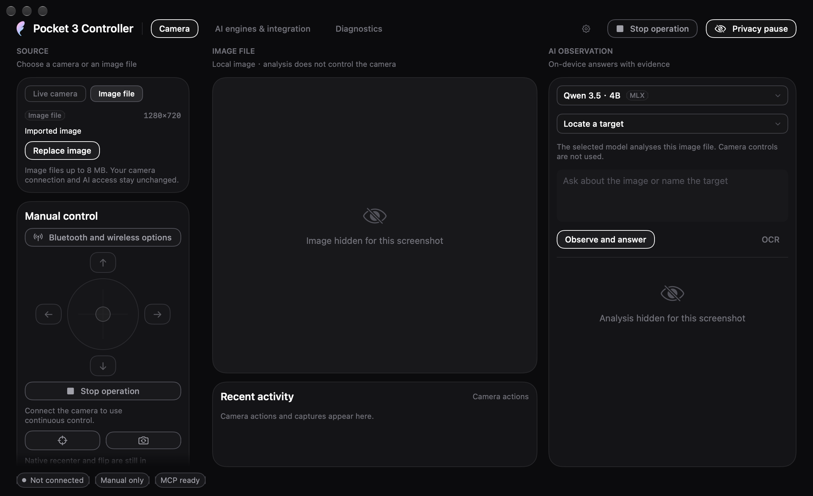

# Using Pocket 3 Controller

English · [繁體中文](zh-Hant/guide.md) · [简体中文](zh-Hans/guide.md)

[Documentation index](README.md) · [Product overview](../README.md)

This guide covers published **0.0.1 beta 1, build 9** and separately labels development features. **Build 23 is in development; its actual App smoke test and complete release gate are pending.** Build 22's passed offline, packaged-App and UI checks, screenshots and model results are historical evidence. Neither development build is a published download, and the build 16 hardware result does not verify build 23 hardware behaviour.
A disabled or experimental control is not a promise that its camera function is supported.

## Install and first launch

Download the DMG or ZIP from the [beta 1 release](https://github.com/YuhuanStudio/Pocket3-Controller/releases/tag/v0.0.1-beta.1)
and move **Pocket 3 Controller.app** into **Applications**. macOS 27 and Apple
Silicon are required. The release page also provides SHA-256 checksums.

The beta uses a local development certificate and is not Apple-notarized. If
macOS blocks the first launch, check the download's source, then use **System
Settings → Privacy & Security → Open Anyway** for that app. The project does not
provide a Homebrew cask. First-launch behaviour on every other Mac has not been verified.

Connect Pocket 3 by USB, choose **Webcam** on the camera, then select it and connect in the app. No Mac Wi-Fi change is needed.

## Access and privacy

The access selector controls what AI and external clients may do with the live camera:

| Setting | Behaviour |
|---|---|
| **Manual only** | Default. Use the app's preview and manual controls; AI observation and actions are not granted. |
| **Observe only** | Allow image observation and questions, without granting camera movement. |
| **Observe and move** | Allow observation and eligible camera actions; each action still checks its capabilities and verification requirements. |

macOS camera access is requested when connecting. Microphone permission is needed
for audio use, and Bluetooth permission is requested when explicitly starting a
Bluetooth operation. If a permission was denied, change it in System Settings
before trying the corresponding operation again.

**Stop** cancels pending camera work and attempts the applicable hold operations.
**Privacy pause** stops the current work and releases capture inputs. Closing the
main window keeps the menu bar service running; **Quit** ends the service.
The menu bar icon opens the panel with a left click and its menu with a right click.

## Remote desktop and background use

The camera service has no physical-display-on requirement. The app must remain
running in the logged-in user's macOS session; the local CLI/MCP helper uses that
same user's service and does not start a system daemon before login. Remote
desktop input still depends on an accessible desktop and the app window receiving
the gesture. Display sleep, a locked desktop and system sleep are different states.

Development build 18 keeps an activity open while capture is running to prevent
idle system sleep and App Nap, without keeping the display on. Pause, disconnect
and capture teardown release it. An explicit system sleep still suspends the
camera; reconnect after waking. This is a development addition, not a beta 1 claim.
Actual Mac Studio remote-desktop, display-off and remote-disconnect input tests
remain pending; the build 17 external MCP zoom test ran with the display awake.

## USB preview and formats

Start with **1920 × 1080, NV12, 30 fps**, the beta smoke-test configuration.
Select another resolution, frame rate or input format and reconnect to apply it.
720p30 and 1080p24 also produced fresh frames; 4K30 NV12 has earlier bounded-trial
evidence. The format picker reflects device declarations, which do not prove that
every advertised combination will produce frames.

Portrait results depend on the camera's physical orientation and selected mode.
Earlier portrait trials passed after changing the body orientation; do not assume
that selecting a portrait resolution alone rotates the camera or enables all
native portrait modes. UYVY / H.264 paths and 4K60 do not have a passing capture
result. If no frames arrive, return to the tested 1080p30 NV12 combination.

The snapshot action captures a single image; CLI snapshots write to your explicit `--output` path.
A preview does not imply that the app records or controls all internal recording modes.

## Manual gimbal control

Hold a direction button or drag the joystick to move pan or tilt. Drag farther
from its centre to request faster movement. Release the input to stop the gesture;
losing focus and the Stop action also end it. Manual interaction takes priority
over AI work. These controls use USB position targets and retain the Mac's network.

Start with a small gesture and check the visible result. Physical speed, full
range and worst-case stopping latency are not calibrated. Stable readback after
Stop is software evidence, not mechanical emergency-stop certification. If the
app reports that stopping could not be confirmed, inspect the camera rather than
repeating the previous movement automatically.

Native rapid recenter and front/back flip remain in development; slow USB motion is not an equivalent.

## Zoom and experimental Roll

Use the Zoom slider or minus / plus buttons. Its percentage describes travel
within the reported control range, not optical magnification. The tested device
reported raw 100–400 with step 1; a 100 → 200 → 100 round trip was observed.
Other devices or sessions must use their own reported capabilities.

Roll is labelled **Experimental**. Its values are device control units, not a
calibrated physical angle. Only a 0 → 1 → 0 raw round trip has been verified;
physical direction and stopping during a larger adjustment remain under evaluation.
A successful zoom or pan test does not validate Roll.

## Bluetooth read-only status

Open the Bluetooth connection panel, scan explicitly, choose your camera and pair.
Confirm the pairing request on the camera when prompted. This workflow does not
join the Mac to a camera Wi-Fi network.

After pairing, the panel can show camera-reported battery, charging, pose, AF mode,
white balance and exposure. Use its read action to refresh the three camera-setting
values. Missing or stale readings are not treated as confirmed current values.
Low battery and a sustained downward trend are reported separately from charging.

These values are read-only. A Bluetooth peer is not automatically identified as
the selected USB camera, and BLE pose is not calibrated to USB coordinates.
The camera body can support tap-to-focus while app-side tap-to-focus is still
unavailable; an AF mode readback is not a focus-point setter.

## Local AI

Choose an engine on **AI engines and integration**. Apple Foundation Models need
the corresponding system model available. MLX Qwen 3.5 is optional: select its
download action and allow space for roughly 3.1 GB of model files. The download
requires a network connection; inference uses the locally available model.

### Build 23 development: images, selected video frames and areas

This extends build 22's image workspace. Build 23 source implements the workflow below; actual App and complete release-gate verification are pending. The local offline media regression log records 72 tests across six suites passing, but it is development evidence rather than the actual App smoke test or the complete release gate. These features are not included in published beta 1 build 9.

1. Choose **Media file** as the observation source, then **Open media**. Select a readable local image of up to 8 MB or a local video containing a video track. **Replace media** opens another file and clears the previous analysis and selected area. Video support depends on macOS being able to decode the file; a filename extension alone does not establish support.
2. For a video, use the **Video time** slider or **−1 s / +1 s** buttons to choose a frame. Release the slider and wait for the preview to update before analysing. The displayed time returns to the decoded frame's actual presentation timestamp (PTS), which may differ from the requested time. The result describes that one frame; this workspace does not play the video, analyse audio, summarise events across time or continuously track a subject.
3. To analyse part of the image or frame, choose **Select area** and drag a rectangle inside the displayed image. Only the selected area's cropped pixels are passed to the model or OCR. A location returned within the crop is mapped back onto the original image for its marker. Choose **Whole frame** to remove the selection. Changing the selection, including resetting it, clears the old result.
4. Choose **Ask about image**, **Count objects**, or **Locate a target**, enter the question or target, then use the analysis button. **OCR** reads visible text without requiring a question. For example, select a label and ask “What does this label say?”, or select a shelf and count the visible bottles. Check the preview and selection before each run.

File analysis works without Pocket 3 and uses the selected Apple or MLX model; OCR uses local text recognition. It does not acquire camera-control rights or turn a marker into a gimbal or autofocus command. Switching the observation source leaves any existing camera connection and its access setting unchanged; use **Privacy pause** separately to release live capture.

Counts, positions and answers are model estimates and can be wrong, especially with similar objects or partial occlusion. **Cancel** requests cancellation and waits for the current work to finish. Replacing the file, seeking to another video frame, changing the area or changing the observation source clears stale answers, markers and the exportable result. Wait for cancelled work to finish before starting another analysis.

#### Save a result

After a successful analysis, use **Save Markdown** or **Save JSON** in the **Export result** footer and choose the destination in the save dialog. Markdown is suitable for reading or sharing; JSON preserves structured fields for further processing. The footer follows the shared Yun interface styles.

Each export is a fixed snapshot of the completed analysis: the source basename, source type, submitted question and engine, task, answer, evidence and uncertainties, frame metadata, selected-area metadata when used, and result creation time. Video frame metadata records the decoded frame's actual PTS; a crop retains its original-frame and region information. OCR records the Vision engine and no question. Changing the question or engine after completion does not rewrite that earlier result; run analysis again to obtain a result for the new settings.

Exports do not embed image bytes or the source file's URL or directory path. They do contain the source filename and analysis text, which may include visible personal information; review the document before sharing. The snapshot records model output, not proof that a camera action occurred.

#### Historical build 22 image workspace

Build 22's actual App smoke test passed Apple questions, MLX counting and location, Vision OCR, cancellation, image replacement and stale-result clearing without a camera. Its software/package gate and three-language UI review also passed. Those results do not verify build 23's video, area or export additions.



*Historical build 22 screenshot: the imported image and analysis are hidden. It does not show build 23's media, area or export controls and is not the published beta 1 interface.*

### Build 22 development: choose the task separately from camera access

For the **camera** source, select **Observe only** or **Assist framing** for the current question. This task choice is separate from the global camera-access selector and never grants permissions by itself.

| Engine and task | Model behaviour |
|---|---|
| Apple + Observe only | Apple reads the frame with read-only tools. Existing camera-control permission does not start MLX. |
| Apple + Assist framing, with eligible control permission and capability | An already-downloaded MLX model runs the permitted adjustment loop; the App obtains a fresh frame for Apple's answer. |
| MLX + Observe only | MLX observes without movement or zoom tools. |
| MLX + Assist framing | MLX receives only the adjustment tools allowed by the existing access and capability checks. |

The initial task mode is observation. Models are not downloaded automatically. Assistance that needs an absent MLX model reports the requirement; observation with Apple does not require that download. An engine role never proves that an action occurred: check the actual action result and its readback. Build 22's offline routing, CLI and UI checks passed; no new physical camera adjustment was tested.

### Historical build 16 hardware result

The earlier mixed-model route selected control from available access rather than an explicit task mode. One build 16 live-camera run completed in 38.039 seconds with 11 checks passing: MLX used `capture_frame → camera_zoom_status → camera_set_zoom → capture_frame`, submitted one raw-200 zoom, and received verified readback. The App then refreshed the frame for Apple; that refresh was not an extra model tool call. Raw 100 and manual access were restored.

This is evidence for that bounded build 16 case, not new build 22 or build 23 hardware acceptance or Apple independently controlling the camera. Published beta 1 remains build 9. See the [hardware record](HARDWARE_ACCEPTANCE.md).

## MCP and CLI

Keep the app running. Copy the MCP JSON from the integration page, or use the
[configuration in the README](../README.md#mcp-and-cli). The installed helper is
`/Applications/Pocket 3 Controller.app/Contents/MacOS/pocket3`; MCP uses `args: ["mcp"]`.
It connects to the app through a private local Unix socket and respects the access selector.

```sh
'/Applications/Pocket 3 Controller.app/Contents/MacOS/pocket3' status
'/Applications/Pocket 3 Controller.app/Contents/MacOS/pocket3' snapshot --output "$PWD/pocket3-frame.jpg"
'/Applications/Pocket 3 Controller.app/Contents/MacOS/pocket3' ask --engine apple --question 'Read the visible label.'
```

In the development CLI, introduced in build 22, `ask --intent observe|assistFraming` makes the task explicit and defaults to `observe` when omitted. For example:

```sh
'/Applications/Pocket 3 Controller.app/Contents/MacOS/pocket3' ask --engine apple --intent observe --question 'What is visible?'
```

`assistFraming` still needs eligible camera-control permission and capabilities. Debug `evaluate-workflow` accepts the same intent for its simulated camera; it defaults to observation too, and a simulated action is not hardware evidence.

MCP still exposes exactly six basic camera tools: `camera_status`, `capture_frame`, `move_gimbal`, `stop_gimbal`, `camera_zoom_status`, and `camera_set_zoom`. CLI `ask`, media-file analysis and the evaluation endpoints are not new MCP wrapper tools.

For MCP zoom, obtain `camera_status.capture.sessionID`, pass it as
`expectedSessionID` to `camera_zoom_status`, and select an integer `rawValue`
on the reported minimum / maximum / step grid for `camera_set_zoom`.
Check `completed` and `verified`, then obtain a fresh frame. A cancelled or
unconfirmed action must not trigger an automatic sequence of retry movements.

## Troubleshooting and updates

| Symptom | Next step |
|---|---|
| Camera not listed | Check the USB data connection and select Webcam on the camera. |
| Camera listed but no preview | Check camera permission, close another capture app if it holds the device, and reconnect with 1080p30 NV12. |
| MCP image request denied | Keep the app connected and choose Observe only before requesting an image. |
| Local media will not open or a video frame cannot be read | Choose a readable file on a local volume with a decodable video track, or try another time in the clip; still images must be no larger than 8 MB. |
| Result or export controls disappeared after changing a frame or area | The previous result was cleared because its input changed. Analyse the current frame and area again. |
| Model unavailable | Check the system model's availability or complete the optional MLX download. |
| AF, rapid recenter or flip unavailable | These are unfinished app capabilities; pairing alone does not enable them. |
| Battery is falling over time | Check the camera's own battery indication and power connection; USB configuration values are not current measurements. |
| Main window closed, camera still in use | Use Privacy pause to release capture, or Quit to end the service. |

Beta 1 uses this project's Sparkle configuration. The signed beta feed is now
public, and the publicly downloaded feed and ZIP passed public-key signature
verification. Manual downloads remain available from [GitHub Releases](https://github.com/YuhuanStudio/Pocket3-Controller/releases).
Installation and relaunch from one published version to a newer one have not yet
been verified. The development version on `main` is not a newer published download.
