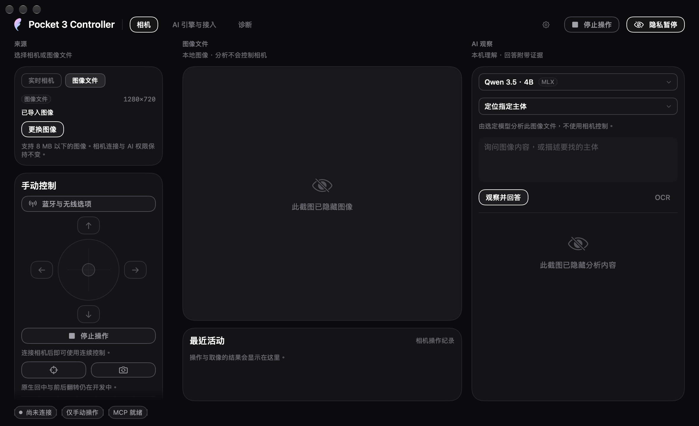

# 使用 Pocket 3 Controller

[English](../guide.md) · [繁體中文](../zh-Hant/guide.md) · 简体中文

[文档入口](README.md) · [项目概览](../../README.zh-Hans.md)

本指南涵盖已发布的 **0.0.1 beta 1，build 9**，并单独标明开发功能。**build23仍在开发，真实App基本流程测试与完整发行gate待验。** build22已通过的离线软件、打包App和UI检查，以及截图与模型结果，均保留为历史证据。这两个开发版都不是公开下载；build16硬件结果不代表build23真机行为已验证。停用或标为实验性的控制，不表示对应机身功能已支持。

## 安装与首次启动

从 [beta 1 发行页](https://github.com/YuhuanStudio/Pocket3-Controller/releases/tag/v0.0.1-beta.1) 下载 DMG 或 ZIP，把 **Pocket 3 Controller.app** 放入 **Applications**。需要 macOS 27 与 Apple Silicon；发行页也提供 SHA-256 checksums。

此 Beta 使用本地开发证书，尚未 Apple 公证。若 macOS 阻挡首次启动，先确认下载来源，再依「系统设置 → 隐私与安全性 → 仍要打开」提示允许该 App。目前没有 Homebrew cask；其他 Mac 的首次启动行为尚未全面验证。

以 USB 连接 Pocket 3，在机身选择 **Webcam**，再于 App 选择相机并连接。不需要更改 Mac 的 Wi-Fi。

## 访问权限与隐私

访问选项决定 AI 与外部客户端可以对实时相机做什么：

| 选项 | 行为 |
|---|---|
| **仅手动操作（Manual only）** | 默认。可以使用 App 预览与手动控制；没有授予 AI 观察或动作权限。 |
| **只允许观察（Observe only）** | 允许帧观察与图片问答，不授予相机移动权限。 |
| **允许观察与移动（Observe and move）** | 允许观察及符合条件的相机动作；每次动作仍检查能力与验证要求。 |

连接时会请求 macOS 相机权限。使用音频时需要麦克风权限，明确启动 Bluetooth 操作时才请求其权限。若先前拒绝，先在系统设置更改相应权限，再重试该功能。

**停止（Stop）** 取消待执行的相机工作并尝试相应保持操作。**隐私暂停（Privacy pause）** 停止目前工作并释放采集输入。关闭主窗口会保留菜单栏服务；**退出（Quit）** 才会结束服务。菜单栏图标左键开面板，右键开功能菜单。

## 远程桌面与后台使用

相机服务没有实体屏幕亮起的要求。App须在已登录用户的macOS会话持续运行；本机CLI／MCP helper使用同一用户的服务，不是在登录前启动的系统daemon。远程桌面操作仍需能进入桌面，并由App窗口接收手势。屏幕关闭、桌面锁定及整机睡眠是不同状态。

开发build18在持续采集时持有活动保护，防止闲置系统睡眠及App Nap，但不要求屏幕保持亮起；暂停、断线与采集结束会释放。明确让整台Mac睡眠仍会暂停相机，唤醒后需重连。这是开发版新增能力，不是beta1的已有功能声明。实际Mac Studio远程桌面、熄屏及远程断线时的手势测试仍待完成；build17的外部MCP缩放测试是在屏幕已亮起时运行。

## USB 预览与格式

先使用 Beta 基本流程验收的 **1920×1080、NV12、30 fps**。选择其他分辨率、帧率或输入格式后，重新连接才会生效。720p30 与 1080p24 也已取得新帧，4K30 NV12 有较早的有界实测证据。格式菜单反映设备声明，不代表每个组合都会产生帧。

竖屏结果取决于机身物理方向及选定模式。早期竖屏试验在改变机身方向后通过；不能假设只选择竖屏分辨率就会旋转相机或启用全部原生竖屏模式。UYVY／H.264 路径及 4K60 仍没有通过的取像结果。没有新帧时，回到已测的 1080p30 NV12。

快照只采集一张图片；CLI 会写入你明确提供的 `--output` 路径。可以预览不代表 App 已能录像或控制全部机身录像模式。

## 手动云台控制

按住方向按钮或拖动摇杆，移动 pan／tilt；离中心越远，要求的移动越快。松开输入、失焦或按停止都会结束手势。手动操作优先于 AI，通过 USB 位置目标控制，Mac 保留原有网络。

先做小幅手势，确认画面结果。物理速度、完整范围及最坏情况的停止延迟尚未校准。停止后稳定读回是软件证据，不是机械急停认证。若 App 报告无法确认停止，请查看相机实际状态，不要自动重复前一个移动。

原生快速回中及正反面翻转仍在开发，慢速 USB 移动不是等价替代。

## 缩放与实验性 Roll

使用缩放滑块或减／加按钮。百分比表示设备报告范围内的控制行程，不是光学放大倍率。已测设备报告原始值 100–400、step 1，并完成 100 → 200 → 100 往返。其他设备或连接必须使用各自读到的能力。

Roll 标为**实验性**，数值是设备控制单位，不是已校准的物理角度。目前只有 0 → 1 → 0 原始值往返的验证；物理方向及较大调整中的停止仍待验收。缩放或 pan 通过不等于 Roll 也通过。

## Bluetooth 只读状态

开启 Bluetooth 连接面板，明确扫描、选择相机并配对。机身出现提示时确认配对要求。此流程不会让 Mac 加入相机 Wi-Fi。

配对后，面板可显示机身回报的电量、充电、姿态、AF 模式、白平衡及曝光。用读取操作更新三个机身设置值；缺少或过期的数据不视为已确认的目前状态。低电量与持续下降趋势会分别显示，不和充电状态混为一谈。

这些值是只读数据。BLE peer 不自动视为选定的 USB 相机，BLE 姿态也未与 USB 坐标校准。机身可以支持点按对焦，而 App 内的点按对焦仍不可用；AF 模式读回不是设置对焦点的功能。

## 本地 AI

在「AI 引擎与接入」选择引擎。Apple Foundation Models 需要相应系统模型可用。MLX Qwen 3.5 为可选，通过下载操作取得，预留约 3.1 GB 模型空间。下载需要网络，推理使用已在本地的模型。

### build23开发版：图片、指定视频帧与区域

此版本扩展build22的图片工作区。以下流程已在build23源码实现，真实App及完整发行gate仍待验证。本地离线媒体回归记录显示六个测试套件共72项通过，但那只是开发证据，不是真实App基本流程测试或完整发行gate。已发布的beta1 build9不包含这些功能。

1. 把观察来源切为 **Media file（媒体文件）**，点击 **Open media（打开媒体）**，选择不超过8 MB的可读本地图片，或含有视频轨的本地视频。**Replace media（更换媒体）**会打开另一个文件，并清除前一次分析和选取区域。视频需能由macOS解码，扩展名本身不保证支持。
2. 视频可用 **Video time（视频时间）**滑块或 **−1 s／+1 s** 按钮选取帧。松开滑块，等待预览更新后再分析；显示时间会回到实际解码帧的呈现时间戳（PTS），可能与请求的时间不同。结果只描述该帧；工作区不播放视频、不分析音频、不跨时间总结事件，也不持续跟踪主体。
3. 若只需分析局部，点击 **Select area（选择区域）**，在显示的图像内拖出矩形。模型或OCR只会收到该区域裁剪后的像素；模型在裁剪区内返回的位置会映回原图显示标记。点击 **Whole frame（完整画面）**移除选取范围。更换或重置区域都会清除旧结果。
4. 选择 **Ask about image（图片问答）**、**Count objects（计算对象）**或 **Locate a target（定位目标）**，输入问题或目标后开始分析。**OCR**可直接读取可见文字，不需要先输入问题。例如圈选标签询问文字，或圈选一层架子计算可见瓶子；每次执行前先核对预览与区域。

文件分析不需要Pocket3，使用所选的Apple或MLX模型；OCR使用本地文字识别。它不获取相机控制权，位置标记也不会变成云台或对焦命令。切换观察来源会保留现有相机连接与访问设置；要释放正在进行的实时采集，另外使用“隐私暂停”。

对象数量、位置与回答都是模型估计，可能出错，尤其是相似对象或部分遮挡。**取消**会提出取消请求并等待当前工作结束。更换文件、移到其他视频帧、更改区域或切换观察来源，都会清除过期回答、标记及可导出结果；等取消中的工作结束后，再开始下一次分析。

#### 保存分析结果

成功分析后，在结果页脚的 **Export result（导出结果）**区使用 **Save Markdown（保存 Markdown）**或 **Save JSON（保存 JSON）**，并在保存对话框选择位置。Markdown方便阅读与分享，JSON保留供后续处理的结构化字段；页脚沿用Yun共用界面样式。

每份导出固定记录该次已完成的分析：来源 basename（仅文件名）、来源类型、提交时的问题与引擎、任务、回答、依据与不确定性、帧元数据、使用裁剪时的区域数据，以及结果创建时间。视频帧记录实际解码的PTS；裁剪保留原始帧与区域信息。OCR记录Vision引擎且不含问题。完成后修改输入框或引擎，不会改写先前结果；要获取新设置的结果，需再次分析。

导出不嵌入图片字节，也不附来源文件URL或目录路径；仍包含来源文件名与分析文字，可能带有图像中的个人信息，分享前请先检查。这份快照记录模型输出，不是相机动作已发生的证明。

#### build22图片工作区历史记录

build22曾在真实App、无相机条件下通过Apple问答、MLX计数与定位、Vision OCR、取消、换图及过期结果清除；软件／打包gate及三语UI检查也已通过。这些结果不验证build23新增的视频、区域或导出功能。



*build22历史截图；导入图片与分析内容已隐藏。画面不包含build23的媒体、区域与导出控件，也不是公开beta1的界面。*

### build22开发版：本次任务与相机权限分开

使用**相机来源**时，可为本次问题选择 **Observe only（只观察）**或 **Assist framing（协助取景）**。这是任务模式，与全局相机访问选项分开，不会自行授予权限。

| 引擎与任务 | 模型行为 |
|---|---|
| Apple＋只观察 | Apple使用只读工具观察画面；即使已有相机控制权，也不启动MLX。 |
| Apple＋协助取景，且已有符合条件的控制权与能力 | 已下载的MLX执行允许的调整流程，App再取新画面给Apple回答。 |
| MLX＋只观察 | MLX只观察，不获取移动或缩放工具。 |
| MLX＋协助取景 | MLX只获取现有权限与能力检查允许的调整工具。 |

源码的初始任务模式为观察，不会自动下载模型。协助取景若需要尚未下载的MLX，会说明需求；Apple纯观察不需要该下载。模型角色本身不表示做过动作，仍需核对实际结果与读回。build22的离线路由、CLI及UI检查已通过；本轮没有测试新的实体相机调整。

### build16的历史硬件结果

较早的混合路由根据可用控制权选择流程，尚未区分本次任务模式。一次build16真机任务以38.039秒完成，11项检查通过；MLX顺序为`capture_frame → camera_zoom_status → camera_set_zoom → capture_frame`，只有一次raw200缩放并取得verified读回。App再取新画面交给Apple，这不是额外的模型工具调用。之后恢复raw100及manual。

这是build16单个有界案例的证据，不是build22或build23新增的硬件验收，也不代表Apple曾独立控制相机。公开beta1维持build9，详见[硬件记录](../HARDWARE_ACCEPTANCE.md)。

## MCP 与 CLI

保持 App 开启，从接入页复制 MCP JSON，或使用[首页设置](../../README.zh-Hans.md#mcp-与-cli)。安装后的 helper 路径是 `/Applications/Pocket 3 Controller.app/Contents/MacOS/pocket3`，MCP 使用 `args: ["mcp"]`。它通过私有本地 Unix socket 调用 App，遵守访问选项。

```sh
'/Applications/Pocket 3 Controller.app/Contents/MacOS/pocket3' status
'/Applications/Pocket 3 Controller.app/Contents/MacOS/pocket3' snapshot --output "$PWD/pocket3-frame.jpg"
'/Applications/Pocket 3 Controller.app/Contents/MacOS/pocket3' ask --engine apple --question '读取画面上可见的标签。'
```

开发版CLI自build22起以 `ask --intent observe|assistFraming` 明确指定本次任务；省略时默认为 `observe`。例如：

```sh
'/Applications/Pocket 3 Controller.app/Contents/MacOS/pocket3' ask --engine apple --intent observe --question '画面中有什么？'
```

`assistFraming`仍需要符合条件的相机控制权与能力。Debug版 `evaluate-workflow` 的模拟相机也接受相同intent，省略时同样只观察；模拟动作不是硬件证据。

MCP维持六个基础相机工具：`camera_status`、`capture_frame`、`move_gimbal`、`stop_gimbal`、`camera_zoom_status`、`camera_set_zoom`。CLI的`ask`、媒体文件分析及评测入口没有另外包装成新的MCP工具。

MCP 缩放先取得 `camera_status.capture.sessionID`，以 `expectedSessionID` 传给 `camera_zoom_status`，再选择符合其 minimum／maximum／step 刻度的整数 `rawValue` 调用 `camera_set_zoom`。检查 `completed` 与 `verified`，再取得新帧。取消或未确认的动作不能触发自动连续重试。

## 常见问题与更新

| 现象 | 下一步 |
|---|---|
| 找不到相机 | 检查 USB 数据连接，并在机身选择 Webcam。 |
| 列出相机但没有预览 | 检查相机权限；若另一个取像 App 占用设备，先结束它，再以 1080p30 NV12 重连。 |
| MCP 取像被拒绝 | 保持 App 已连接，并先选择「只允许观察」。 |
| 本地媒体无法打开，或读不到指定视频帧 | 选择本地磁盘上可读、包含可解码视频轨的文件，或尝试片段中的其他时间点；静态图片不得超过8 MB。 |
| 换帧或区域后结果与导出控件消失 | 输入改变后会清除旧结果，请重新分析当前帧与区域。 |
| 模型不可用 | 检查系统模型是否可用，或完成可选 MLX 模型下载。 |
| AF、快速回中或翻转不可用 | 这些 App 能力尚未完成，单纯配对不会启用它们。 |
| 电量持续下降 | 核对机身电量与供电连接；USB 配置值不是电流实测值。 |
| 关闭主窗口后相机仍在使用 | 以「隐私暂停」释放采集，或「退出」终止服务。 |

beta 1 已包含本项目 Sparkle 设置，Beta signed feed 也已完成 Keychain 签名与发布。公开 HTTPS 下载的 feed 及 ZIP 已通过 CryptoKit 与本项目 Ed25519 公钥验证。自动检查依你的偏好启用，也可通过 [GitHub Releases](https://github.com/YuhuanStudio/Pocket3-Controller/releases) 手动下载。实际从一个已发布版本更新到下一版的安装、替换与重启尚未验收；不要把 `main` 的开发版视为更新的公开下载。
