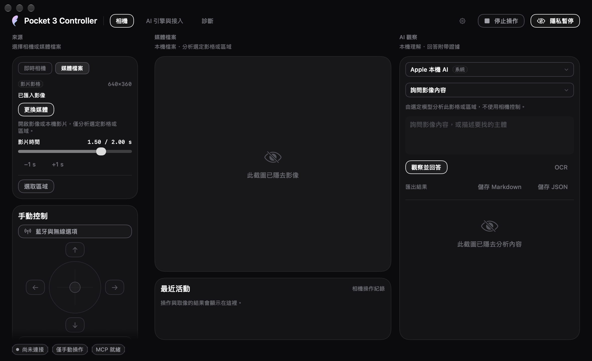
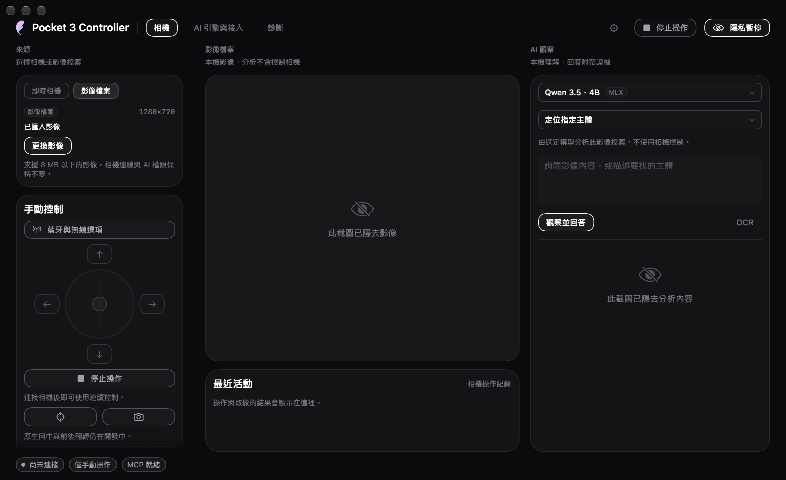

# 使用 Pocket 3 Controller

[English](../guide.md) · 繁體中文 · [简体中文](../zh-Hans/guide.md)

[文件入口](README.md) · [專案概觀](../../README.zh-Hant.md)

本指南涵蓋 **0.0.1 beta 2，build 24**，並標明用來驗收媒體工作區與任務分流的build23證據。build24透過tag `v0.0.1-beta.2`發布；後續 `main` 可能更新。超出本次有界檢查的真機影音／運動、Developer ID簽署及公證仍未完成。build22、build16與beta1紀錄保留為歷史證據。停用或標為實驗性的控制，不表示對應機身功能已支援。

## 安裝與首次啟動

從 [beta 2 發行頁](https://github.com/YuhuanStudio/Pocket3-Controller/releases/tag/v0.0.1-beta.2) 下載 DMG 或 ZIP，把 **Pocket 3 Controller.app** 放入 **Applications**。需要 macOS 27 與 Apple Silicon；發行頁也提供 SHA-256 checksums。

此 Beta 使用本機開發憑證，尚未 Apple 公證。若 macOS 阻擋首次啟動，先確認下載來源，再依「系統設定 → 隱私權與安全性 → 仍要打開」提示允許該 App。目前沒有 Homebrew cask；其他 Mac 的首次啟動行為尚未全面驗證。

以 USB 連接 Pocket 3，在機身選擇 **Webcam**，再於 App 選擇相機並連接。不需要更改 Mac 的 Wi-Fi。

## 存取權與隱私

存取選項決定 AI 與外部客戶端可以對即時相機做什麼：

| 選項 | 行為 |
|---|---|
| **僅手動操作（Manual only）** | 預設。可以使用 App 預覽與手動控制；沒有授予 AI 觀察或動作權限。 |
| **只允許觀察（Observe only）** | 允許影格觀察與圖片問答，不授予相機移動權限。 |
| **允許觀察與移動（Observe and move）** | 允許觀察及符合條件的相機動作；每次動作仍檢查能力與驗證要求。 |

連接時會請求 macOS 相機權限。使用音訊時需要麥克風權限，明確啟動 Bluetooth 操作時才請求其權限。若先前拒絕，先在系統設定更改相應權限，再重試該功能。

**停止（Stop）** 取消待執行的相機工作並嘗試相應保持操作。**隱私暫停（Privacy pause）** 停止目前工作並釋放擷取輸入。關閉主視窗會保留選單列服務；**結束（Quit）** 才會結束服務。選單列圖示左鍵開面板，右鍵開功能選單。

## 遠端桌面與背景使用

相機服務沒有實體螢幕亮起的要求。App須在已登入使用者的macOS工作階段持續執行；本機CLI／MCP helper使用同一使用者的服務，不是在登入前啟動的系統daemon。遠端桌面操作仍需能進入桌面，並由App視窗接收手勢。螢幕關閉、桌面鎖定及整機睡眠是不同狀態。

開發build18在持續取像時持有活動保護，防止閒置系統睡眠及App Nap，但不要求螢幕保持亮起；暫停、斷線與取像結束會釋放。明確讓整台Mac睡眠仍會暫停相機，喚醒後需重連。這是開發版新增能力，不是beta1的既有功能宣稱。實際Mac Studio遠端桌面、熄屏及遠端斷線時的手勢測試仍待完成；build17的外部MCP縮放測試是在螢幕已亮起時執行。

## USB 預覽與格式

先使用 Beta 基本流程驗收的 **1920×1080、NV12、30 fps**。選擇其他解析度、幀率或輸入格式後，重新連接才會生效。720p30 與 1080p24 也已取得新影格，4K30 NV12 有較早的有界實測證據。格式選單反映裝置宣告，不代表每個組合都會產生影格。

直幅結果取決於機身實體方向及選定模式。早期直幅試驗在改變機身方向後通過；不能假設只選擇直幅解析度就會旋轉相機或啟用全部原生直幅模式。UYVY／H.264 路徑及 4K60 仍沒有通過的取像結果。**HEVC 主機輸出**使用 BGRA／NV12 取像加 Mac VideoToolbox，這是 Mac 端編碼路徑，不代表 Pocket 3 USB wire 或機身錄影器輸出 HEVC。

Developer CLI 只有在明確提供檔案路徑時才會附加本機檔案 consumer：

```text
pocket3 host-hevc-start --device DEVICE-ID --session CAPTURE-SESSION-ID \
  --output /path/to/capture.hevc --max-bytes 268435456 \
  --max-duration-seconds 300 --execute --hardware-validation
pocket3 host-hevc-status --hardware-validation
pocket3 host-hevc-stop --hardware-validation
```

輸出是 Annex-B `.hevc`；串流開始及每個 keyframe 前寫入 VPS、SPS、PPS，並嚴格驗證四位元組 length-prefixed hvc1 access unit 後按原順序轉換。停止或達到有界上限時會 flush 暫存檔並以 atomic move 發布；取消、重連及過期 session／generation 影格會刪除暫存檔。沒有 `--output` 不會建立檔案，預覽仍可同時使用。

單張擷取只取得一張圖片；CLI 會寫入你明確提供的 `--output` 路徑。可以預覽不代表 App 已能錄影或控制全部機身錄影模式。

## 手動雲台控制

按住方向按鈕或拖曳搖桿，移動 pan／tilt；離中心越遠，要求的移動越快。放開輸入、失焦或按停止都會結束手勢。手動操作優先於 AI，透過 USB 位置目標控制，Mac 保留原有網路。

先做小幅手勢，確認畫面結果。物理速度、完整範圍及最壞情況的停止延遲尚未校準。停止後穩定讀回是軟體證據，不是機械急停認證。若 App 回報無法確認停止，請查看相機實際狀態，不要自動重複前一個移動。

原生快速回中及正反面翻轉仍在開發，慢速 USB 移動不是等價替代。

## 縮放與實驗性 Roll

使用縮放滑桿或減／加按鈕。百分比表示裝置回報範圍內的控制行程，不是光學放大倍率。已測裝置回報原始值 100–400、step 1，並完成 100 → 200 → 100 往返。其他裝置或連線必須使用各自讀到的能力。

Roll 標為**實驗性**，數值是裝置控制單位，不是已校準的物理角度。目前只有 0 → 1 → 0 原始值往返的驗證；物理方向及較大調整中的停止仍待驗收。縮放或 pan 通過不等於 Roll 也通過。

## Bluetooth 只讀狀態

開啟 Bluetooth 連接面板，明確掃描、選擇相機並配對。機身出現提示時確認配對要求。此流程不會讓 Mac 加入相機 Wi-Fi。

配對後，面板可顯示機身回報的電量、充電、姿態、AF 模式、白平衡及曝光。用讀取操作更新三個機身設定值；缺少或過期的資料不視為已確認的目前狀態。低電量與持續下降趨勢會分別顯示，不和充電狀態混為一談。

這些值是只讀資料。BLE peer 不自動視為選定的 USB 相機，BLE 姿態也未與 USB 座標校準。機身可以支援點按對焦，而 App 內的點按對焦仍不可用；AF 模式讀回不是設定對焦點的功能。

## 本機 AI

在「AI 引擎與接入」選擇引擎。Apple Foundation Models 需要相應系統模型可用。MLX Qwen 3.5 為選配，透過下載操作取得，預留約 3.1 GB 模型空間。下載需要網路，推論使用已在本機的模型。

### build23已驗證開發版：圖片、指定影片影格與區域

此版本延伸build22的圖片工作區。build23原始碼與已安裝App已通過完整gate及實際媒體工作區檢查。最終gate列出537項、執行534項、3項選配跳過（Intelligence 44、Evaluation 1、Core 420、App 72）；另完成59份三語UI擷取、7個Yun檔案、複製App的MLX／CoreAI推論與記憶體釋放，以及ZIP／DMG／簽章檢查。媒體gate與手動基本流程只使用合成圖片／影片，通過ROI的MLX計數1但附不確定警告、Vision OCR `FRAME B`、Apple回答 `FRAME B`、JSON／Markdown匯出，以及快速移動影格取消後顯示實際影片時間1.5秒。三語隱私遮罩畫面通過，離線期間相機影格、session與access維持不變。已發布的beta1 build9不包含這些功能。



*build23分析單一指定影片影格後的媒體工作區；公開介面截圖已隱去匯入影格、檔名、問題與結果。*

1. 把觀察來源切成 **Media file（媒體檔案）**，按 **Open media（開啟媒體）**，選取不超過8 MB的可讀本機圖片，或含有視訊軌的本機影片。**Replace media（更換媒體）**會開啟另一個檔案，並清除前一次分析與選取區域。影片需能由macOS解碼，副檔名本身不保證支援。
2. 影片可用 **Video time（影片時間）**滑桿或 **−1 s／+1 s** 按鈕選取影格。放開滑桿，等待預覽更新後再分析；顯示時間會回到實際解碼影格的呈現時間戳（PTS），可能與要求的時間不同。結果只描述該張影格。**比較 +1 秒** 會在本機比較選取的解碼影格與下一個可選秒數，只回報時間間隔、取樣像素數、平均絕對亮度差與暗像素變化比例；不儲存影格。**取樣場景變化** 會從選取影格起，最多比較八個相鄰一秒區段；它不是語義事件偵測或持續主體追蹤。工作區不播放影片、不分析音訊、不跨時間總結事件，也不持續追蹤主體。
3. 若只需分析局部，按 **Select area（選取區域）**，在顯示的影像內拖出矩形。模型或OCR只會收到該區域裁切後的像素；模型在裁切區內傳回的位置會映回原圖顯示標記。按 **Whole frame（完整畫面）**移除選取範圍。更換或重設區域都會清除舊結果。
4. 選擇 **Ask about image（圖片問答）**、**Count objects（計算物件）**或 **Locate a target（定位目標）**，輸入問題或目標後開始分析。**OCR**可直接讀取可見文字，不需要先輸入問題。例如圈選標籤詢問文字，或圈選一層架子計算可見瓶子；每次執行前先核對預覽與區域。

檔案分析不需要Pocket3，使用所選的Apple或MLX模型；OCR使用本機文字辨識。它不取得相機控制權，位置標記也不會變成雲台或對焦命令。切換觀察來源會保留既有相機連線與存取設定；要釋放正在進行的即時取像，另外使用「隱私暫停」。

物件數量、位置與回答都是模型估計，可能出錯，尤其是相似物件或部分遮擋。**取消**會提出取消要求並等待目前工作結束。更換檔案、移到其他影片影格、更改區域或切換觀察來源，都會清除過期回答、標記及可匯出結果；等取消中的工作結束後，再開始下一次分析。

#### 儲存分析結果

成功分析後，在結果頁尾的 **Export result（匯出結果）**區使用 **Save Markdown（儲存 Markdown）**或 **Save JSON（儲存 JSON）**，並在儲存對話框選擇位置。Markdown方便閱讀與分享，JSON保留供後續處理的結構化欄位；頁尾沿用Yun共用介面樣式。

每份匯出固定記錄該次已完成的分析：來源 basename（僅檔名）、來源類型、送出時的問題與引擎、任務、回答、依據與不確定性、影格中繼資料、使用裁切時的區域資料，以及結果建立時間。影片影格記錄實際解碼的PTS；裁切保留原始影格與區域資訊。OCR記錄Vision引擎且不含問題。完成後修改輸入框或引擎，不會改寫先前結果；要取得新設定的結果，需再次分析。

匯出不嵌入圖片位元組，也不附來源檔案URL或目錄路徑；仍包含來源檔名與分析文字，可能帶有影像中的個人資訊，分享前請先檢視。這份快照記錄模型輸出，不是相機動作已發生的證明。

#### build22圖片工作區歷史紀錄

build22曾在真App、無相機條件下通過Apple問答、MLX計數與定位、Vision OCR、取消、換圖及過期結果清除；軟體／打包gate及三語UI檢查也已通過，benchmark與公開純UI截圖保留為歷史證據。build23新增的影片、區域及匯出功能已由上述gate驗證。



*build22歷史截圖；匯入圖片與分析內容已隱去。畫面不包含build23的媒體、區域與匯出控制，也不是公開beta1的介面。*

### build22開發版：本次任務與相機權限分開

使用**相機來源**時，可為本次問題選擇 **Observe only（只觀察）**或 **Assist framing（協助取景）**。這是任務模式，與全域相機存取選項分開，不會自行授予權限。

| 引擎與任務 | 模型行為 |
|---|---|
| Apple＋只觀察 | Apple使用只讀工具觀察影格；即使已有相機控制權，也不啟動MLX。 |
| Apple＋協助取景，且已有符合條件的控制權與能力 | 已下載的MLX執行允許的調整流程，App再取新影格給Apple回答。 |
| MLX＋只觀察 | MLX只觀察，不取得移動或縮放工具。 |
| MLX＋協助取景 | MLX只取得既有權限與能力檢查允許的調整工具。 |

原始碼的初始任務模式為觀察，不會自動下載模型。協助取景若需要尚未下載的MLX，會說明需求；Apple純觀察不需要該下載。模型角色本身不表示做過動作，仍需核對實際結果與讀回。build22的離線路由、CLI及UI檢查已通過；本輪沒有測試新的實體相機調整。

### build16的歷史硬體結果

較早的混合路由依可用控制權選擇流程，尚未區分本次任務模式。一次build16真機任務以38.039秒完成，11項檢查通過；MLX順序為`capture_frame → camera_zoom_status → camera_set_zoom → capture_frame`，只有一次raw200縮放並取得verified讀回。App再取新影格交給Apple，這不是額外的模型工具呼叫。其後恢復raw100及manual。

這是build16單一有界案例的證據，不是完整build22或build23硬體驗收，也不代表Apple曾獨立控制相機。公開beta1維持build9，詳見[硬體紀錄](../HARDWARE_ACCEPTANCE.md)。

### build23有界硬體檢查

另外的硬體檢查只涵蓋已宣告的觀察與協助取景路徑。MLX observe intent在既有control權限下只使用 `read_visible_text`，沒有write工具，也沒有改變pan、tilt或zoom，之後在同一session恢復manual。Apple observe嘗試觸發系統安全防護，清理已驗證。Assist framing的MLX流程以 `camera_zoom_status → camera_set_zoom` 送出raw110目標；獨立回讀為109、在容許誤差1內，之後於同一session恢復raw100與manual，且沒有active motion。相機格式為1920 × 1080、NV12、30 fps，觀察吞吐約30 fps。這些檢查不代表完整雲台、預設動作、對焦或機身設定驗收。

## MCP 與 CLI

保持 App 開啟，從接入頁複製 MCP JSON，或使用[首頁設定](../../README.zh-Hant.md#mcp-與-cli)。安裝後的 helper 路徑是 `/Applications/Pocket 3 Controller.app/Contents/MacOS/pocket3`，MCP 使用 `args: ["mcp"]`。它透過私有本機 Unix socket 呼叫 App，遵守存取選項。

```sh
'/Applications/Pocket 3 Controller.app/Contents/MacOS/pocket3' status
'/Applications/Pocket 3 Controller.app/Contents/MacOS/pocket3' snapshot --output "$PWD/pocket3-frame.jpg"
'/Applications/Pocket 3 Controller.app/Contents/MacOS/pocket3' ask --engine apple --question '讀取畫面上可見的標籤。'
```

開發版CLI自build22起以 `ask --intent observe|assistFraming` 明確指定本次任務；省略時預設為 `observe`。例如：

```sh
'/Applications/Pocket 3 Controller.app/Contents/MacOS/pocket3' ask --engine apple --intent observe --question '畫面中有什麼？'
```

`assistFraming`仍需要符合條件的相機控制權與能力。Debug版 `evaluate-workflow` 的模擬相機也接受相同intent，省略時同樣只觀察；模擬動作不是硬體證據。

MCP目前有十三個基礎相機工具：`camera_status`、`camera_format_inventory`、`camera_body_status`、`camera_connect`、`camera_pause`、`camera_compare_frames`、`camera_focus_status`、`camera_roll_status`、`capture_frame`、`move_gimbal`、`stop_gimbal`、`camera_zoom_status`、`camera_set_zoom`。`camera_connect`明確啟動本機USB預覽、`camera_pause`釋放它；`camera_compare_frames`需要觀察權限，僅回傳同一session兩張新影格的scalar差異。`camera_focus_status`只讀取 AVFoundation 的點選／自動／連續對焦能力，不送出對焦點或啟動 BLE。`camera_format_inventory`列出所選相機宣告的模式與輸入 path，不啟動取像；宣告不代表已驗證可串流。`camera_body_status`只回傳 App 已有的 Bluetooth discovery snapshot，不掃描、配對、加入 Wi-Fi 或寫入設定。`camera_roll_status`只回報 UVC Roll capability；在獨立物理 moving-stop 驗證通過前，刻意不提供 Roll 寫入。CLI的`ask`、媒體檔案分析及評測入口沒有另包成新的MCP工具。

MCP 縮放先取得 `camera_status.capture.sessionID`，以 `expectedSessionID` 傳給 `camera_zoom_status`，再選擇符合其 minimum／maximum／step 刻度的整數 `rawValue` 呼叫 `camera_set_zoom`。檢查 `completed` 與 `verified`，再取得新影格。取消或未確認的動作不能觸發自動連續重試。

## 常見問題與更新

| 現象 | 下一步 |
|---|---|
| 找不到相機 | 檢查 USB 資料連接，並在機身選擇 Webcam。 |
| 列出相機但沒有預覽 | 檢查相機權限；若另一個取像 App 占用裝置，先結束它，再以 1080p30 NV12 重連。 |
| MCP 取像被拒絕 | 保持 App 已連接，並先選擇「只允許觀察」。 |
| 本機媒體無法開啟，或讀不到指定影片影格 | 選擇本機磁碟上可讀、包含可解碼視訊軌的檔案，或嘗試片段中的其他時間點；靜態圖片不得超過8 MB。 |
| 換影格或區域後結果與匯出控制消失 | 輸入改變後會清除舊結果，請重新分析目前影格與區域。 |
| 模型不可用 | 檢查系統模型是否可用，或完成選配 MLX 模型下載。 |
| AF、快速回中或翻轉不可用 | 這些 App 能力尚未完成，單純配對不會啟用它們。 |
| 電量持續下降 | 核對機身電量與供電連接；USB 配置值不是電流實測值。 |
| 關閉主視窗後相機仍在使用 | 以「隱私暫停」釋放擷取，或「結束」終止服務。 |

beta 1 已包含本專案 Sparkle 設定，Beta signed feed 也已完成 Keychain 簽署與發布。公開 HTTPS 下載的 feed 及 ZIP 已透過 CryptoKit 與本專案 Ed25519 公鑰驗證。自動檢查依你的偏好啟用，也可透過 [GitHub Releases](https://github.com/YuhuanStudio/Pocket3-Controller/releases) 手動下載。實際從一個已發布版本更新到下一版的安裝、替換與重啟尚未驗收；不要把 `main` 的開發版視為更新的公開下載。
